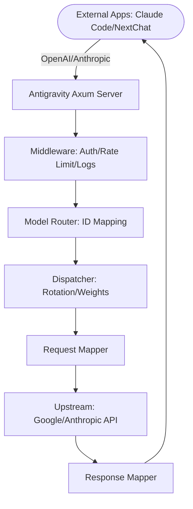
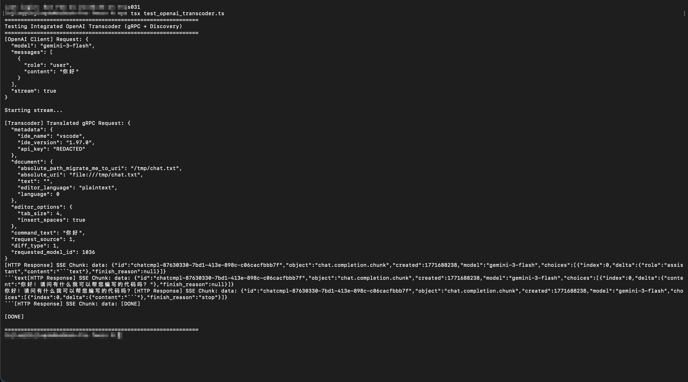

# AntiSwitcher 🚀
> 专业级 AI 账号管理与协议代理系统 (v4.1.22)
<div align="center">
  

  <h3>Your Personal High-Performance AI Dispatch Gateway</h3>
  <p>Seamlessly proxy Gemini & Claude. OpenAI-Compatible. Privacy First.</p>
  
  <p>
    <a href="https://github.com/lbjlaq/Antigravity-Manager">
      
    </a>
    
    
    
    
  </p>

  <p>
    <a href="#-features">Features</a> • 
    <a href="#-gui-overview">GUI Overview</a> • 
    <a href="#-architecture">Architecture</a> • 
    <a href="#-installation">Installation</a> • 
    <a href="#-quick-integration">Integration</a>
  </p>

  <p>
    <a href="./README.md">简体中文</a> | 
    <strong>English</strong>
  </p>
</div>

---

**AntiSwitcher** is an all-in-one desktop application designed for developers and AI enthusiasts. It perfectly combines multi-account management, protocol conversion, and smart request scheduling to provide you with a stable, high-speed, and low-cost **Local AI Relay Station**.

By leveraging this app, you can transform common Web Sessions (Google/Anthropic) into standardized API interfaces, completely eliminating the protocol gap between different providers.

## 💖 Sponsors

| Sponsor | Description |
| :---: | :--- |
|  | Thanks to **PackyCode** for sponsoring this project! PackyCode is a reliable and efficient API relay service provider, offering relays for various services such as Claude Code, Codex, and Gemini. PackyCode provides a special offer for users of this project: Register using [this link](https://www.packyapi.com/register?aff=Ctrler) and enter the **"Ctrler"** coupon code when topping up to enjoy a **10% discount**. |
|  | Thanks to **AICodeMirror** for sponsoring this project! AICodeMirror provides official high-stability relay services for Claude Code / Codex / Gemini CLI, supporting enterprise-grade concurrency, fast invoicing, and 24/7 dedicated technical support. Claude Code / Codex / Gemini official channels at 38% / 2% / 9% of original price, with extra discounts on top-ups! AICodeMirror offers special benefits for Antigravity-Manager users: register via [this link](https://www.aicodemirror.com/register?invitecode=MV5XUM) to enjoy 20% off your first top-up, and enterprise customers can get up to 25% off! |

### ☕ Support

If you find this project helpful, feel free to buy me a coffee!

<a href="https://www.buymeacoffee.com/Ctrler" target="_blank"></a>

| Alipay | WeChat Pay | Buy Me a Coffee |
| :---: | :---: | :---: |
|  |  |  |

## 🌟 Detailed Feature Matrix

### 1. 🎛️ Smart Account Dashboard
*   **Global Real-time Monitoring**: Instant insight into the health of all accounts, including average remaining quotas for Gemini Pro, Gemini Flash, Claude, and Gemini Image generation.
*   **Smart Recommendation**: The system uses a real-time algorithm to filter and recommend the "Best Account" based on quota redundancy, supporting **one-click switching**.
*   **Active Account Snapshot**: Visually displays the specific quota percentage and the last synchronization time of the currently active account.

### 2. 🔐 Professional AI Account Management & Proxy System
*   **OAuth 2.0 Authorization (Auto/Manual)**: Pre-generates a copyable authorization URL so you can finish auth in any browser; after the callback, the app auto-completes and saves the account (use “I already authorized, continue” if needed).
*   **Multi-dimensional Import**: Supports single token entry, JSON batch import, and automatic hot migration from V1 legacy databases.
*   **Gateway-level Views**: Supports switching between "List" and "Grid" views. Provides 403 Forbidden detection, automatically marking and skipping accounts with permission anomalies.

### 3.  Protocol Conversion & Relay (API Proxy)
*   **Multi-Protocol Adaptation (Multi-Sink)**:
    *   **OpenAI Format**: Provides `/v1/chat/completions` endpoint, compatible with 99% of existing AI apps.
    *   **Anthropic Format**: Provides native `/v1/messages` interface, supporting all features of **Claude Code CLI** (e.g., chain-of-thought, system prompts).
    *   **Gemini Format**: Supports direct calls from official Google AI SDKs.
*   **Smart Self-healing**: When a request encounters `429 (Too Many Requests)` or `401 (Expired)`, the backend triggers **millisecond-level automatic retry and silent rotation**, ensuring business continuity.

### 4. 🔀 Model Router Center
*   **Series-based Mapping**: Classify complex original model IDs into "Series Groups" (e.g., routing all GPT-4 requests uniformly to `gemini-3-pro-high`).
*   **Expert Redirection**: Supports custom regex-level model mapping for precise control over every request's landing model.
*   **Tiered Routing [New]**: Automatically prioritizes models based on account tiers (Ultra/Pro/Free) and reset frequencies to ensure stability for high-volume users.
*   **Silent Background Downgrading [New]**: Intelligently identifies background tasks (e.g., Claude CLI title generation) and reroutes them to Flash models to preserve premium quota.

### 5. 🎨 Multimodal & Imagen 3 Support
*   **Advanced Image Control**: Supports precise control over image generation tasks via OpenAI `size` (e.g., `1024x1024`, `16:9`) parameters or model name suffixes.
*   **Enhanced Payload Support**: The backend supports payloads up to **100MB** (configurable), more than enough for 4K HD image recognition and processing.

##  GUI Overview

| | |
| :---: | :---: |
|  <br> Dashboard |  <br> Account List |
|  <br> About Page |  <br> API Proxy |
|  <br> Settings | |

### 💡 Usage Examples

| | |
| :---: | :---: |
|  <br> Claude Code Web Search |  <br> Cherry Studio Integration |
|  <br> Imagen 3 Advanced Drawing |  <br> Kilo Code Integration |

## 🏗️ Architecture


```mermaid
graph TD
    Client([External Apps: Claude Code/NextChat]) -->|OpenAI/Anthropic| Gateway[Antigravity Axum Server]
    Gateway --> Middleware[Middleware: Auth/Rate Limit/Logs]
    Middleware --> Router[Model Router: ID Mapping]
    Router --> Dispatcher[Dispatcher: Rotation/Weights]
    Dispatcher --> Mapper[Request Mapper]
    Mapper --> Upstream[Upstream: Google/Anthropic API]
    Upstream --> ResponseMapper[Response Mapper]
    ResponseMapper --> Client
```

## 📥 Installation

### 选项 A: 终端安装 (推荐)

#### 跨平台一键安装脚本

自动检测操作系统、架构和包管理器，一条命令完成下载与安装。

**Linux / macOS:**
```bash
curl -fsSL https://raw.githubusercontent.com/lbjlaq/Antigravity-Manager/v4.1.22/install.sh | bash
```

**Windows (PowerShell):**
```powershell
irm https://raw.githubusercontent.com/lbjlaq/Antigravity-Manager/main/install.ps1 | iex
```

> **支持的格式**: Linux (`.deb` / `.rpm` / `.AppImage`) | macOS (`.dmg`) | Windows (NSIS `.exe`)
>
> **高级用法**: 安装指定版本 `curl -fsSL ... | bash -s -- --version 4.1.22`，预览模式 `curl -fsSL ... | bash -s -- --dry-run`

#### macOS - Homebrew
如果您已安装 [Homebrew](https://brew.sh/)，也可以通过以下命令安装：

```bash
# 1. Tap the repository
brew tap lbjlaq/antigravity-manager https://github.com/lbjlaq/Antigravity-Manager

# 2. Install the app
brew install --cask antigravity-tools
```
> **Tip**: If you encounter permission issues, add the `--no-quarantine` flag.

#### Arch Linux
You can choose to install via the one-click script or Homebrew:

**Option 1: One-click script (Recommended)**
```bash
curl -sSL https://raw.githubusercontent.com/lbjlaq/Antigravity-Manager/main/deploy/arch/install.sh | bash
```

**Option 2: via Homebrew** (If you have [Linuxbrew](https://sh.brew.sh/) installed)
```bash
brew tap lbjlaq/antigravity-manager https://github.com/lbjlaq/Antigravity-Manager
brew install --cask antigravity-tools
```

#### Other Linux Distributions
The AppImage will be automatically symlinked to your binary path with executable permissions.

### Option B: Manual Download
Download from [GitHub Releases](https://github.com/lbjlaq/Antigravity-Manager/releases):
*   **macOS**: `.dmg` (Universal, Apple Silicon & Intel)
*   **Windows**: `.msi` or portable `.zip`
*   **Linux**: `.deb` or `AppImage`

### Option C: Docker Deployment (Recommended for NAS/Servers)
If you prefer running in a containerized environment, we provide a native Docker image. This image supports the v4.0.3 Native Headless architecture, automatically hosts frontend static resources, and allows for direct browser-based management.

```bash
# Option 1: Direct Run (Recommended)
# - API_KEY: Required. Used for AI request authentication.
# - WEB_PASSWORD: Optional. Used for Web UI login. Defaults to API_KEY if NOT set.
docker run -d --name antigravity-manager \
  -p 8045:8045 \
  -e API_KEY=sk-your-api-key \
  -e WEB_PASSWORD=your-login-password \
  -e ABV_MAX_BODY_SIZE=104857600 \
  -v ~/.antigravity_sw:/root/.antigravity_sw \
  lbjlaq/antigravity-manager:latest

# Forgot keys? Run `docker logs antigravity-manager` or `grep -E '"api_key"|"admin_password"' ~/.antigravity_sw/gui_config.json`

#### 🔐 Authentication Scenarios
*   **Scenario A: Only `API_KEY` is set**
    - **Web Login**: Use `API_KEY` to access the dashboard.
    - **API Calls**: Use `API_KEY` for AI request authentication.
*   **Scenario B: Both `API_KEY` and `WEB_PASSWORD` are set (Recommended)**
    - **Web Login**: **Must** use `WEB_PASSWORD`. Using API Key will be rejected (more secure).
    - **API Calls**: Continue to use `API_KEY`. This allows you to share the API Key with team members while keeping the password for administrative access only.

#### 🆙 Upgrade Guide for Older Versions
If you are upgrading from v4.0.1 or earlier, your installation won't have a `WEB_PASSWORD` set by default. You can add one using any of these methods:
1.  **Web UI (Recommended)**: Log in using your existing `API_KEY`, go to the **API Proxy Settings** page, find the **Web UI Management Password** section below the API Key, set your new password, and save.
2.  **Environment Variable (Docker)**: Stop the old container and start the new one with the added parameter `-e WEB_PASSWORD=your_new_password`. **Note: Environment variables have the highest priority and will override any changes in the UI.**
3.  **Config File (Persistent)**: Directly edit `~/.antigravity_sw/gui_config.json` and add/modify `"admin_password": "your_new_password"` inside the `proxy` object.
    - *Note: `WEB_PASSWORD` is the environment variable name, while `admin_password` is the JSON key in the config file.*

> [!TIP]
> **Priority Logic**:
> - **Environment Variable** (`WEB_PASSWORD`) has the highest priority. If set, the application will always use it and ignore values in the configuration file.
> - **Configuration File** (`gui_config.json`) is used for persistent storage. When you change the password via Web UI and save, it is written here.
> - **Fallback**: If neither is set, it falls back to `API_KEY`; if even `API_KEY` is missing, a random one is generated.

# Option 2: Use Docker Compose
# 1. Enter the Docker directory
cd docker
# 2. Start the service
docker compose up -d
```
> **Access URL**: `http://localhost:8045` (Admin Console) | `http://localhost:8045/v1` (API Base)
> **System Requirements**:
> - **RAM**: **1GB** recommended (minimum 256MB).
> - **Persistence**: Mount `/root/.antigravity_sw` to persist your data.
> - **Architecture**: Supports x86_64 and ARM64.
> **See**: [Docker Deployment Guide (docker)](./docker/README.md)

### 🛠️ Troubleshooting

#### macOS says "App is damaged"?
Due to macOS security gatekeeper, non-App Store apps might show this. Run this in Terminal to fix:
```bash
sudo xattr -rd com.apple.quarantine "/Applications/AntiSwitcher.app"
```

## 🔌 Quick Integration Examples

### 🔐 OAuth Authorization Flow (Add Account)
1. Go to `Accounts` → `Add Account` → `OAuth`.
2. The dialog pre-generates an authorization URL before you click any button. Click the URL to copy it to the system clipboard, then open it in the browser you prefer and complete authorization.
3. After consent, the browser opens a local callback page and shows “✅ Authorized successfully!”.
4. The app automatically continues the flow and saves the account; if it doesn’t, click “I already authorized, continue” to finish manually.

> Note: the auth URL contains a one-time local callback port. Always use the latest URL shown in the dialog. If the app isn’t running or the dialog is closed during auth, the browser may show `localhost refused connection`.

### How to use with Claude Code CLI?
1. Start Antigravity service in the "API Proxy" tab.
2. In your terminal:
```bash
export ANTHROPIC_API_KEY="sk-antigravity"
export ANTHROPIC_BASE_URL="http://127.0.0.1:8045"
claude
```

<<<<<<< HEAD
### How to use in Python?
=======
### 如何接入 OpenCode?
1.  进入 **API 反代**页面 → **外部 Providers** → 点击 **OpenCode Sync** 卡片。
2.  点击 **Sync** 按钮，将自动生成 `~/.config/opencode/opencode.json` 配置文件：
    - 创建独立 provider `antigravity-manager`（不覆盖 google/anthropic 原生配置）
    - 可选：勾选 **Sync accounts** 导出 `antigravity-accounts.json`（plugin-compatible v3 格式），供 OpenCode 插件直接导入
3.  点击 **Clear Config** 可一键清除 Manager 配置并清理 legacy 残留；点击 **Restore** 可从备份恢复。
4.  Windows 用户路径为 `C:\Users\<用户名>\.config\opencode\`（与 `~/.config/opencode` 规则一致）。

**快速验证命令：**
```bash
# 测试 antigravity-manager provider（支持 --variant）
opencode run "test" --model antigravity-manager/claude-sonnet-4-5-thinking --variant high

# 若已安装 opencode-antigravity-auth 插件，验证 google provider 仍可独立工作
opencode run "test" --model google/antigravity-claude-sonnet-4-5-thinking --variant max
```

### 如何接入 Kilo Code?
1.  **协议选择**: 建议优先使用 **Gemini 协议**。
2.  **Base URL**: 填写 `http://127.0.0.1:8045`。
3.  **注意**: 
    - **OpenAI 协议限制**: Kilo Code 在使用 OpenAI 模式时，其请求路径会叠加产生 `/v1/chat/completions/responses` 这种非标准路径，导致 Antigravity 返回 404。因此请务必填入 Base URL 后选择 Gemini 模式。
    - **模型映射**: Kilo Code 中的模型名称可能与 Antigravity 默认设置不一致，如遇到无法连接，请在“模型映射”页面设置自定义映射，并查看**日志文件**进行调试。

### 如何在 Python 中使用?
>>>>>>> 2e87fe84972af5ef5491a6935ea9d02004e04e38
```python
import openai

client = openai.OpenAI(
    api_key="sk-antigravity",
    base_url="http://127.0.0.1:8045/v1"
)

response = client.chat.completions.create(
    model="gemini-3-flash",
    messages=[{"role": "user", "content": "Hello, please introduce yourself"}]
)
print(response.choices[0].message.content)
```

## 📝 Developer & Community

<<<<<<< HEAD
*   **Changelog**:
=======
#### 方式一：OpenAI Images API (推荐)
```python
import openai

client = openai.OpenAI(
    api_key="sk-antigravity",
    base_url="http://127.0.0.1:8045/v1"
)

# 生成图片
response = client.images.generate(
    model="gemini-3-pro-image",
    prompt="一座未来主义风格的城市，赛博朋克，霓虹灯",
    size="1920x1080",      # 支持任意 WIDTHxHEIGHT 格式，自动计算宽高比
    quality="hd",          # "standard" | "hd" | "medium"
    n=1,
    response_format="b64_json"
)

# 保存图片
import base64
image_data = base64.b64decode(response.data[0].b64_json)
with open("output.png", "wb") as f:
    f.write(image_data)
```

**支持的参数**：
- **`size`**: 任意 `WIDTHxHEIGHT` 格式（如 `1280x720`, `1024x1024`, `1920x1080`），自动计算并映射到标准宽高比（21:9, 16:9, 9:16, 4:3, 3:4, 1:1）
- **`quality`**: 
  - `"hd"` → 4K 分辨率（高质量）
  - `"medium"` → 2K 分辨率（中等质量）
  - `"standard"` → 默认分辨率（标准质量）
- **`n`**: 生成图片数量（1-10）
- **`response_format`**: `"b64_json"` 或 `"url"`（Data URI）

#### 方式二：Chat API + 参数设置 (✨ 新增)

**所有协议**（OpenAI、Claude）的 Chat API 现在都支持直接传递 `size` 和 `quality` 参数：

```python
# OpenAI Chat API
response = client.chat.completions.create(
    model="gemini-3-pro-image",
    size="1920x1080",      # ✅ 支持任意 WIDTHxHEIGHT 格式
    quality="hd",          # ✅ "standard" | "hd" | "medium"
    messages=[{"role": "user", "content": "一座未来主义风格的城市"}]
)
```

```bash
# Claude Messages API
curl -X POST http://127.0.0.1:8045/v1/messages \
  -H "Content-Type: application/json" \
  -H "x-api-key: sk-antigravity" \
  -d '{
    "model": "gemini-3-pro-image",
    "size": "1280x720",
    "quality": "hd",
    "messages": [{"role": "user", "content": "一只可爱的猫咪"}]
  }'
```

```

**参数优先级**: `imageSize` 参数 > `quality` 参数 > 模型后缀

**✨ 新增 `imageSize` 参数支持**:

除了 `quality` 参数外,现在还支持直接使用 Gemini 原生的 `imageSize` 参数:

```python
# 使用 imageSize 参数(最高优先级)
response = client.chat.completions.create(
    model="gemini-3-pro-image",
    size="16:9",           # 宽高比
    imageSize="4K",        # ✨ 直接指定分辨率: "1K" | "2K" | "4K"
    messages=[{"role": "user", "content": "一座未来主义风格的城市"}]
)
```

```bash
# Claude Messages API 也支持 imageSize
curl -X POST http://127.0.0.1:8045/v1/messages \
  -H "Content-Type: application/json" \
  -H "x-api-key: sk-antigravity" \
  -d '{
    "model": "gemini-3-pro-image",
    "size": "1280x720",
    "imageSize": "4K",
    "messages": [{"role": "user", "content": "一只可爱的猫咪"}]
  }'
```

**参数说明**:
- **`imageSize`**: 直接指定分辨率 (`"1K"` / `"2K"` / `"4K"`)
- **`quality`**: 通过质量等级推断分辨率 (`"standard"` → 1K, `"medium"` → 2K, `"hd"` → 4K)
- **优先级**: 如果同时指定 `imageSize` 和 `quality`,系统会优先使用 `imageSize`


#### 方式三：Chat 接口 + 模型后缀
```python
response = client.chat.completions.create(
    model="gemini-3-pro-image-16-9-4k",  # 格式：gemini-3-pro-image-[比例]-[质量]
    messages=[{"role": "user", "content": "一座未来主义风格的城市"}]
)
```

**模型后缀说明**：
- **宽高比**: `-16-9`, `-9-16`, `-4-3`, `-3-4`, `-21-9`, `-1-1`
- **质量**: `-4k` (4K), `-2k` (2K), 不加后缀（标准）
- **示例**: `gemini-3-pro-image-16-9-4k` → 16:9 比例 + 4K 分辨率

#### 方式四：Cherry Studio 等客户端设置
在支持 OpenAI 协议的客户端（如 Cherry Studio）中，可以通过**模型设置**页面配置图片生成参数：

1. **进入模型设置**：选择 `gemini-3-pro-image` 模型
2. **配置参数**：
   - **Size (尺寸)**: 输入任意 `WIDTHxHEIGHT` 格式（如 `1920x1080`, `1024x1024`）
   - **Quality (质量)**: 选择 `standard` / `hd` / `medium`
   - **Number (数量)**: 设置生成图片数量（1-10）
3. **发送请求**：直接在对话框中输入图片描述即可

**参数映射规则**：
- `size: "1920x1080"` → 自动计算为 `16:9` 宽高比
- `quality: "hd"` → 映射为 `4K` 分辨率
- `quality: "medium"` → 映射为 `2K` 分辨率


## 📝 开发者与社区

*   **版本演进 (Changelog)**:
    *   **v4.1.22 (2026-02-21)**:
        -   **[重要提醒] 2api 风控风险提示**:
            -   由于近期的谷歌风控原因，使用 2api 功能会导致账号被风控的概率显著增加。
            -   **强烈建议**: 为了确保您的账号安全与调用稳定性，建议减少或停止使用 2api 功能。目前更原生、更稳定的 **gRPC (`application/grpc`)** 或 **gRPC-Web (`application/grpc-web`)** 协议代理支持仍在积极测试中，如果您有相关的测试经验或想法，非常欢迎联系讨论，也欢迎您建立新分支一起探索！
            -   <details><summary>📸 点击查看 gRPC 实时转换 OpenAI 规范测试演示</summary></details>
        -   **[核心优化] Claude Sonnet 4.5 迁移至 4.6 (PR #2014)**:
            -   **模型升级**: 引入 `claude-sonnet-4-6` 及 `claude-sonnet-4-6-thinking` 作为主推模型。
            -   **平滑过渡**: 自动将 legacy 模型 `claude-sonnet-4-5` 重定向至 `4.6`。
            -   **全局适配**: 更新了全部 12 种语言的本地化文件、UI 标签（Sonnet 4.6, Sonnet 4.6 TK, Opus 4.6 TK）以及预设路由。
        -   **[核心优化] Gemini Pro 模型名称迁移 (PR #2063)**: 将 `gemini-pro-high/low` 迁移至 `gemini-3.1-pro`，确保与 Google 最新 API 命名对齐。
        -   **[重大架构] 国际化 (i18n) 与结构化模型配置集成 (PR #2040)**:
            -   **架构重构**: 引入了全新的 i18n 翻译框架，将硬编码的模型展示逻辑解耦至结构化 `MODEL_CONFIG`。
            -   **逻辑适配**: 在账号表格、详情弹窗和设置页面中集成了基于 i18n 标签的动态去重机制，修复了 Gemini 3.1 Pro 额度重复显示的 UI 问题。
            -   **多语言提升**: 优化并修正了所有 12 种语言的版本描述，将 `Claude 4.5` 描述全面升级为正式版 `4.6`，并将 `G3` 描述统一为 `G3.1`。
            -   **[核心修复] Claude Opus 4.6 思考模式 400 报错 (Claude 协议)**:
            -   **参数专项对齐**: 修复了 `claude-opus-4-6-thinking` 在 Claude 协议下返回 `400 INVALID_ARGUMENT` 的问题。通过强制对齐 `thinkingBudget` (24576) 与 `maxOutputTokens` (57344)，并剔除在该模式下不兼容的 `stopSequences`，确保其请求参数与 100% 成功的 OpenAI 协议完全一致，提升了对 Claude 原生协议客户端的兼容性。
    *   **v4.1.21 (2026-02-17)**:
        -   **[核心修复] Cherry Studio / Claude 协议兼容性 (Fix Issue #2007)**:
            -   **maxOutputTokens 限制**: 修复了 Cherry Studio 等客户端发送超大 `maxOutputTokens` (128k) 导致 Google API 返回 `400 INVALID_ARGUMENT` 的问题。现在自动将 Claude 协议的输出上限限制为 **65536**，确保请求始终在 Gemini 允许的范围内。
            -   **Adaptive 思考模式对齐**: 针对 Gemini 模型优化了 Claude 协议的 `thinking: { type: "adaptive" }` 行为。现在自动映射为 **24576** 的固定思考预算 (与 OpenAI 协议一致)，解决了 Gemini Vertex AI 对 `thinkingBudget: -1` 的不兼容问题，显著提升了 Cherry Studio 的思考模式稳定性。
        -   **[核心修复] 生产环境自定义协议支持 (PR #2005)**:
            -   **协议修复**: 默认启用 `custom-protocol` 特性，修复了生产环境下自定义协议 (如 `tauri://`) 加载失败的问题，确保本地资源和特殊协议请求的稳定性。
        -   **[核心优化] 托盘图标与窗口生命周期管理**:
            -   **智能托盘**: 引入 `AppRuntimeFlags` 状态管理，实现了窗口关闭行为与托盘状态的联动。
            -   **行为优化**: 当托盘启用时，关闭窗口将自动隐藏而非退出应用；当托盘禁用时，关闭窗口将正常退出，提供了更符合直觉的桌面体验。
        -   **[核心增强] Linux 版本检测与 HTTP 客户端鲁棒性**:
            -   **版本解析**: 增强了 Linux 平台的版本号提取逻辑 (`extract_semver`)，能从复杂的命令行输出中准确识别版本，提升了自动更新和环境检测的准确性。
            -   **客户端降级**: 为 HTTP 客户端构建过程增加了自动降级机制。当代理配置导致构建失败时，系统会自动回退到无代理模式或默认配置，防止因网络配置错误导致应用完全不可用。
        -   **[核心修复] Cherry Studio 联网搜索空响应修复 (/v1/responses)**:
            -   **SSE 事件补全**: 重写了 `create_codex_sse_stream`，补全了 OpenAI Responses API 规范要求的完整 SSE 事件生命周期（`response.output_item.added`、`content_part.added/done`、`output_item.done`、`response.completed`），解决了 Cherry Studio 因事件缺失导致无法组装响应内容的问题。
            -   **联网搜索注入修复**: 过滤了 Cherry Studio 发送的 `builtin_web_search` 工具声明，防止其与 `inject_google_search_tool` 冲突，确保 Google Search 工具被正确注入。
            -   **搜索引文回显**: 为 Codex 流式响应添加了 `groundingMetadata` 解析，支持在联网搜索结果中回显搜索查询和来源引文。
        -   **[优化] Claude 协议联网与思考稳定性 (PR #2007)**:
            -   **移除联网降级**: 移除了 Claude 协议中针对联网搜索的激进模型降级逻辑，避免不必要的模型回退。
            -   **移除思考历史降级**: 移除了 `should_disable_thinking_due_to_history` 检查，不再因历史消息格式问题永久禁用思考模式，改为依赖 `thinking_recovery` 机制自动修复。
        -   **UI 优化 (Fix #2008)**: 改进了冷却时间的显示颜色 (使用蓝色)，提高了在小字体下的可读性。
    *   **v4.1.20 (2026-02-16)**:
        *   **[✨ 新春祝福] 祝大家马年一马当先，万事如意！Code 运昌隆，上线无 Bug！🧧**
        *   **[Critical]** 修复了 Claude Opus/Haiku 等模型在 Antigravity API 上的 `400 INVALID_ARGUMENT` 错误（通过恢复 v4.1.16 的核心协议格式）。
        *   增强了流式响应的健壮性，优化了对心跳包和非从零开始的 Thinking Block 的处理。
        *   **[核心修复] 修复图像生成配额同步问题 (Issue #1995)**：
            *   **放宽模型过滤**：优化了配额抓取逻辑，增加了对 `image` / `imagen` 关键字的支持，确保图像模型的配额信息能正常同步。
            *   **即时刷新机制**：在图像生成成功后立即异步触发全局配额刷新，实现了 UI 侧剩余配额的实时反馈。
        *   **[核心修复] 修复 OpenAI 流式收集器工具调用合并 Bug (PR #1994)**：
            *   **ID 冲突校验**：在聚合流式片段时引入 ID 校验，防止多个工具调用因索引重叠而导致参数被错误拼接。
            *   **索引稳定性优化**：优化了流式输出中的索引分配逻辑，确保多轮数据传输下工具调用索引始终单向递增。
        *   **[核心优化] 极致拟真请求伪装 (Request Identity Camouflage)**:
            *   **动态版本伪装**: 实现了智能版本探测机制。Antigravity 现在会自动读取本地安装的真实版本号构建 User-Agent，彻底告别了硬编码的 "1.0.0" 时代。
            *   **Docker 环境兜底**: 针对无头模式（Docker/Linux Server），内置了“已知稳定版”指纹库。当无法检测到本地客户端时，自动伪装为最新稳定版客户端（如 v1.16.5），确保服务端看到的永远是合法的官方客户端。
            *   **全维度 Header 注入**: 补全了 `X-Client-Name`, `X-Client-Version`, `X-Machine-Id`, `X-VSCode-SessionId` 等关键指纹头，实现了从网络层到应用层的像素级伪装，进一步降低了 403 风控概率。
        *   **[核心功能] 后台自动刷新开关与设置热保存**:
            *   **独立开关**: 在设置页面新增了“后台自动刷新”的独立开关，允许用户更精细地控制后台任务。
            *   **配置热保存**: 实现了设置项（自动刷新、智能预热、配额保护）的热保存机制，无需手动点击保存按钮即可实时生效。
        *   **[逻辑优化] 智能预热与配额保护解耦**:
            *   **解除锁定**: 彻底移除了“额度保护”对“智能预热”的强制绑定。现在开启额度保护仅会强制开启“后台自动刷新”（用于检测配额），而不会强制启动预热请求。
            *   **[重要建议]**: 建议用户在当前版本暂时关闭“额度保护”和“后台自动刷新”功能，以避免因频繁请求导致的潜在问题。
    *   **v4.1.19 (2026-02-15)**:
        -   **[核心修复] 修复 Claude Code CLI 工具调用空文本块错误 (Fix #1974)**:
            -   **字段缺失修复**: 修复了 Claude Code CLI 在工具调用过程中，因发送空文本块 (`text: ""`) 导致上游 API 报错 `Field required` 的问题。
            -   **空值过滤**: 在协议转换层增加了对无效空文本块的自动过滤与清理。
        -   **[核心功能] Gemini 模型 MCP 工具名模糊匹配支持**:
            -   **幻觉修复**: 针对 Gemini 模型经常幻觉出错误的 MCP 工具名称（如显式调用 `mcp__puppeteer_navigate` 而非注册名 `mcp__puppeteer__puppeteer_navigate`）的问题，实现了智能模糊匹配算法。
            -   **三级匹配策略**: 引入了后缀匹配、包含匹配及 Token 重叠度评分机制，显著提升了 Gemini 模型调用 MCP 工具的成功率。
        -   **[核心修复] Opencode 同步逻辑修正 (Fix #1972)**:
            -   **模型缺失修复**: 修复了 Opencode CLI 同步时缺失 `claude-opus-4-6-thinking` 模型定义的问题，确保该模型能被客户端正确识别和调用。
    *   **v4.1.18 (2026-02-14)**:
        -   **[核心升级] JA3 指纹伪装 (Chrome 123) 全面实装**:
            -   **反爬虫突破**: 引入 `rquest` 核心库并集成 BoringSSL，实现了像素级复刻 Chrome 123 的 TLS 指纹 (JA3/JA4)，有效解决高防护上游的 403/Captchas 拦截问题。
            -   **全局覆盖**: 指纹伪装已应用至全局共享客户端及代理池管理器，确保从配额查询到对话补全的所有出站流量均模拟为真实浏览器行为。
        -   **[架构重构] 通用流式响应处理 (Universal Stream Handling) (Issue #1955)**:
            -   **双核兼容**: 重构了 SSE 处理与调试日志模块，通过 `Box<dyn Stream>` 实现了对 `reqwest` (标准) 与 `rquest` (伪装) 响应流的统一兼容，消除了底层类型冲突。
        -   **[核心功能] 账号错误详情增强 (Account Error Details Expansion)**:
            -   **详情解读**: 为“已禁用”和“403 Forbidden”状态的账号引入了深度错误详情弹窗，自动展示底层 API 报错原因（如 `invalid_grant` 等）。
            -   **验证链接识别**: [新] 智能检测错误文本中的 Google 验证/申诉链接，支持在弹窗内直接点击跳转，加速账号修复流程。
            -   **时间校准**: 修复了由于单位转换错误导致的“检测时间”显示为未来的 Bug。
        -   **[i18n] 全球化多语言支持大满贯**:
            -   **全语言适配**: 为全部 12 种支持语言（阿、西、日、韩、缅、葡、俄、土、越、英及简繁中）同步补全了账号详情与错误状态词条。
            -   **本地化精修**: 优化了各语言下的术语匹配（特别是日语、土耳其语和繁体中文），确保全球用户都能获得准确的母语提示。
        -   **[核心修复] 修复图像生成模型后缀导致的配额匹配失效 (Issue #1955)**:
            -   **模式归一化**: 修复了 `gemini-3-pro-image` 及其分辨率/比例后缀（如 `-4k`, `-16x9`）因归一化匹配不精确导致的配额校验失效问题。
            -   **配额对齐**: 确保所有图像模型变体都能正确映射到标准 ID，从而准确触发账号配额保护，解决了“无可用配额账号”的误报。
    *   **v4.1.17 (2026-02-13)**:
        -   **[用户体验] 自动更新体验升级 (PR #1923)**:
            -   **后台下载**: 实现了更新包的后台静默下载，下载过程中不再阻断用户操作。
            -   **进度反馈**: 新增下载进度条显示，实时反馈下载状态。
            -   **重启提示**: 下载完成后会弹出更友好的重启提示，支持“立即重启”或“稍后重启”。
            -   **逻辑优化**: 优先检查 `updater.json`，减少对 GitHub API 的直接依赖，提升检查速度。
        -   **[文档更新] 跨平台安装脚本 (PR #1931)**:
            -   **一键安装**: 在 README 中更新了 Option A 安装方式，推荐使用跨平台一键安装脚本。
        -   **[社区建设] 新增 Telegram 频道入口**:
            -   **社群卡片**: 在“设置 -> 关于”页面新增了 Telegram 频道卡片，方便用户快速加入官方频道获取最新资讯。
            -   **布局优化**: 调整了关于页面的卡片网格布局，适配了 5 列显示，确保界面整洁美观。
    *   **v4.1.16 (2026-02-12)**:
        -   **[核心修复] 修复 Claude 协议 (Thinking 模型) 400 错误 (V4 方案)**:
            -   **协议对齐**: 彻底修复了 Claude 3.7/4.5 Thinking 等模型在通过代理调用时因参数结构不匹配导致的 `400 Invalid Argument` 错误。
            -   **统一注入**: 废弃了导致冲突的根目录 `thinking` 字段注入，现在统一使用 Google 原生协议推荐的 `generationConfig.thinkingConfig` 嵌套结构。
            -   **预算适配**: 为 Claude 模型适配了默认 16k 的思考预算 (Thinking Budget)，并解决了 Rust 借用检查导致的编译与运行时异常。
        -   **[Bug修复] 修复 OpenAI 流式响应 Usage 重复问题 (Issue #1915)**:
            -   **Token爆炸修复**: 修复了在流式传输模式下 (stream=true)，`usage` 字段被错误地附加到每一个数据块 (Chunk) 中，导致客户端 (如 Cline/Roo Code) 统计的 Token 用量呈指数级虚高的问题。
        -   **[核心优化] 开启 Linux 平台原生自动更新支持 (PR #1891)**:
            -   **全平台覆盖**: 在 `updater.json` 中增加了对 `linux-x86_64` 和 `linux-aarch64` 平台的支持，使 Linux AppImage 用户现在也能正常收到自动更新通知。
            -   **发布流优化**: 自动匹配并读取 Linux 版本的 `.AppImage.sig` 签名文件，实现了 macOS、Windows 与 Linux 三大主流平台的自动更新能力闭环。
        -   **[新增功能] 跨平台一行命令安装脚本支持 (PR #1892)**:
            -   **安装体验升级**: 新增 `install.sh` (Linux/macOS) 和 `install.ps1` (Windows) 脚本，支持通过极简的 `curl` 或 `irm` 命令实现全自动下载、安装与环境配置。
            -   **智能适配**: 脚本支持自动识别操作系统、架构、包管理器（DEB/RPM/AppImage/DMG/NSIS），并提供版本锁定与 Dry-Run 预览模式。
        -   **[核心优化] OpenCode 配置与本地二进制解耦及自定义网络支持 (Issue #1869)**:
            -   **环境解耦**: 后端不再强制校验 `opencode` 二进制是否存在，允许在 Docker 等隔离环境下仅通过配置文件管理同步状态。
            -   **自定义 BaseURL**: 前端新增 "Custom Manager BaseURL" 设置，支持手动指定 Manager 访问地址，完美解决 Docker Compose 容器互联与自定义反代场景下的连接问题。
            -   **完全本地化**: 为新功能补全了中、英双语 I18n 支持，并修复了 OpenCode 同步弹窗的 JSX 渲染异常。
        -   **[UI 修复] 修复 API 代理模板生成的 Python 代码缩进不一致问题 (PR #1879)**:
            -   **显示优化**: 移除了 Python 集成示例代码块中多余的行首空格，确保从界面复制的代码可以直接运行，无需手动调整缩进。
        -   **[核心修复] 解决 Gemini 图像生成因关键词匹配导致的 effortLevel 冲突 (PR #1873)**:
            -   **逻辑冲突修复**: 彻底修复了 `gemini-3-pro-image` 及其 4k/2k 变体因包含 `gemini-3-pro` 关键词，被系统错误判定为支持 Adaptive Thinking 从而误注入 `effortLevel` 导致的 HTTP 400 错误。
        -   **[文档更新] 发布 Gemini 3 Pro (Imagen 3) 图像生成全功能调用指南**:
            -   **深度指南**: 新增 [Gemini 3 Pro 图像模型调用指南](docs/gemini-3-image-guide.md)，详细说明了宽高比自动映射、画质等级对应关系图表，以及新增的图生图 (Image-to-Image) 与后缀魔法用法。
        -   **[安装优化] 官方 Homebrew Cask 维护与更新**:
            -   **版本同步**: 更新 `antigravity-tools.rb` Cask 配置至 v4.1.16，确保 macOS 与 Linux 用户通过 `brew install` 始终获取最新稳定版本。
            -   **参数清洗**: 在代理请求层增加了对图像生成模型的特殊过滤，确保不再为非思维链模型注入不兼容的生成参数。
    *   **v4.1.15 (2026-02-11)**:
        -   **[核心功能] 开启 macOS 与 Windows 原生自动更新支持 (PR #1850)**:
            -   **端到端自动更新**: 启用了 Tauri 的原生更新插件，支持在应用内直接检测、下载并安装更新。
            -   **发布工作流修复**: 彻底修复了 Release 工作流中生成更新元数据 (`updater.json`) 的逻辑。现在系统会自动根据 `.sig` 签名文件构建完整的更新索引，支持 darwin-aarch64, darwin-x86_64 以及 windows-x86_64 架构。
            -   **体验打通**: 配合前端已有的更新提醒组件，实现了从发布到安装的全自动化闭环。
        -   **[核心修复] 解决切换账号时由于空 Project ID 导致的 400 错误 (PR #1852)**:
            -   **空值过滤**: 在 Proxy 层增加了对 `project_id` 的空字符串过滤逻辑。
            -   **自动纠错**: 当检测到账号数据中的 `project_id` 为空时，现在会触发自动重新获取流程，有效解决了 Issue #1846 和 #1851 中提到的 "Invalid project resource name projects/" 错误。
        -   **[故障排查] 针对 HTTP 404 "Resource projects/... not found" 的解决建议 (Issue #1858)**:
            -   **验证项目 ID**: 登录 [Google Cloud Console](https://console.cloud.google.com/)，在项目选择器中搜索报错提到的 ID（如 `bold-spark-xxx`）。若项目不存在，请创建新项目并启用所需的 Vertex AI API。
            -   **重置账户会话**: 尝试在 Antigravity 应用中“删除账户”并“重新添加”，以清除旧的会话残留。
            -   **CLI 辅助验证**: 建议使用 Gemini CLI (`gcloud auth login`) 重新进行身份验证，并确保 `gcloud config set project` 指向了正确的有效项目。
        -   **[故障排查] 针对 HTTP 403 "Forbidden" 错误的解决建议 (Issue #1834)**:
            -   **检查验证链接**: 请检查 API 响应中是否包含提示 "To continue, verify your account at..." 的链接。若有，请点击该链接并按照 Google 提示完成验证。
            -   **确认计划资格**: 访问 [FAQ 页面](https://antigravity.google/docs/faq#why-am-i-ineligible-for-a-google-one-ai-plan) 确认您的账号是否符合 Google One AI 计划或 Gemini Code Assist 的使用要求。
            -   **自动恢复**: 部分 403 错误（如触发风险控制或配额调整）可能会在等待一段时间后自动恢复正常。
    *   **v4.1.15 (2026-02-11)**:
        -   **[核心修复] Cloudflared 公网访问设置持久化 (Issue #1805)**:
            -   **设置记忆**: 修复了 Cloudflared (CF Tunnel) 的 Token、隧道模式及 HTTP/2 设置在应用重启后丢失的问题。
            -   **热更新同步**: 实现了设置的实时持久化。现在切换隧道模式、修改 Token (失焦同步) 或切换 HTTP/2 选项时，配置都会立即保存，确保重启后恢复如初。
        -   **[核心修复] 修复 Warmup 过程中的 403 禁用标记 (PR #1803)**:
            -   **禁用识别**: 修复了账号在 Warmup (预热) 过程中返回 403 错误时未被标记为 `is_forbidden` 的问题。
            -   **自动跳过**: 现在 Warmup 过程中检测到 403 将立即标记并持久化账号禁用状态，并在后续的调度、预热和配额检查中自动跳过该账号，避免无效请求。
        -   **[UI 优化] 迷你视图 (Mini View) 状态显示与交互增强 (PR #1816)**:
            -   **状态指示点**: 在迷你视图底部新增了请求状态圆点。成功 (200-399) 显示为绿色，失败显示为红色，直观反馈最近一次请求结果。
            -   **模型名称回退**: 优化了模型名称显示逻辑。当 `mapped_model` 为空时，自动回退显示原始模型 ID 而非 "Unknown"，提升信息透明度。
            -   **刷新动画优化**: 改进了刷新按钮的动画效果，使旋转动画仅作用于 `RefreshCw` 图标本身，交互更加细腻。
        -   **[核心功能] Claude 4.6 Adaptive Thinking 模式支持**:
            -   **Dynamic Effort**: 全面支持 `effort` 参数 (low/medium/high)，允许用户动态调整模型的思考深度与预算。
            -   **Token 限制自适应**: 修复了 Adaptive 模式下 `maxOutputTokens` 未能正确感知 Budget 导致被截断的问题，确保长思维链不被腰斩。
        -   **[文档更新] 新增 Adaptive 模式测试用例**:
            -   提供了 `docs/adaptive_mode_test_examples.md`，涵盖多轮对话、复杂任务场景及 Budget 模式切换的完整验证指南。
        -   **[核心功能] 图片生成 imageSize 参数支持**:
            -   **直接参数支持**: 新增对 Gemini 原生 `imageSize` 参数的直接支持,可在所有协议(OpenAI/Claude/Gemini)中使用。
            -   **参数优先级**: 实现了清晰的参数优先级逻辑:`imageSize` 参数 > `quality` 参数推断 > 模型后缀推断。
            -   **全协议兼容**: OpenAI Chat API、Claude Messages API 和 Gemini 原生协议均支持通过 `imageSize` 字段直接指定分辨率("1K"/"2K"/"4K")。
            -   **向后兼容**: 完全兼容现有的 `quality` 参数和模型后缀方式,不影响现有代码。
        -   **[核心功能] Opencode 提供商隔离与清理工作流 (PR #1820)**:
            -   **隔离同步逻辑**: 实现 Opencode 提供商的独立同步机制,防止状态污染,确保数据纯净。
            -   **清理工作流**: 新增资源清理工作流,优化资源管理,提升系统运行效率。
            -   **稳定性增强**: 增强了同步过程的稳定性和可靠性。
    *   **v4.1.15 (2026-02-11)**:
        -   **[核心功能] Homebrew Cask 安装检测与支持 (PR #1673)**:
            -   **应用升级**: 新增了对 Homebrew Cask 安装的检测逻辑。如果应用是通过 Cask 安装的，现在可以直接在应用内触发 `brew upgrade --cask` 流程，实现无缝升级体验。
        -   **[核心修复] Gemini 图像生成配额保护 (PR #1764)**:
            -   **保护生效**: 修复了配额保护机制可能会错误统计文本请求的问题，并确保在绘图配额耗尽时能正确拦截 `gemini-3-pro-image` 的请求。
        -   **[UI 优化] 修复导航栏边界与显示问题 (PR #1636)**:
            -   **边界修复**: 修复了导航栏右侧菜单在特定窗口宽度下可能超出边界或显示不全的问题。
            -   **兼容性**: 此次合并保留了主分支上的 Mini View 等新特性，只应用了必要的样式修正。
        -   **[UI 优化] 修复英文模式下的布局溢出与水平滚动 (Issue #1783)**:
            -   **全局限制**: 在全局样式中封锁了水平轴溢出，杜绝了因文字过长导致的页面横向抖动。
            -   **响应式增强**: 优化了导航栏断点，将文字胶囊的显示阈值提高至 1120px，确保长英文标签在窄窗口下自动切换为图标模式，保持布局整洁。
        -   **[核心修复] 修复处理复杂 JSON Schema 时可能发生的栈溢出问题 (Issue #1781)**:
            -   **安全加固**: 为 `flatten_refs` 等深度递归逻辑引入了 `MAX_RECURSION_DEPTH` (10) 限制，有效防止了由循环引用或过深嵌套导致的程序崩溃。
        -   **[核心修复] 修复流式输出下多个工具调用被错误拼接的问题 (Issue #1786)**:
            -   **索引校正**: 修正了 `create_openai_sse_stream` 中 `tool_calls` 的索引分配逻辑，确保同一个 chunk 中的多个工具调用拥有独立且连续的 `index`，避免了参数被错误拼接导致解析失败的现象。
        -   **[核心修复] 修复 Claude Thinking 模型多轮对话时的签名错误 (Issue #1790)**:
            -   **签名注入与降级**: 在 OpenAI 协议转换层中增加了对历史消息思考块签名的自动注入逻辑。当无法获取有效签名时，自动将其降级为普通文本块，从而解决了 Claude-opus-thinking 等模型在多轮对话中因签名缺失导致的 HTTP 400 错误。
        -   **[核心修复] 修复 Google Cloud 项目 ID 获取失败导致的 503 错误 (Issue #1794)**:
            -   **增加兜底**: 修复了由于账号权限导致无法获取官方项目 ID 时会跳过该账号的 Bug。现在系统会自动回退到经验证稳定的通用 Project ID (`bamboo-precept-lgxtn`)，确保 API 请求的连续性。
        -   **[i18n] 完善 Settings 与 ApiProxy 国际化支持 (PR #1789)**:
            -   **重构**: 将 `Settings.tsx` 和 `ApiProxy.tsx` 中硬编码的中文字符串替换为 `t()` 国际化调用。
            -   **翻译补全**: 同步更新了韩语、缅甸语、葡萄牙语、俄语、土耳其语、越南语、繁体中文和简体中文的本地化词条。
        -   **[核心修复] 修复 IP 白名单删除失败问题 (Issue #1797)**:
            -   **参数规范化**: 修复了由于前端与后端参数命名风格 (snake_case vs camelCase) 不一致导致无法删除白名单 IP 的问题。同时统一了黑名单管理与 IP 访问日志的相关参数，确保全系统参数传递的一致性。
    *   **v4.1.12 (2026-02-10)**:
        -   **[核心功能] OpenCode CLI 深度集成 (PR #1739)**:
            -   **自动探测**: 新增了对 OpenCode CLI 的自动检测与环境变量配置同步支持。
            -   **一键同步**: 支持通过“外部 Providers”卡片将 Antigravity 的配置无缝注入到 OpenCode CLI 环境，实现零配置接入。
        -   **[核心修复] Claude Opus 思考预算自动注入 (PR #1747)**:
            -   **预算修正**: 修复了 Opus 模型在自动启用思考模式时，未能正确注入默认思考预算 (Thinking Budget) 的问题，防止因预算缺失导致的上游错误。
        -   **[核心优化] Claude Opus 4.6 Thinking 全面升级 (Issue #1741, #1742, #1743)**:
            -   **模型迭代**: 正式引入 `claude-opus-4-6-thinking` 支持，提供更强大的推理能力。
            -   **无感迁移**: 实现了从 `claude-opus-4.5` / `claude-opus-4` 到 `4.6` 的自动重定向，旧版配置无需修改即可直接享受新模型。
        -   **[核心修复] 账户索引自动修复机制 (PR #1755)**:
            -   **容错增强**: 修复了在部分极端情况下（如文件损坏）账户索引无法自动重建的问题。现在系统会在检测到索引异常时自动触发自我修复流程，确保账号数据安全可用。
        -   **[核心修复] 修复 IP 黑名单删除与时区问题 (PR #1748)**:
            -   **参数修正**: 修复了 IP 黑名单删除接口因参数命名风格 (snake_case vs camelCase) 不匹配导致的删除失败问题。
            -   **逻辑修复**: 修正了清除黑名单时传递了错误参数 (ip_pattern 而非 id) 的问题。
            -   **时区校准**: 修复了宵禁时间 (Curfew) 判断逻辑，强制使用北京时间 (UTC+8)，解决了服务器本地时区非 UTC+8 时的判断偏差。
            -   **拒绝对齐**: 优化了令牌拒绝响应，返回 403 状态码及 JSON 错误详情，对齐了统一错误响应标准。
        -   **[核心功能] 新增迷你视图模式 (Mini View Mode) (PR #1750)**:
            -   **便捷访问**: 新增迷你窗口模式，支持双向切换。该模式常驻桌面顶层，提供精简的快捷操作入口，方便用户即时查看状态与监控信息。
        -   **[核心修复] Gemini 协议 400 错误自愈 (PR #1756)**:
            -   **Token 补全**: 修复了在 Gemini 原生协议下调用持续思考模型（如 Claude Opus 4.6 Thinking）时，因 `maxOutputTokens` 小于 `thinkingBudget` 导致的 400 报错。现在系统会自动补全并对齐 Token 限制，确保请求合规。
        -   **[核心修复] 修复 macOS 下 bun 全局安装的路径识别 (PR #1765)**:
            -   **路径增强**: 新增对 `~/.bun/bin` 及全局安装路径的探测，解决了 bun 用户无法自动同步 Claude CLI 配置的问题。
        -   **[核心优化] 修复 Logo 文本在小容器下的换行与显示 (PR #1766)**:
            -   **显示优化**: 使用 Tailwind CSS 容器查询逻辑优化了 Logo 文本的显示与隐藏切换，防止在容器空间不足时发生文字换行。
        -   **[核心修复] Google Cloud Code API 404 重试与账号轮换 (PR #1775)**:
            -   **智能重试**: 针对 Google Cloud Code API 返回的 404 错误（常见于分阶段发布或权限差异场景），新增自动重试与账号轮换机制。系统将以 300ms 短延迟进行重试，并自动切换到下一个可用账号。
            -   **短周期避让**: 对 404 错误实施 5 秒软锁定（区别于其他服务端错误的 8 秒），在保护账号的同时最大程度减少用户等待时间。
    *   **v4.1.11 (2026-02-09)**:
        -   **[核心优化] 重构 Token 轮询逻辑 (High-End Model Routing Optimization)**:
            -   **能力硬门槛**: 针对 `claude-opus-4-6` 等高端模型实施了严格的 Capability Filtering。系统现在会检查账号实际持有的 `model_quotas`，只有明确拥有目标模型配额的账号才能参与轮询，彻底解决了 Pro/Free 账号因 "Soft Priority" 而被错误选中的问题。
            -   **严格层级优先**: 确立了 `Ultra > Pro > Free` 的绝对优先级排序策略。只要 Ultra 账号可用，系统将始终优先调度 Ultra 账号，防止降级到 Pro 账号，确保了高端模型的服务质量。
            -   **[配置警告]**: 请检查 `设置 -> 自定义模型映射` 或 `gui_config.json`，确保**没有**配置 `"claude-opus-4-*": "claude-opus-4-5-thinking"` 这样的通配符，否则会导致 `claude-opus-4-6-thinking` 被错误映射到 `claude-opus-4-5-thinking`。建议为 `claude-opus-4-6-thinking` 添加明确的精确映射。
        -   **[核心修复] 修复配置热重载失效问题 (PR #1713)**:
            -   **即时生效**: 修复了在 WebUI 或 Docker 环境下保存配置时，内存中的代理池配置未同步更新的问题。现在修改配置后无需重启即可立即生效。
        -   **[Docker 优化] 新增本地绑定限制选项**:
            -   **网络安全**: 新增 `ABV_BIND_LOCAL_ONLY` 环境变量。当设置为 `true` 时，Docker/Headless 模式将仅绑定 `127.0.0.1`，不再默认向 `0.0.0.0` 暴露服务，满足特定安全网络需求。
        -   **[核心功能] 用户 Token 支持自定义过期时间 (PR #1722)**:
            -   **灵活控制**: 创建用户 Token 时现在支持选择精确到分钟的自定义过期时间，不再局限于预设的固定时长。
        -   **[核心修复] Token 编辑数据同步与参数封装 (PR #1720, #1722)**:
            -   **数据同步**: 修复了编辑 Token 时部分字段数据未正确回显的问题。
            -   **代码重构**: 优化了 Token 创建与更新的参数传递结构，提升了代码的可维护性。
        -   **[核心修复] 修复代理认证信息持久化失效问题 (Issue #1738)**:
            -   **魔术前缀机制**: 引入 `ag_enc_` 前缀来明确标识已加密的密码字段。
            -   **双重加密防护**: 彻底解决了后端无法区分“用户输入的明文”与“已加密的密文”，导致在多次保存或导入导出时发生双重加密（Double Encryption）的问题。
            -   **兼容性**: 完美兼容旧版配置（无前缀），并在下次保存时自动迁移到新格式。同时增强了批量导入功能的健壮性。
        -   **[核心修复] 解决用户创建/加载失败问题 (Issue #1719)**:
            -   **数据清洗**: 在数据库初始化阶段增加了针对旧数据的清洗逻辑，自动将 NULL 值重置为默认值，修复了因字段缺失导致的列表接口崩溃。
            -   **鲁棒性增强**: 优化了后端数据读取逻辑，为关键字段增加了防御性默认值处理。
        -   **[前端修复] 修复用户 Token 续期功能失效**:
            -   **参数修正**: 修正了续期接口调用时的参数命名风格 (snake_case -> camelCase)，解决了 "missing required key" 报错。
        -   **[核心修复] 彻底解决 Google Cloud 项目 404 错误 (Issue #1736)**:
            -   **移除无效 Mock 逻辑**: 彻底删除了随机生成 Project ID 的失效逻辑（如 `useful-flow-g3dts`），此类 ID 目前会被 Google API 拦截并返回 404。
            -   **智能兜底策略**: 现在当账号无法自动获取项目 ID 时，系统会安全回退到经验证长期有效的稳定 Project ID `bamboo-precept-lgxtn`，确保 API 请求的连续性与稳定性。
        -   **[核心修复] 增强网络环境下的流式传输稳定性 (Issue #1732)**:
            -   **强制缓冲区冲刷 (Flush)**: 解决了在不稳定网络环境下，SSE 流因缺少末尾换行符而导致的对话挂起及 "IO 为 0" 问题。
            -   **超时容错增强**: 将流式响应超时时间延长至 60s，有效对抗高延迟网络引发的异常中断。
            -   **Session ID 稳定性优化**: 改进了会话标识生成算法，防止网络重连后的 ID 漂移及其引发的思维模型签名失效。
    *   **v4.1.10 (2026-02-08)**:
        -   **[核心功能] 扩展 CLI 探测路径以支持 Volta (PR #1695)**:
            -   **路径增强**：在 `cli_sync` 和 `opencode_sync` 中新增了对 `.volta/bin` 及其内部二进制文件的自动探测支持，确保 Volta 用户在同步 CLI 配置时能够获得“零配置”的顺滑体验。
        -   **[核心修复] 图像生成分辨率智能保护 (Issue #1694)**:
            -   **逻辑保护**：重构了图像配置合并算法，优先保留模型名后缀（如 `-4k`, `-2k`）或显式参数（`quality: "hd"`）指定的高分辨率设置，防止由于请求体中的默认值导致的分辨率降级。
            -   **能力增强**：支持在生成高分辨率图像的同时，完整保留并回显思维链（Thinking）内容。
        -   **[核心功能] 高级思维与全局配置深度优化**:
            -   **图像思维开关**：新增全局“图像思维模式”选项。启用时可获得双图（草图+终稿）及思维链；禁用时系统显式强制注入 `includeThoughts: false`，优先保证单图生成质量。
            -   **UI 重构**：对“高级思维”模块进行了空间压缩，采用行式布局和紧凑控件，将垂直空间占用减少了 50%，极大提升了配置效率。
            -   **全局提示词优化**：增强了输入框体验，添加了实时字符计数与超长警告。
        -   **[i18n] 全球 10+ 语言同步更新**:
            -   **多语言补全**：为高级思维模块补全了繁体中文、日语、韩语、阿拉伯语、西班牙语、俄语、越南语、土耳其语、葡萄牙语和缅甸语的完整翻译，确保全球体验一致。
        -   **[核心修复] 全协议接口兼容性补全**:
            -   **全渠道覆盖**：图像思维控制逻辑已同步覆盖 Gemini 原生协议、OpenAI 兼容协议以及 Claude (Anthropic) 协议。
            -   **测试稳定性**：修复了后端单元测试中的全局状态竞争问题，并更新了 GitHub Release CI 脚本以支持发布覆盖。
        -   **[核心修复] 账号代理绑定持久化与配额保护可靠性提升 (Issue #1700)**:
            -   **绑定持久化**：修复了前端设置保存时因类型定义缺失导致 `account_bindings` 被覆盖的问题，确保绑定关系跨重启有效。
            -   **保护增强**：增强了模型名归一化引擎以识别实际 API 模型名，并完善了触发保护后的内存同步与调度过滤逻辑，彻底消除保护逃逸。
        -   **[核心功能] 优化全球上游代理 I18n 与样式 (Issue #1701)**:
            -   **I18n 同步**：补全了全部 12 种支持语言的代理配置词条，解决 `zh.json` 内容缺失及各语言翻译不统一问题。
            -   **样式优化**：重构了全球代理配置卡片，引入渐变背景与微动画，使其在视觉上与代理池设置保持一致。
            -   **SOCKS5H 支持**：在界面增加了 `socks5h://` 协议建议提示，并统一了后端代理 URL 标准化逻辑，显著增强了远程 DNS 解析的引导。
    *   **v4.1.9 (2026-02-08)**:
        -   **[核心功能] 扩展 CLI 配置快速同步支持 (PR #1680, #1685)**:
            -   **更多工具集成**: 现已支持同步配置到 **Claude Code**, **Gemini CLI**, **Codex AI**, **OpenCode** 以及 **Droid**。
            -   **模型选择定制**: 为单模型 CLI (Claude, Codex, Gemini) 增加了模型选择下拉框，支持同步自定义模型 ID；为多模型 CLI (OpenCode, Droid) 实现了拖拽式模型列表管理。
            -   **逻辑校准**: 深度适配了各 CLI 的预设逻辑（如 Claude 根节点的 `model` 字段及镜像环境清理），确保同步后的兼容性。
            -   **交互优化**: 同步面板现支持默认折叠并适配平滑动画，同时优化了同步前后的 UI 状态反馈。
            -   **备份安全性**: 同步前自动生成 `.antigravity.bak` 备份，支持一键还原。
        -   **[核心功能] 新增全局系统提示词 (Global System Prompt) 支持 (PR #1669)**:
            -   **统一指令注入**: 在“系统设置”中新增全局系统提示词配置，支持将自定义指令自动注入到所有 OpenAI、Claude 和 Gemini 协议请求中。
            -   **前端界面**: 新增 `GlobalSystemPrompt` 组件，支持一键启用及多行内容编辑。
        -   **[核心修复] 修复浮点数序列化精度丢失问题 (PR #1669)**:
            -   **精度升级**: 将后端 `temperature` 和 `top_p` 的数据类型从 `f32` 升级为 `f64`。
            -   **逻辑校准**: 解决了请求参数在反代过程中因浮点转换导致的微小偏差（如 `0.95` 变成 `0.949999...`），显著提升了上游调用的稳定性。
        -   **[核心重构] 实现应用名称国际化 (PR #1662)**:
            -   **UI 升级**: 移除了 `NavLogo` 和 `Settings` 页面中硬编码的 "AntiSwitcher"，全面采用 `app_name` 翻译键，确保 UI 语言切换的一致性。
        -   **[核心修复] 修正 gemini-3-pro-image 因关键词匹配被误判定为思维模型的问题 (Issue #1675)**:
            -   **问题根源**: `gemini-3-pro-image` 及其 4k/2k 变体因包含 `gemini-3-pro` 关键词，被系统错误判定为“思维模型”（Thinking Model）。
            -   **冲突修复**: 修正了误注入 `thinkingConfig` 与图像生成 `imageConfig` 发生的冲突，解决了导致后端分辨率降级（降至 1k）的问题。
            -   **Token 优化**: 解决了因思维模型逻辑注入占位符或特定限制而触发的“Token 超限（131072）” 400 错误。
        -   **[国际化] 日语翻译实现 100% 同步 (PR #1662)**:
            -   **翻译补全**: 同步了 `en.json` 中的所有缺失键值，涵盖了 Cloudflared、断路器、OpenCode 同步等新功能。
        -   **[核心重构] 重构 UpstreamClient 响应处理逻辑**:
            -   **结构化响应**: 引入 `UpstreamCallResult` 统一管理上游请求结果，优化了流式与非流式响应的处理路径。
    *   **v4.1.8 (2026-02-07)**:
        -   **[核心功能] 集成 Claude Opus 4.6 Thinking 模型支持 (PR #1641)**:
            -   **混合模式架构**: 实现了“静态配置 + 动态获取”的双模架构。模型列表通过 Antigravity API 动态拉取，而 Thinking 模式等高级元数据则由本地注册表静态补充，完美平衡了灵活性与稳定性。
            -   **零配置接入**: `claude-opus-4-6` 系列模型自动启用 Thinking 模式并预设 Budget，无需用户手动干预即可享受最新推理能力。
            -   **前沿模型映射**: 新增 `claude-opus-4-6-thinking` 及其别名 (`claude-opus-4-6`, `20260201`) 的支持，并将其归入 `claude-sonnet-4.5` 配额组进行统筹管理。
        -   **[核心优化] 优化 OpenCode CLI 检测逻辑 (PR #1649)**:
            -   **路径扩展**: 增加了对 Windows 环境下常见全局安装路径（如 `npm`, `pnpm`, `Yarn`, `NVM`, `FNM` 等）的自动扫描。
            -   **稳定性增强**: 修复了在 `PATH` 环境不完整时可能导致检测失败的问题，并增强了对 `.cmd` 和 `.bat` 文件的支持。
        -   **[核心修复] 修复监控日志缺失流式工具调用内容的问题**:
            -   **多协议支持**: 重构了 SSE 解析逻辑，全面支持 OpenAI `tool_calls` 和 Claude `tool_use`。
            -   **增量累积**: 实现了工具参数片段的流式累积，确保长参数工具调用能被完整记录并显示在监控面板中。
        -   **[UI 优化] 导航栏与链接交互优化 (PR #1648)**:
            -   **禁止拖拽**: 为导航栏及 Logo 等所有链接和图片添加了 `draggable="false"`，防止用户在意外拖拽时触发浏览器的默认行为，提升交互稳定性。
            -   **SmartWarmup 悬停增强**: 优化了智能预热组件图标在未激活状态下的悬停颜色切换逻辑，使界面反馈更加细腻一致。
        -   **[核心功能] 账号自定义标签支持扩展 (PR #1620)**:
            -   **长度限制**: 将标签长度限制从 20 字符优化为 15 字符，在前后端同步生效。
            -   **后端验证**: 增强了后端 Rust 命令的验证逻辑，支持 Unicode 字符计数，并优化了错误处理。
            -   **前端对齐**: 账户列表和卡片视图的编辑框均已同步 15 字符的最大长度。
        -   **[核心修复] 修复 UserToken 页面剪贴板错误 (PR #1639)**:
            -   **逻辑修复**: 修复了在 UserToken 页面尝试访问或写入剪贴板时可能触发的异常。
            -   **体验优化**: 提高了剪贴板交互的鲁棒性，确保在各种环境下都能正常工作。
        -   **[核心优化] 优化 Token 排序性能并减少磁盘 I/O (PR #1627)**:
            -   **内存配额缓存**: 将模型配额信息引入内存，在 `get_token` 排序 hot path 中直接使用缓存。
            -   **性能提升**: 消除了排序过程中由于频繁读取磁盘文件（`std::fs::read_to_string`）导致的同步 I/O 阻塞，显著降低了高并发下的请求推迟与延迟。
        -   **[国际化] 修复自定义标签功能缺失的翻译 (PR #1630)**:
            -   **翻译补全**: 补全了繁体中文等语种中“编辑标签”、“自定义标签占位符”以及“标签更新成功”提示的国际化翻译。
        -   **[UI 修复] 修复 SmartWarmup 图标悬停效果缺失 (PR #1568)**:
            -   **增加交互**: 为未启用状态的图标添加了悬停变色效果，与其他设置项保持一致。
        -   **[核心修复] 修复 OpenAI 协议下 Vertex AI 思考模型签名缺失问题 (Issue #1650)**:
            -   **Sentinel 注入**: 移除了对 Vertex AI (`projects/...`) 模型的哨兵签名注入限制。现在即使缺少真实签名，系统也会自动注入 `skip_thought_signature_validator`，从而避免 `Field required for thinking signature` 错误。
    *   **v4.1.7 (2026-02-06)**:
        -   **[核心修复] 修复图像生成 API (429/500/503) 自动切换账号问题 (Issue #1622)**:
            -   **自动重试**: 为 `images/generations` 和 `images/edits` 引入了与 Chat API 一致的自动重试与账号轮换机制。
            -   **体验一致性**: 确保在某个账号配额耗尽或服务不可用时，请求能自动故障转移到下一个可用账号，不再直接失败。
        -   **[核心功能] 新增账户自定义标签支持 (PR #1620)**:
            -   **标签管理**: 支持为每个账户设置个性化标签，方便在多账户环境下快速识别。
            -   **交互优化**: 账户列表和卡片视图均支持直接查看和内联编辑标签。
            -   **多语言支持**: 完整适配中、英双语显示。
        -   **[核心修复] 修复数据库为空时 `get_stats` 返回 NULL 导致崩溃的问题 (PR #1578)**:
            -   **NULL 值处理**: 在 SQL 查询中使用 `COALESCE(SUM(...), 0)` 确保在没有日志记录时依然返回数值，解决了 `rusqlite` 无法将 `NULL` 转换为 `u64` 的问题。
            -   **性能保留**: 保留了本地分支中通过单次查询获取多项统计数据的性能优化逻辑。

        -   **[核心修复] Claude 403 错误处理与账号轮换优化 (PR #1616)**:
            -   **403 状态映射**: 将 403 (Forbidden) 错误映射为 503 (Service Unavailable)，防止客户端（如 Claude Code）因检测到 403 而自动登出。
            -   **自动禁用逻辑**: 检测到 403 错误时自动将账号标记为 `is_forbidden` 并从活跃池中移除，避免该账号在接下来的请求中被继续选中。
            -   **临时风控识别**: 识别 `VALIDATION_REQUIRED` 错误，并对相关账号执行 10 分钟的临时阻断。
            -   **轮换稳定性**: 修复了在账号额度耗尽 (QUOTA_EXHAUSTED) 时的过早返回问题，确保系统能正确尝试轮换到下一个可用账号。
        -   **[核心功能] OpenCode CLI 配置同步集成 (PR #1614)**:
            -   **一键同步**: 自动生成 `~/.config/opencode/opencode.json`，支持 Anthropic 和 Google 双 Provider 自动配置。
            -   **账号导出**: 可选同步账号列表至 `antigravity-accounts.json`，供 OpenCode 插件直接导入。
            -   **备份与还原**: 同步前自动备份原有配置，支持一键还原。
            -   **跨平台支持**: 统一适配 Windows、macOS 和 Linux 环境。
            -   **体验优化**: 修复了 RPC 参数包装问题，补全了多语言翻译，并优化了配置文件不存在时的视图状态。
        -   **[核心功能] 允许隐藏未使用的菜单项 (PR #1610)**:
            -   **可见性控制**: 在设置页面新增“菜单项显示设置”，允许用户自定义侧边栏显示的导航项。
            -   **界面美化**: 为极简用户提供更清爽的界面，隐藏不常用的功能入口。

        -   **[核心修复] Gemini 原生协议图像生成完全修复 (Issue #1573, #1625)**:
            -   **400 错误修复**: 修复了 Gemini 原生协议生成图片时，因请求体 `contents` 数组缺失 `role: "user"` 字段导致的 `INVALID_ARGUMENT` 错误。
            -   **参数透传支持**: 确保 `generationConfig.imageConfig` (如 `aspectRatio`, `imageSize`) 能正确透传给上游，不再被错误过滤。
            -   **错误码优化**: 优化了图像生成服务的错误映射，确保 429/503 等状态码能正确触发客户端的重试机制。
        -   **[核心增强] 自定义映射支持手动输入任意模型 ID**:
            -   **灵活输入**: 在自定义映射的目标模型选择器中新增手动输入功能，用户现在可以在下拉菜单底部直接输入任意模型 ID。
            -   **未发布模型体验**: 支持体验 Antigravity 尚未正式发布的模型，例如 `claude-opus-4-6`。用户可以通过自定义映射将请求路由到这些实验性模型。
            -   **重要提示**: 并非所有账号都支持调用未发布的模型。如果您的账号无权访问某个模型，请求可能会返回错误。建议先在少量请求中测试，确认账号权限后再大规模使用。
            -   **快捷操作**: 支持 Enter 键快速提交自定义模型 ID，提升输入效率。
    *   **v4.1.6 (2026-02-06)**:
        -   **[核心修复] 深度重构 Claude/Gemini 思考模型中断与工具循环自愈逻辑 (#1575)**:
            -   **思考异常恢复**: 引入了 `thinking_recovery` 机制。当检测到历史消息中包含陈旧思考块或陷入状态循环时，自动进行剥离与引导，提升了在复杂工具调用场景下的稳定性。
            -   **解决签名绑定错误**: 修正了误将缓存签名注入客户端自定义思考内容的逻辑。由于签名与文本强绑定，此举解决了会话中断或重置后常见的 `Invalid signature` (HTTP 400) 报错。
            -   **会话级完全隔离**: 删除了全局签名单例，确保所有思维签名严格在 Session 级别隔离，杜绝了多账号、多会话并发时的签名污染。
        -   **[修复] 解决 Gemini 系列由于 `thinking_budget` 越界导致的 HTTP 400 错误 (#1592, #1602)**:
            -   **全协议路径硬截断**: 修复了 OpenAI 和 Claude 协议映射器在「自定义模式」下缺失限额保护的问题。现在无论选择何种模式（自动/自定义/透传），只要目标模型为 Gemini，后端都会强制执行 24576 的物理上限保护。
            -   **自动适配与前端同步**: 重构了协议转换逻辑，使其基于最终映射的模型型号进行动态限额；同步更新了设置界面的提示文案，明确了 Gemini 协议的物理限制。
        -   **[核心修复] Web Mode 登录验证修复 & 登出按钮 (PR #1603)**:
            -   **登录验证**: 修复了 Web 模式下登录验证逻辑的异常，确保用户身份验证的稳定性。
            -   **登出功能**: 在界面中新增/修复了登出按钮，完善了 Web 模式下的账户管理闭环。
    <details>
    <summary>显示旧版本日志 (v4.1.5 及更早)</summary>

    *   **v4.1.5 (2026-02-05)**:
        -   **[安全修复] 前端 API Key 存储迁移 (LocalStorage -> SessionStorage)**:
            -   **存储机制升级**: 将 Admin API Key 的存储位置从持久化的 `localStorage` 迁移至会话级的 `sessionStorage`，显著降低了在公共设备上的安全风险。
            -   **自动无感迁移**: 实现了自动检测与迁移逻辑。系统会识别旧的 `localStorage` 密钥，将其自动转移到 `sessionStorage` 并彻底清除旧数据，确保现有用户无缝过渡且消除安全隐患。
        -   **[核心修复] 修复 Docker 环境下添加账号失败问题 (Issue #1583)**:
            -   **账号上下文修复**: 修复了在添加新账号时 `account_id` 为 `None` 导致代理选择异常的问题。现在系统会为新账号生成临时 UUID,确保所有 OAuth 请求都有明确的账号上下文。
            -   **日志增强**: 优化了 `refresh_access_token` 和 `get_effective_client` 的日志记录,提供更详细的代理选择信息,帮助诊断 Docker 环境下的网络问题。
            -   **影响范围**: 修复了 Docker 部署环境下通过 Refresh Token 添加账号时可能出现的长时间挂起或失败问题。
        -   **[核心修复] Web Mode 兼容性修复 & 403 账号轮换优化 (PR #1585)**:
            -   **Security API Web Mode 兼容性修复 (Issue: 400/422 错误)**:
                -   为 `IpAccessLogQuery` 添加 `page` 和 `page_size` 的默认值,解决 `/api/security/logs` 返回 400 Bad Request 的问题
                -   移除 `AddBlacklistWrapper` 和 `AddWhitelistWrapper` 结构体,解决 `/api/security/blacklist` 和 `/api/security/whitelist` POST 返回 422 Unprocessable Content 的问题
                -   前端组件参数名修正:`ipPattern` → `ip_pattern`,确保与后端 API 参数一致
            -   **403 账号轮换优化 (Issue: 403 后未正确跳过账号)**:
                -   在 `token_manager.rs` 中添加 `set_forbidden` 方法,支持标记账号为禁用状态
                -   账号选择时检查 `quota.is_forbidden` 状态,自动跳过被禁用的账号
                -   403 时清除该账号的 sticky session 绑定,确保立即切换到其他可用账号
            -   **Web Mode 请求处理优化**:
                -   `request.ts` 修复路径参数替换后从 body 中移除已使用的参数,避免重复传参
                -   支持 PATCH 方法的 body 处理,补全 HTTP 方法支持
                -   自动解包 `request` 字段,简化请求结构
            -   **Debug Console Web Mode 支持**:
                -   `useDebugConsole.ts` 添加 `isTauri` 环境检测,区分 Tauri 和 Web 环境
                -   Web 模式下使用 `request()` 替代 `invoke()`,确保 Web 环境下的正常调用
                -   添加轮询机制,Web 模式下每 2 秒自动刷新日志
            -   **Docker 构建优化**:
                -   添加 `--legacy-peer-deps` 标志,解决前端依赖冲突
                -   启用 BuildKit 缓存加速 Cargo 构建,提升构建速度
                -   补全 `@lobehub/icons` peer dependencies,修复前端依赖缺失导致的构建失败
            -   **影响范围**: 此更新显著提升了 Docker/Web 模式下的稳定性和可用性,解决了 Security API 报错、403 账号轮换失效、Debug Console 不可用等问题,同时优化了 Docker 构建流程。
        -   **[核心修复] 修复 Web/Docker 模式下调试控制台崩溃与日志同步问题 (Issue #1574)**:
            -   **Web 兼容性**: 修复了在非 Tauri 环境下直接调用原生 `invoke` API 导致的 `TypeError` 崩溃。现在通过兼容性请求层进行后端通信。
            -   **指纹绑定修复**: 修复了生成指纹并绑定时,由于前后端参数结构不匹配导致的 `HTTP Error 422` 报错。通过调整后端包装类,使其兼容前端嵌套的 `profile` 对象。
            -   **日志轮询机制**: 为 Web 模式引入了自动日志轮询功能(2秒/次),解决了浏览器端无法接收 Rust 后端事件推送导致调试日志为空的问题。
        -   **[核心优化] 补全 Tauri 命令的 HTTP API 映射**:
            -   **全量适配**: 对齐了 30+ 个原生 Tauri 命令,为缓存管理(清理日志/应用缓存)、系统路径获取、代理池配置、用户令牌管理等核心功能补全了 HTTP 映射,确保 Web/Docker 版本的功能完整性。
        -   **[安全修复] 任意文件读写漏洞加固**:
            -   **API 安全层**: 彻底移除了高危接口 `/api/system/save-file` 及其关联函数,并在数据库导入接口中增加了路径遍历防范 (`..` 校验)。
            -   **Tauri 安全增强**: 为 `save_text_file` 和 `read_text_file` 命令引入了统一的路径校验器,严禁目录遍历并封堵了系统敏感目录的访问权限。
    *   **v4.1.4 (2026-02-05)**:
        -   **[核心功能] 代理池持久化与账号筛选优化 (PR #1565)**:
            -   **持久化增强**: 修复了代理池绑定在反代服务重启或重载时无法正确恢复的问题，确保绑定关系严格持久化。
            -   **智能筛选**: 优化了 `TokenManager` 的账号获取逻辑,在全量加载、同步以及调度路径中增加了对 `disabled` 和 `proxy_disabled` 状态的深度校验，彻底杜绝已禁用账号被误选的问题。
            -   **验证阻止支持**: 引入了 `validation_blocked` 字段体系，专门处理 Google 的 `VALIDATION_REQUIRED` (403 临时风控) 场景，实现了基于截止时间的智能自动绕过。
            -   **状态清理加固**: 账号失效时同步清理内存令牌、限流记录、会话绑定及优先账号标志，保证内部状态机的一致性。
        -   **[核心修复] 修复 Web/Docker 模式下的关键兼容性问题 (Issue #1574)**:
            -   **调试模式修复**: 修正了前端调试控制台 URL 映射错误（移除多余的 `/proxy` 路径），解决了 Web 模式下调试模式无法开启的问题。
            -   **指纹绑定修复**: 为 `admin_bind_device_profile_with_profile` 接口增加了 `BindDeviceProfileWrapper` 结构，修复了前端发送嵌套参数导致的 HTTP 422 错误。
            -   **向后兼容性**: 使用 `serde alias` 功能在 API 层同时支持 camelCase（前端）和 snake_case（后端文件），确保旧账号文件正常加载。
        -   **[代码优化] 简化 API 处理结构**:
            -   移除了多个管理 API 路由（如 IP 黑白名单管理、安全设置更新等）中的冗余包装层 (`Wrapper`)，直接解构业务模型，提升了代码的简洁性与开发效率。
        -   **[核心修复] 解决 OpenCode 调用 Thinking 模型中断问题 (Issue #1575)**:
            -   **finish_reason 强制修正**: 修复了工具调用时 `finish_reason` 被错误设置为 `stop` 导致 OpenAI 客户端提前终止对话的问题。现在系统会强制将有工具调用的响应 `finish_reason` 设置为 `tool_calls`，确保工具循环正常运行。
            -   **工具参数标准化**: 实现了 shell 工具参数名称的自动标准化，将 Gemini 可能生成的 `cmd`/`code`/`script` 等非标准参数名统一转换为 `command`，提升了工具调用的兼容性。
            -   **影响范围**: 修复了 OpenAI 协议下 Thinking 模型（如 `claude-sonnet-4-5-thinking`）的工具调用流程，解决了 OpenCode 等客户端的中断问题。

    *   **v4.1.3 (2026-02-05)**:
        -   **[核心修复] 解决 Web/Docker 模式下安全配置与 IP 管理失效问题 (Issue #1560)**:
            -   **协议对齐**: 修复了后端 Axum 接口无法解析前端 `invoke` 封装的嵌套参数格式（如 `{"config": ...}`）的问题，确保安全配置能正确持久化。
            -   **参数规范化**: 为 IP 管理相关接口添加了 `camelCase` 重命名支持，解决了 Web 端 Query 参数大小写不匹配导致的添加失败与删除失效。
        -   **[核心修复] 恢复 Gemini Pro 思考块输出 (Issue #1557)**:
            -   **跨协议对齐**: 修复了自 v4.1.0 以来 `gemini-3-pro` 等模型在 OpenAI、Claude 和 Gemini 原生协议下思考块缺失的问题。
            -   **智能注入逻辑**: 实现了 `thinkingConfig` 的自动注入与默认开启机制，确保即使客户端未发送配置，模型也能正确激活思考能力。
            -   **鲁棒性增强**: 优化了 `wrapper.rs` 内部类型处理，解析并解决了高并发场景下的配置冲突。
>>>>>>> 2e87fe84972af5ef5491a6935ea9d02004e04e38
    *   **v4.1.2 (2026-02-05)**:
        -   **[Core Feature] ClientAdapter Framework (Issue #1522)**:
            -   **Architecture Refactor**: Introduced `ClientAdapter` framework with `Arc` reference counting to fully decouple handler logic from downstream client specifics, ensuring thread-safe sharing.
            -   **Full Protocol Compatibility**: Achieved seamless integration for **4 protocols** (Claude/OpenAI/Gemini/OA-Compatible) specifically for third-party clients like `opencode`, eliminating `AI_TypeValidationError`.
            -   **Smart Strategies**: Implemented FIFO signature buffering and `let_it_crash` fail-fast mechanism to significantly improve stability and error feedback in high-concurrency scenarios.
            -   **Standardized Error Responses**: Unified error formats across all protocols (SSE `event: error` / Non-stream JSON), ensuring clients can correctly parse upstream exceptions.
        -   **[Core Fix] Unified Account Disable Status Check Logic (Issue #1512)**:
            -   **Logic Alignment**: Fixed an issue where the manual disable status (`proxy_disabled`) was ignored in batch quota refresh and auto-warmup logic.
            -   **Background Noise Reduction**: Ensured that accounts marked as "Disabled" or "Proxy Disabled" no longer trigger any background network requests, enhancing privacy and resource efficiency.
        -   **[Core Fix] Resolve 400 Invalid Argument Errors in OpenAI Protocol (Issue #1506)**:
            -   **Session-level Signature Isolation**: Integrated `SignatureCache` to physically isolate thinking signatures using `session_id`, preventing signature cross-contamination in multi-turn or concurrent sessions.
            -   **Enhanced Robustness**: Added logic to recognize and automatically clean invalid thinking placeholders (e.g., `[undefined]`), improving compatibility with various clients like Cherry Studio.
            -   **Full-link Context Propagation**: Refactored request mapping and streaming chains to ensure precise Session context propagation across both non-streaming and streaming requests.
        -   **[UI Enhancement] Model Logo Support & Automatic Sorting (PR #1535)**:
            -   **Visual Excellence**: Integrated `@lobehub/icons` to display brand-specific logos for models in account cards, tables, and dialogs.
            -   **Smart Sorting**: Implemented a weight-based model sorting algorithm (Series > Tier > Suffix) to prioritize primary models like Gemini 3 Pro.
            -   **Configuration Centralization**: Decoupled model metadata (Labels, Short Names, Icons, and Weights), improving codebase maintainability.
            -   **i18n Synchronization**: Updated model display names across 13 languages.
        -   **[Core Fix] Enhanced Account Disable Status & Real-time Disk State Verification (PR #1546)**:
            -   **Deep Disk Verification**: Introduced a `get_account_state_on_disk` mechanism that adds a second-layer status confirmation on the token acquisition path, completely resolving issues with disabled accounts being selected due to memory cache latency.
            -   **Smart Fixed Account Sync**: Optimized the `toggle_proxy_status` command to automatically disable fixed account mode when an account is disabled and trigger an immediate proxy pool reload.
            -   **Auth Failure Self-healing**: When the backend detects an `invalid_grant` error and auto-disables an account, it now physically purges in-memory tokens, rate limit records, and session bindings, ensuring immediate offline status for faulty accounts.
            -   **End-to-end Filtering**: Integrated disable status checks into the Warmup logic and Scheduler, significantly reducing redundant background network requests.
        -   **[Core Optimization] Concurrent Proxy Pool Health Checks (PR #1547)**:
            -   **Performance Boost**: Integrated a concurrent execution mechanism based on `futures` streams, refactoring sequential checks into parallel processing (concurrency limit: 20).
            -   **Efficiency Enhancement**: Significantly reduced the total duration of health checks for large proxy pools, improving the system's responsiveness to proxy status changes.
        -   **[Core Fix] Resolve crypto.randomUUID Compatibility in Docker/HTTP (Issue #1548)**:
            -   **Crash Fix**: Resolved application crashes ("Unexpected Application Error") and batch import failures in non-secure contexts (e.g., HTTP or partial Docker environments) where the browser disables the `crypto.randomUUID` API.
            -   **Compatibility**: Introduced a cross-platform compatible UUID generation fallback mechanism, ensuring ID generation stability in any deployment environment.
    *   **v4.1.1 (2026-02-04)**:
        -   **[Core Feature] Update Checker Enhanced (Update Checker 2.0) (PR #1494)**:
            -   **Proxy Support**: The update checker now fully respects the global upstream proxy configuration.
            -   **Multi-layer Fallback**: Implemented a 3-layer fallback strategy: `GitHub API -> GitHub Raw -> jsDelivr`, significantly improving update detection reliability.
            -   **Observability**: The update notification now displays the source of the detection.
        -   **[Core Optimization] Antigravity Database Compatibility Improvement (>= 1.16.5)**:
            -   **Smart Version Detection**: Added a cross-platform version detection module (macOS/Windows/Linux) to automatically identify the Antigravity client version.
            -   **Format Adaptation**: Supported the new `antigravityUnifiedStateSync.oauthToken` format for v1.16.5+ while maintaining backward compatibility for legacy formats.
            -   **Smart Injection**: Implemented a version-aware injection strategy with a dual-format fallback mechanism to ensure seamless account switching.
        -   **[Core Fix] Resolve react-router SSR XSS Vulnerability (CVE-2026-21884) (PR #1500)**:
            -   **Security Fix**: Upgraded `react-router` dependency to a safe version, addressing a cross-site scripting (XSS) risk in the `ScrollRestoration` component during server-side rendering (SSR).
        -   **[i18n] Enhanced Japanese Translation Support (PR #1524)**:
            -   **Improvement**: Completed Japanese localization for critical modules including Proxy Pool, streaming error messages, and User-Agent configurations.
    *   **v4.1.0 (2026-02-04)**:
<<<<<<< HEAD
        -   **[Major Update] Proxy Pool 2.0 & Stability Enhancements**:
            -   **Account-level Exclusive IP Isolation**: Implemented strong binding between accounts and proxies. Bound proxies are automatically isolated from the public pool.
            -   **Protocol Auto-completion**: Backend now automatically handles short-hand inputs (e.g., `ip:port`) by prepending `http://`.
            -   **Intelligent Health Check**: Added browser-like User-Agent to prevent blocks and switched default fallback check URL to `cloudflare.com`.
            -   **Responsive Status Sync**: Fixed the "sleep-before-check" logic, ensuring immediate UI status updates on startup.
            -   **Persistence Bug Fix**: Resolved race conditions where high-frequency polling could rollback manual proxy additions.
        -   **Proxy Pool 2.0 Logic Breakdown**:
            -   **Scene 1: Full-chain Locking** — Once Account A is bound to Node-01, all requests (Token refresh, Quota sync, AI inference) are forced through Node-01. Google sees a consistent IP for the account.
            -   **Scene 2: Auto-Isolation for Public Pool** — Account B has no binding. Node-01 is automatically excluded from the public rotation as it's exclusively used by A, eliminating association risks.
            -   **Scene 3: Self-healing & Failover** — If Node-01 fails and "Auto failover" is on, Account A temporarily borrows from the public pool for urgent tasks (e.g., Token refresh) with audit logs.
        -   **[New Feature] UserToken Page & Monitoring Enhancements (PR #1475)**:
            -   **Page Navigation**: Added dedicated UserToken management page for granular token control.
            -   **Monitoring**: Enhanced system monitoring and routing integration for better observability.
        -   **[Core Fix] Warmup API Field Missing Fix**:
            -   **Compilation Fix**: Resolved compilation error caused by missing `username` field in `ProxyRequestLog` initialization.
        -   **[Core Fix] Docker Warmup 401/502 Error Fix (PR #1479)**:
            -   **Network Optimization**: Used a client with `.no_proxy()` for Warmup requests in Docker environments, preventing localhost requests from being incorrectly routed to external proxies causing 502/401 errors.
            -   **Auth Update**: Exempted `/internal/*` paths from authentication, ensuring internal warmup requests are not intercepted.
        -   **[Core Fix] Debug Console & Binding in Docker/Headless**:
            -   **Debug Console**: Fixed uninitialized log bridge in Docker and added HTTP API mappings for Web UI log access.
            -   **Fingerprint Binding**: Enhanced device fingerprint binding logic for better Docker container compatibility and API support.
        -   **[Core Fix] Account Deletion Cache Sync Fix (Issue #1477)**:
            -   **Sync Mechanism**: Introduced a global deletion signal synchronization queue, ensuring accounts are purged from memory cache immediately after disk deletion.
            -   **Thorough Cleanup**: TokenManager now synchronizes the cleanup of tokens, health scores, rate limits, and session bindings for deleted accounts, completely resolving "ghost account" scheduling issues.
        -   **[UI Optimization] Localize Update Notification (PR #1484)**:
            -   **i18n Adaptation**: Completely removed hardcoded strings in the update notification dialog, achieving full support for all 12 languages.
        -   **[UI Upgrade] Navbar Refactor & Responsive Optimization (PR #1493)**:
            -   **Component Deconstruction**: Split the monolithic Navbar into smaller modular components for better maintainability.
            -   **Responsive Optimization**: Optimized layout breakpoints and the "Refresh Quota" button's responsive behavior.
=======
        -   **[重大更新] 代理池 2.0 (Proxy Pool) 完全体与稳定性修复**:
            -   **账号级专属 IP 隔离**: 实现账号与代理的强绑定逻辑。一旦账号绑定专属代理，该 IP 将自动从公共池隔离，杜绝跨账号关联风险。
            -   **协议自动补全与兼容性**: 后端支持自动识别简写输入（如 `ip:port`），自动补全 `http://` 方案。
            -   **智能健康检查加固**: 引入浏览器 User-Agent 伪装，解决 `google.com` 拦截问题；更换保底检查 URL 至 `cloudflare.com`。
            -   **响应式状态同步**: 修复“先睡眠后检查”逻辑，实现启动即更新状态，消除 UI 显示超时的同步延迟。
            -   **持久化 Bug 修复**: 彻底解决在高频率轮询下，后端旧状态可能回滚前端新增代理的竞态问题。
        -   **代理池 2.0 运行机制解析**:
            -   **场景 1：账号全链路锁定** — 系统识别到账号 A 与 Node-01 的绑定关系后，其 Token 刷新、额度同步、AI 推理将全量强制走 Node-01。Google 侧始终捕获到该账号在单一稳定 IP 上操作。
            -   **场景 2：公用池自动隔离** — 账号 B 无绑定。系统在扫描代理池时，会自动发现 Node-01 已被 A 专属占用并将其剔除，仅从剩余节点中轮询。确保不同账号 IP 绝不混用，零关联风险。
            -   **场景 3：故障自愈与保底** — 若 Node-01 宕机且开启了“故障重试”，账号 A 会临时借用公共池节点完成 Token 刷新等紧急任务，并记录日志，确保服务不中断。
        -   **[新功能] UserToken 页面导航与监控增强 (PR #1475)**:
            -   **页面导航**: 新增 UserToken 独立管理页面，支持更细粒度的用户令牌管理。
            -   **监控增强**: 完善了系统监控和路由功能的集成，提升了系统的可观测性。
        -   **[核心修复] Warmup 接口字段丢失修复**:
            -   **编译修复**: 修复了 `ProxyRequestLog` 初始化时缺失 `username` 字段导致的编译错误。
        -   **[核心修复] Docker Warmup 401/502 错误修复 (PR #1479)**:
            -   **网络优化**: 在 Docker 环境下的 Warmup 请求中，使用了带 `.no_proxy()` 的客户端，防止 localhost 请求被错误路由到外部代理导致 502/401 错误。
            -   **鉴权变更**: 豁免了 `/internal/*` 路径的鉴权，确保内部预热请求不会被拦截。
        -   **[核心修复] Docker/Headless 环境调试与绑定问题修复**:
            -   **调试控制台**: 修复了 Docker 模式下日志模块未初始化的问题，并新增 HTTP API 映射，支持 Web 前端获取实时日志。
            -   **指纹绑定**: 优化了设备指纹绑定逻辑，确保其在 Docker 容器环境下的兼容性并支持通过 API 完整调用。
        -   **[核心修复] 账号删除缓存同步修复 (Issue #1477)**:
            -   **同步机制**: 引入了全局删除信号同步队列，确保账号在磁盘删除后即刻从内存缓存中剔除。
            -   **清理**: TokenManager 现在会同步清理已删除账号的令牌、健康分数、限流记录以及会话绑定，解决“已删除账号仍被调度”的问题。
        -   **[UI 优化] 更新通知本地化 (PR #1484)**:
            -   **国际化适配**: 移除了更新提示框中的硬编码字符串，实现了对所有 12 种语言的完整支持。
        -   **[UI 优化] 导航栏重构与响应式适配 (PR #1493)**:
            -   **组件解构**: 将单体 Navbar 拆分为更细粒度的模块化组件，提升代码可维护性。
            -   **响应式增强**: 优化了布局断点及“刷新配额”按钮的响应式行为。
>>>>>>> 2e87fe84972af5ef5491a6935ea9d02004e04e38
    *   **v4.0.15 (2026-02-03)**:
        -   **[Core Optimization] Enhanced Warmup Functionality & False-Positive Fixes (PR #1466)**:
            -   **Logic Optimization**: Removed the hardcoded model whitelist, enabling automatic warmup for all models reaching 100% quota based on account data.
            -   **Accuracy Fix**: Fixed false-positive warmup status reporting, ensuring success records are only committed when the process truly completes.
            -   **Extended Features**: Optimized traffic logging for warmup requests and implemented skip logic for 2.5 series models.
        -   **[Core Optimization] Thinking Budget Global i18n & UX Polishing**:
            -   **Multi-language Support**: Completed and optimized translations for English, Japanese, Korean, Russian, Spanish, Traditional Chinese, and Arabic.
            -   **UX Refinement**: Polished settings hints (Auto Hint / Passthrough Warning) to guide users in configured optimal thinking token depth for diverse models.
    *   **v4.0.14 (2026-02-02)**:
        -   **[核心修复] 解决 Web/Docker 部署下 API Key 随机变更问题 (Issue #1460)**:
            -   **问题修复**: 修复了在没有配置文件的情况下，每次刷新页面都会重新生成 API Key 的 Bug。
            -   **逻辑优化**: 优化了配置加载流程，确保首次生成的随机 Key 被正确持久化；同时也确保了 Headless 模式下环境变量（如 `ABV_API_KEY`）的覆盖能够被前端正确获取。
        -   **[核心功能] 可配置思考预算 (Thinking Budget) (PR #1456)**:
            -   **预算控制**: 在系统设置中新增了“思考预算”配置项。
            -   **智能适配**: 支持为 Claude 4.6+ 和 Gemini 2.0 Flash Thinking 等模型自定义最大思考 token 限制。
            -   **默认优化**: 默认值设置为智能适配模式，确保在大多数场景下不仅能获得完整思考过程，又能避免触发上游 budget 限制。
    *   **v4.0.13 (2026-02-02)**:
        -   **[Core Optimization] Load Balancing Algorithm Upgrade (P2C Algorithm) (PR #1433)**:
            -   **Algorithm Upgrade**: Upgraded the scheduling algorithm from Round-Robin to P2C (Power of Two Choices).
            -   **Performance Boost**: Significantly reduced request latency in high-concurrency scenarios and optimized load distribution across backend instances, preventing single-node overloads.
        -   **[UI Upgrade] Responsive Navbar & Layout (PR #1429)**:
            -   **Mobile Adaptation**: Redesigned responsive navigation bar, perfectly adapting to mobile devices and small screens.
            -   **Visual Enhancement**: Added intuitive icons to navigation items, improving the overall visual experience and usability.
        -   **[New Feature] Enhanced Account Quota Visibility (PR #1429)**:
            -   **Show All Quotas**: Added a "Show all quotas" toggle in the Accounts page. When enabled, it displays real-time quota information for all dimensions (Ultra/Pro/Free/Image), not just the primary quota.
        -   **[i18n] Comprehensive Language Support Update**:
            -   **Coverage Boost**: Completed missing translation keys for 10 languages including Traditional Chinese, Japanese, Korean, Spanish, Arabic, etc.
            -   **Polishing**: Fixed missing translations for "Show all quotas" and OAuth authorization prompts.
        -   **[i18n] Background Task Translation Fix (PR #1421)**:
            -   **Translation Fix**: Resolved missing translations for background tasks (e.g., title generation), ensuring proper localization across all supported languages.
            -   **Root Cause**: Resolved a `ref` conflict introduced during merge that caused incorrect click detection on mobile/desktop.
            -   **Outcome**: The language switcher menu now opens and interacts correctly.
        -   **[Docker/Web Fix] Web IP Management Support (IP Security for Web)**:
            -   **Feature Completion**: Fixed an issue where IP security features (Logs, Blacklist/Whitelist) were unavailable in Docker/Web mode due to missing backend routes.
            -   **API Implementation**: Implemented proper RESTful management endpoints, ensuring the Web frontend can fully interact with the security module.
            -   **UX Polish**: Optimized parameter handling for deletion operations, resolving issues where deleting blacklist/whitelist entries failed in certain browsers.
    *   **v4.0.12 (2026-02-01)**:
        -   **[Code Refactoring] Connector Service Optimization**:
            -   **Deep Optimization**: Rewrote the core logic of the connector service (`connector.rs`) to eliminate inefficient legacy code.
            -   **Performance Boost**: Optimized the connection establishment and handling process, improving overall system stability and response speed.
    *   **v4.0.11 (2026-01-31)**:
        -   **[Core Fix] Endpoint Reordering & Auto-Blocking (Fix 403 VALIDATION_REQUIRED)**:
            -   **Endpoint Optimization**: Prioritized API endpoints as `Sandbox -> Daily -> Prod`. Using lenient environments first to reduce the occurrence of 403 errors.
            -   **Smart Blocking**: Upon detecting `VALIDATION_REQUIRED` (403), the system temporarily blocks the account for 10 minutes. Requests will skip this account during the block period to prevent further flagging.
            -   **Auto-Recovery**: The system automatically attempts to restore the account after the block period expires.
        -   **[Core Fix] Account Hot-Reloading**:
            -   **Unified Architecture**: Eliminated duplicate `TokenManager` instances, ensuring the Admin Dashboard and Proxy Service share a single account manager.
            -   **Real-time Updates**: Fixed the issue where manual enabling/disabling, reordering, or bulk operations required an app restart. Changes now take effect immediately.
        -   **[Core Fix] Quota Protection Logic Optimization (PR #1344 Patch)**:
            -   Refined the differentiation between "Disabled" status and "Quota Protected" status in the quota protection logic, ensuring accurate logging and real-time state synchronization.
        -   **[Core Fix] Restore Health Check Endpoint (PR #1364)**:
            -   **Route Restoration**: Fixed the missing `/health` and `/healthz` routes that were lost during the 4.0.0 architecture migration.
            -   **Enhanced Response**: The endpoint now returns a JSON containing `"status": "ok"` and the current application version, facilitating version matching and liveness checks for monitoring systems.
        -   **[Core Fix] Fix Gemini Flash Thinking Budget Limit (Fix PR #1355)**:
            -   **Automatic Capping**: Resolved an issue where the default or upstream `thinking_budget` (e.g., 32k) exceeded the limit (24k) for Gemini Flash thinking models (e.g., `gemini-2.0-flash-thinking`), resulting in `400 Bad Request` errors.
            -   **Multi-Protocol Coverage**: This protection now covers **OpenAI, Claude, and Native Gemini protocols**, ensuring comprehensive safety against invalid budget configurations.
            -   **Smart Truncation**: The system now automatically detects Flash series models and forcibly caps the thinking budget within safe limits (**24,576**), ensuring successful requests without requiring manual client configuration adjustments.
        -   **[Core Feature] IP Security & Risk Control System (PR #1369 by @大黄)**:
            -   **Visual Policy Management**: New "Security Monitor" module for graphical management of IP blacklists and whitelists.
            -   **Smart Ban Policies**: Implemented CIDR-based subnet banning, auto-release scheduling, and ban reason annotation.
            -   **Real-time Audit Logs**: Integrated IP-level real-time access log auditing, supporting filtering by IP and time range for quick anomaly detection.
        -   **[UI Optimization] Premium Visual Experience**:
            -   **Dialog Polish**: Completely upgraded button styles in IP Security module dialogs, adopting solid colors and shadow designs for clearer operation guidance.
            -   **Layout Fixes**: Resolved scrollbar anomalies and layout misalignments in the Security Config page, optimizing the tab switching experience.
        -   **[Core Feature] Debug Console (PR #1385)**:
            -   **Real-time Log Streaming**: Introduced a full-featured debug console for real-time capture and display of backend logs.
            -   **Filtering & Searching**: Supports filtering by log levels (Info, Debug, Warn, Error) and global keyword search.
            -   **Interaction Polish**: Features one-click log clearing, auto-scroll toggle, and full support for both light and dark modes.
            -   **Backend Bridge**: Implemented a high-performance log bridge to ensure log capture without impacting proxy performance.
    *   **v4.0.9 (2026-01-30)**:
        -   **[Core Feature] User-Agent Customization & Version Spoofing (PR #1325)**:
            - **Dynamic Override**: Allows users to customize the `User-Agent` header for upstream requests in "Service Configuration". This enables simulation of any client version (Cheat Mode), effectively bypassing version blocks or risk controls in certain regions.
            - **Smart Fallback**: Implemented a three-tier version fetching mechanism (Remote Fetch -> Cargo Version -> Hardcoded). When the primary version API is unavailable, the system automatically parses the official Changelog page to retrieve the latest version, ensuring the UA always masquerades as the latest client.
            - **Hot Reload**: UA configuration changes take effect immediately without requiring a service restart.
        -   **[Core Fix] Resolve Quota Protection State Sync Defect (Issue #1344)**:
            - **Real-time State Sync**: Fixed a logic defect where `check_and_protect_quota()` would exit early when processing disabled accounts. Now, even if an account is disabled, the system still scans and updates its `protected_models` (model-level protection list) in real-time, ensuring accounts with insufficient quota cannot bypass protection mechanisms after being re-enabled.
            - **Log Path Separation**: Extracted manual disable checks from the quota protection function to the caller, logging accurate messages based on different skip reasons (manual disable/quota protection) to eliminate user confusion.
        -   **[Core Feature] Cache Management & One-click Clearing (PR #1346)**:
            - **Backend Integration**: Introduced `src-tauri/src/modules/cache.rs` to calculate and manage temporary file distributions (e.g., translation cache, log fingerprints).
            - **UI Implementation**: Added a "Clear Cache" feature in "System Settings". Users can view real-time cache size and perform one-click cleanup to reclaim disk space.
        -   **[i18n] New Language Support (PR #1346)**:
            - Added complete translation support for **Spanish (es)** and **Malay (my)**.
        -   **[i18n] Full Language Coverage**:
            - Added complete translation support for the new feature across 10 languages including En, Zh, Zh-TW, Ar, Ja, Ko, Pt, Ru, Tr, Vi.
        -   **[i18n] Localize remaining UI strings (PR #1350)**:
            - **Full Coverage**: Localized the remaining hardcoded strings and untranslated items in the UI, achieving full localization of the interface.
            - **Removed Redundancy**: Removed all English fallbacks from the code, forcing all components to use i18n keys for localization.
            - **Language Enhancement**: Improved translation accuracy for Japanese (ja) and ensured consistent display of new UI components across multiple languages.
    *   **v4.0.8 (2026-01-30)**:
        -   **[Core Feature] Window State Persistence (PR #1322)**: Automatically restores the window size and position from the previous session.
        -   **[Core Fix] Graceful Shutdown for Admin Server (PR #1323)**: Fixed the port 8045 binding failure issue on Windows when restarting the app after exit.
        -   **[Core Feature] Implement Full-link Debug Logging (PR #1308)**:
            - **Backend Integration**: Introduced `debug_logger.rs` to capture and record raw request, transformed payload, and complete streaming response for OpenAI, Claude, and Gemini handlers.
            - **Dynamic Configuration**: Supports hot-reloading for logging settings; enable/disable logging or change output directory without restarting the service.
            - **Frontend Interaction**: Added a "Debug Log" toggle and a custom output directory selector in "Advanced Settings" for easier troubleshooting of protocol conversion and upstream communication.
        -   **[UI Optimization] Optimize Chart Tooltip Floating Behavior (Issue #1263, PR #1307)**:
            - **Overflow Defense**: Optimized the tooltip positioning algorithm in `TokenStats.tsx` to ensure floating information stays within the viewport on small windows or high zoom levels, preventing content from being buried by window boundaries.
        -   **[Core Optimization] Robustness: Dynamic User-Agent Version Fetching with Multi-tier Fallback (PR #1316)**:
            - **Dynamic Fetching**: Supports fetching the version dynamically from a remote endpoint for real-time UA accuracy.
            - **Robust Fallback Chain**: Implements a three-tier fallback strategy (Remote Endpoint -> Cargo.toml -> Hardcoded), significantly improving initialization robustness.
            - **Regex Pre-compilation**: Utilizes `LazyLock` for efficient version parsing, boosting performance and reducing memory jitter.
            - **Enhanced Observability**: Added structured logging and a `VersionSource` enum, allowing developers to trace versioning origins and troubleshoot fetch failures effortlessly.
        -   **[Core Fix] Resolve Gemini CLI "Response stopped due to malformed function call." Error (PR #1312)**:
            - **Parameter Field Alignment**: Renamed `parametersJsonSchema` to `parameters` in tool declarations to align with the latest Gemini API specifications.
            - **Alignment Engine Enhancement**: Removed redundant parameter wrapping layers for more transparent and direct parameter passing.
            - **Robustness Check**: Improved resilience against tool-call responses, effectively preventing output interruptions caused by parameter schema mismatches.
        -   **[Core Fix] Resolve Issue where Port shows as 'undefined' in Docker/Headless Mode (Issue #1305)**: Fixed missing 'port' field and incorrect 'base_url' construction in the management API '/api/proxy/status', ensuring the frontend correctly displays the listening address.
        -   **[Core Fix] Resolve Web Password Bypass in Docker/Headless Mode (Issue #1309)**:
            - **Enhanced Default Auth**: Changed the default `auth_mode` to `auto`. In Docker or LAN-access environments, the system now automatically activates authentication to ensure `WEB_PASSWORD` is enforced.
            - **Environment Variable Support**: Added support for `ABV_AUTH_MODE` and `AUTH_MODE` environment variables, allowing users to explicitly override the authentication mode at startup (supports `off`, `strict`, `all_except_health`, `auto`).
    *   **v4.0.7 (2026-01-29)**:
        -   **[Performance] Optimize Docker Build Process (Fix Issue #1271)**:
            - **Native Architecture Build**: Split AMD64 and ARM64 build tasks into independent parallel jobs and removed the QEMU emulation layer, switching to native GitHub Runners for each architecture. This drastically reduces cross-platform build time from 3 hours to under 10 minutes.

        -   **[Performance] Resolve Docker Version Lag and Crash with Large Datasets (Fix Issue #1269)**:
            - **Asynchronous DB Operations**: Migrated all time-consuming database queries (traffic logs, token stats, etc.) to the background blocking thread pool (`spawn_blocking`). This eliminates UI freezes and proxy unavailability when viewing large log files (800MB+).
            - **Smooth Monitoring Logic**: Optimized the monitoring state toggle logic to remove redundant restart logs, improving stability in Docker environments.
        -   **[Core Fix] Resolve OpenAI Protocol 400 Invalid Argument Error (Fix Issue #1267)**:
            - **Remove Aggressive Default**: Rolled back the default `maxOutputTokens: 81920` setting introduced in v4.0.6 for OpenAI/Claude protocols. This value exceeded the hard limits of many standard models (e.g., `gemini-3-pro-preview` or native Claude 3.5), causing immediate request rejection.
            - **Smart Thinking Config**: Refined the thinking model detection logic to only inject `thinkingConfig` for models explicitly ending with `-thinking`. This prevents side effects on standard models (like `gemini-3-pro`) that do not support this parameter.
        -   **[Compatibility] Fix OpenAI Codex (v0.92.0) Error (Fix Issue #1278)**:
            - **Field Scrubbing**: Automatically filters out the non-standard `external_web_access` field injected by Codex clients in tool definitions, eliminating the 400 Invalid Argument error from Gemini API.
            - **Enhanced Robustness**: Added mandatory validation for the tool `name` field. Invalid tool definitions missing a name will now be automatically skipped with a warning instead of failing the request.
        -   **[Core Feature] Adaptive Circuit Breaker**:
            - **Model-level Isolation**: Implemented compound key (`account_id:model`) rate limit tracking, ensuring that quota exhaustion of a single model does not lock the entire account.
            - **Dynamic Backoff Strategy**: Supports user-defined multi-level backoff steps (e.g., `[60, 300, 1800, 7200]`), automatically increasing lock duration based on consecutive failures.
            - **Live Configuration Refresh**: Integrated with `TokenManager` memory cache to apply configuration changes instantly to the proxy service without requiring a restart.
            - **Management UI Integration**: Added a comprehensive control panel in the API Proxy page, supporting one-click toggle and manual clearing of rate limit records.
        -   **[Core Optimization] Improved Log Cleanup & Reduction (Fix Issue #1280)**:
            - **Automatic Space Recovery**: Introduced a size-based cleanup mechanism that triggers when the log directory exceeds 1GB, purging old logs until usage is below 512MB. This fundamentally prevents disk exhaustion from runaway logs.
            - **Log Verbosity Reduction**: Downgraded high-frequency logs (OpenAI request/call bodies, TokenManager account pool polling) from INFO to DEBUG. INFO level now only contains concise request summaries.
    *   **v4.0.6 (2026-01-28)**:
        -   **[Core Fix] Resolve Google OAuth "Account already exists" Error**:
            - **Persistence Upgrade**: Upgraded the authorization saving logic from "add only" to `upsert` (update or insert) mode. Re-authorizing an existing account now smoothly updates its tokens and project info without error.
        -   **[Core Fix] Fix Manual OAuth Code Backfill Failure in Docker/Web Mode**:
            - **Flow State Pre-initialization**: The backend now synchronizes and initializes the OAuth flow state when generating auth links in web mode. This ensures that manually pasted auth codes or URLs are correctly recognized and processed in environments like Docker where auto-redirect is unavailable.
        -   **[UX Improvement] Unified OAuth Persistence Path**: Refactored `TokenManager` to ensure all platforms share the same robust account verification and storage logic.
        -   **[Performance] Optimize Rate Limit Recovery Mechanism (PR #1247)**:
            - **Auto-Cleanup Frequency**: Shortened the background auto-cleanup interval for rate limit records from 60s to 15s, significantly speeding up business recovery after 429 or 503 errors.
            - **Smart Sync Clearing**: Optimized account refresh logic to immediately clear local rate limit locks when refreshing single or all accounts, allowing updated quotas to be used instantly.
            - **Progressive Capacity Backoff**: Optimized the retry strategy for `ModelCapacityExhausted` errors (e.g., 503) from a fixed 15s wait to a tiered `[5s, 10s, 15s]` approach, significantly reducing wait times for transient capacity fluctuations.
        -   **[Core Fix] Window Titlebar Dark Mode Adaptation (PR #1253)**: Fixed an issue where the titlebar did not follow the system theme when switching to dark mode, ensuring visual consistency.
260:         -   **[Core Fix] Raise Default Output Limit for Opus 4.5 (Fix Issue #1244)**:
261:             -   **Limit Breakthrough**: Increased the default `max_tokens` for Claude and OpenAI protocols from 16k to **81,920** (80k).
262:             -   **Resolve Truncation**: Completely resolved the truncation issue where Opus 4.5 and similar models were capped at around 48k tokens when thinking mode was enabled due to default budget constraints. Users can now enjoy full long-context output capabilities without any configuration.
        -   **[Core Fix] Fix Ghost Account Issue After Deletion**:
            -   **Sync Reload**: Fixed a critical bug where deleted accounts would persist in the proxy service's memory cache.
            -   **Immediate Effect**: Now, deleting single or multiple accounts triggers a mandatory reload of the proxy service, ensuring the deleted accounts are immediately removed from the active pool and no longer participate in request rotation.
        -   **[Core Fix] Cloudflared Tunnel Startup Fixes (Fix PR #1238)**:
            -   **Startup Crash Fix**: Removed unsupported command-line arguments (`--no-autoupdate` / `--loglevel`) that caused the cloudflared process to exit immediately.
            -   **URL Parsing Correction**: Fixed an offset error in named tunnel URL extraction, ensuring correctly formatted access links.
            -   **Windows Experience**: Added `DETACHED_PROCESS` flags for Windows, enabling fully silent background execution without popup windows.
    *   **v4.0.5 (2026-01-28)**:
        -   **[Core Fix] Resolve Google OAuth 400 Error in Docker/Web Mode (Google OAuth Fix)**:
            - **Protocol Alignment**: Forced `localhost` as the OAuth redirect URI for all modes (including Docker/Web) to bypass Google's security restrictions on private IPs and non-HTTPS environments.
            - **Workflow Optimization**: Leveraged the existing "Manual Auth Code Submission" feature to ensure successful account authorization even in remote server deployments.
        -   **[Enhancement] Arabic Language Support & RTL Layout Adaptation (PR #1220)**:
            - **i18n Expansion**: Added full Arabic (`ar`) language support.
            - **RTL Layout**: Implemented automatic detection and adaptation for Right-to-Left (RTL) UI layouts.
            - **Typography**: Integrated the Effra font family to significantly enhance the readability and aesthetics of Arabic text.
        -   **[Enhancement] Manual Clear Rate Limit Records**:
            - **Management UI Integration**: Added a "Clear Rate Limit Records" button in the "Proxy Settings -> Account Rotation & Session Scheduling" section, allowing manual clearing of local rate limit locks (429/503 records) across both Desktop and Web modes.
            - **Smart Sync Linkage**: Implemented smart synchronization of quotas and limits. Refreshing account quotas (single or all) now automatically clears local rate limit states, ensuring immediate effect for updated quotas.
            - **Backend Core**: Implemented manual and automatic clearing logic within `RateLimitTracker` and `TokenManager` to ensure state consistency under high concurrency.
            - **API Support**: Added corresponding Tauri commands and Admin API (`DELETE /api/proxy/rate-limits`) to facilitate programmatic management and integration.
            - **Force Retry**: Enables forcing the next request to ignore previous backoff times and attempt to connect to the upstream directly, facilitating immediate business recovery after network restoration.
    *   **v4.0.4 (2026-01-27)**:
        -   **[Enhancement] Deep Integration of Gemini Image Generation & Multi-Protocol Support (PR #1203)**:
            - **OpenAI Compatibility**: Added support for calling Gemini 3 image models via the standard OpenAI Images API (`/v1/images/generate`), supporting parameters like `size` and `quality`.
            - **Multi-Protocol Integration**: Enhanced Claude and OpenAI Chat interfaces to support direct image generation parameters, implementing automatic aspect ratio calculation and 4K/2K quality mapping.
            - **Documentation**: Added `docs/gemini-3-image-guide.md` providing a complete guide for Gemini image generation integration.
            - **Stability Optimization**: Optimized common utility functions (`common_utils.rs`) and Gemini/OpenAI mapping logic to ensure stable transmission of large payloads.
        -   **[Core Fix] Align OpenAI Retry & Rate Limit Logic (PR #1204)**:
            - **Logic Alignment**: Refactored the retry, rate limiting, and account rotation logic for the OpenAI handler to align with the Claude handler, significantly improving stability under high concurrency.
            - **Hot Reload Optimization**: Ensured that OpenAI requests can accurately execute backoff strategies and automatically switch available accounts when triggering 429 or 503 errors.
        -   **[Core Fix] Web OAuth Account Persistence Fix**:
            - **Index Sync**: Resolved an issue where accounts added via Web OAuth were saved as files but not updated in the global account index (`accounts.json`), causing them to disappear after restart or be invisible to the desktop app.
            - **Lock Unification**: Refactored `TokenManager` persistence logic to reuse `modules::account` core methods, ensuring atomicity of file locks and index updates.
        -   **[Core Fix] Resolve Google OAuth Non-Localhost Callback Restriction (Fix Issue #1186)**:
            -   **Issue Context**: Google does not support using non-localhost private IPs as callback URLs in OAuth flows, triggering "Unsafe App" warnings even with `device_id` injection.
            -   **Solution**: Introduced a standardized "Manual OAuth Submission" flow. When the browser cannot auto-redirect to localhost (e.g., remote deployment), users can manually paste the callback URL or auth code to complete authorization.
            - **Enhancement**: Refactored the manual submission UI with full i18n support (9 languages) and polished interactions, ensuring successful account addition in any network environment.
        -   **[Core Fix] Resolve Google Cloud Code API 429 Errors (Fix Issue #1176)**:
            - **Smart Fallback**: Migrated default API traffic to the more stable Daily/Sandbox environments, bypassing frequent 429 errors currently affecting the production environment (`cloudcode-pa.googleapis.com`).
            - **Enhanced Robustness**: Implemented a three-level fallback strategy (Sandbox -> Daily -> Prod) to ensure high availability of core business flows under extreme network conditions.
        -   **[Core Optimization] Account Scheduling Algorithm Upgrade**:
            - **Health Score System**: Introduced a real-time health score (0.0 to 1.0). Failures (e.g., 429/5xx) significantly penalize the score to demote impaired accounts, while successful requests gradually restore scores for intelligent self-healing.
            - **Tiered Smart Prioritization**: Re-engineered scheduling priority to `Subscription Tier > Remaining Quota > Health Score`. Ensures that among accounts with the same tier and quota, the most stable one is always prioritized.
            - **Throttle Delay Mechanism**: In extreme rate-limiting scenarios, if all accounts are locked but one is due to recover within 2s, the system will automatically suspend the thread to wait instead of erroring out. This markedly improves high-concurrency stability and session stickiness.
            - **Full Protocol Integration**: Refactored the `TokenManager` core interface and completed synchronized adaptation for all handlers (Claude, Gemini, OpenAI, Audio, Warmup), ensuring scheduling changes are transparent to business logic.
        -   **[Core Fix] Persist Fixed Account Mode Setting (PR #1209)**:
            -   **Issue**: The Fixed Account Mode setting was reset after service restart in previous versions.
            -   **Fix**: Implemented persistent storage for the setting, ensuring user preference remains effective after restart.
        -   **[Core Fix] Millisecond Parsing for Rate Limits (PR #1210)**:
            -   **Issue**: Some upstream services return `Retry-After` or rate limit headers with decimal millisecond values, causing parsing failures.
            -   **Fix**: Enhanced time parsing logic to support floating-point time formats, improving compatibility with non-standard upstreams.
    *   **v4.0.3 (2026-01-27)**:
        -   **[Enhancement] Increase Body Limit to Support Large Image Payloads (PR #1167)**:
            - Increased the default request body limit from 2MB to **100MB** to resolve 413 (Payload Too Large) errors during multi-image transfers.
            - Added environment variable `ABV_MAX_BODY_SIZE` to allow dynamic adjustment of the maximum limit.
            - Transparently logs the effective Body Limit on startup for easier troubleshooting.
        -   **[Core Fix] Resolve Google OAuth Authorization Failure Due to Missing 'state' Parameter (Issue #1168)**:
            - Fixed the "Agent execution terminated" error when adding Google accounts.
            - Implemented random `state` parameter generation and callback verification to enhance OAuth security and compatibility.
            - Ensured authorization flows comply with OAuth 2.0 standards in both desktop and web modes.
        -   **[Core Fix] Resolve Proxy Toggle and Account Changes Requiring Restart in Docker/Web Mode (Issue #1166)**:
            - Implemented persistent storage for proxy toggle states, ensuring consistency across container restarts.
            - Added automatic hot-reloading of the Token Manager after adding, deleting, switching, reordering, or importing accounts, making changes effective immediately in the proxy service.
            - Optimized account switching logic to automatically clear legacy session bindings, ensuring requests are immediately routed to the new account.
    *   **v4.0.2 (2026-01-26)**:
        -   **[Core Fix] Session Persistence After Account Switch (Fix Issue #1159)**:
            - Enhanced database injection logic to synchronize identity info (Email) and clear legacy UserID cache during account switching.
            - Resolved session association failures caused by mismatches between the new Token and old identity metadata.
        -   **[Core Fix] Model Mapping Persistence in Docker/Web Mode (Fix Issue #1149)**:
            - Resolved an issue where model mapping configurations modified via API in Docker or Web deployment modes were not saved to disk.
            - Ensured the `admin_update_model_mapping` interface correctly invokes persistence logic, so configurations remain effective after container restarts.
        -   **[Architecture Optimization] MCP Tool Support Architecture Upgrade (Schema Cleaning & Tool Adapters)**:
            - **Constraint Semantic Backfilling (Constraint Hints)**:
                - Implemented intelligent constraint migration mechanism that converts unsupported constraint fields (`minLength`, `pattern`, `format`, etc.) into description hints before removal.
                - Added `CONSTRAINT_FIELDS` constant and `move_constraints_to_description` function to ensure models can understand original constraints through descriptions.
                - Example: `{"minLength": 5}` → `{"description": "[Constraint: minLen: 5]"}`
            - **Enhanced anyOf/oneOf Intelligent Flattening**:
                - Rewrote `extract_best_schema_from_union` function with scoring mechanism to select the best type (object > array > scalar).
                - Automatically adds `"Accepts: type1 | type2"` hints to descriptions after merging, preserving all possible type information.
                - Added `get_schema_type_name` function supporting explicit types and structural inference.
            - **Pluggable Tool Adapter Layer (Tool Adapter System)**:
                - Created `ToolAdapter` trait providing customized Schema processing capabilities for different MCP tools.
                - Implemented `PencilAdapter` that automatically adds descriptions for Pencil drawing tool's visual properties (`cornerRadius`, `strokeWidth`) and path parameters.
                - Established global adapter registry supporting tool-specific optimizations via `clean_json_schema_for_tool` function.
            - **High-Performance Cache Layer (Schema Cache)**:
                - Implemented SHA-256 hash-based Schema caching mechanism to avoid redundant cleaning of identical schemas.
                - Uses LRU eviction strategy with max 1000 entries, memory usage < 10MB.
                - Provides `clean_json_schema_cached` function and cache statistics, expected 60%+ performance improvement.
            - **Impact**: 
                - ✅ Significantly improves Schema compatibility and model understanding for MCP tools (e.g., Pencil)
                - ✅ Establishes pluggable foundation for adding more MCP tools (filesystem, database, etc.) in the future
                - ✅ Fully backward compatible, all 25 tests passing
        -   **[Security Enhancement] Web UI Management Password & API Key Separation (Fix Issue #1139)**:
            - **Independent Password Configuration**: Support setting a separate management console login password via `ABV_WEB_PASSWORD` or `WEB_PASSWORD` environment variables.
            - **Intelligent Authentication Logic**: 
                - Management interfaces prioritize validating the independent password, automatically falling back to `API_KEY` if not set (ensuring backward compatibility).
                - AI Proxy interfaces strictly only allow `API_KEY` for authentication, achieving permission isolation.
            - **Configuration UI Support**: Added a management password editing item in "Dashboard - Service Config," supporting one-click retrieval or modification.
            - **Log Guidance**: Headless mode startup clearly prints the status and retrieval methods for both API Key and Web UI Password.
    *   **v4.0.1 (2026-01-26)**:
        -   **[UX Optimization] Theme & Language Transition Smoothness**:
            - Resolved the UI freezing issue during theme and language switching by decoupling configuration persistence from the state update loop.
            - Optimized View Transition API usage in the Navbar to ensure non-blocking visual updates.
            - Made window background sync calls asynchronous to prevent React render delays.
        -   **[Core Fix] Proxy Service Startup Deadlock**:
            - Fixed a race condition/deadlock where starting the proxy service would block status polling requests.
            - Introduced an atomic startup flag and non-blocking status checks to ensure the UI remains responsive during service initialization.
    *   **v4.0.0 (2026-01-25)**:
        -   **[Major Architecture] Deep Migration to Tauri v2**:
            - Fully adapted to Tauri v2 core APIs, including system tray, window management, and event systems.
            - Resolved asynchronous Trait dynamic dispatch and lifecycle conflict issues, significantly enhancing backend performance and stability.
        -   **[Deployment Revolution] Native Headless Docker Mode**:
            - Implemented a "pure backend" Docker image, completely removing dependencies on VNC, noVNC, or XVFB, significantly reducing RAM and CPU usage.
            - Supports direct hosting of frontend static resources; the management console is accessible via browser immediately after container startup.
        -   **[Deployment Fix] Arch Linux Installation Script Fix (PR #1108)**:
            - Fixed the extraction failure in `deploy/arch/PKGBUILD.template` caused by hardcoded `data.tar.zst`.
            - Implemented dynamic compression format detection using wildcards, ensuring compatibility across different `.deb` package versions.
        -   **[Management Upgrade] Full-Featured Web Console**:
            - Refactored the management dashboard, enabling all core features (Account management, API proxy monitoring, OAuth authorization, model mapping) to be completed via browser.
            - Completed OAuth callback handling for Web mode, supporting `ABV_PUBLIC_URL` customization, perfectly adapting to remote VPS or NAS deployment scenarios.
        -   **[Normalization] Structural Cleanup & Unitization**:
            - Cleaned up redundant `deploy` directories and legacy scripts, resulting in a more modern project structure.
            - Standardized the Docker image name as `antigravity-manager` and integrated a dedicated `docker/` directory and manual.
        -   **[API Enhancement] Traffic Logs & Monitoring**:
            - Optimized the real-time monitoring experience for traffic logs, adding polling mechanisms and statistics endpoints for Web mode.
            - Refined management API route placeholder naming for improved calling precision.
        -   **[UX Improvement] Monitor Page Layout & Dark Mode Optimization (PR #1105)**:
            -   **Layout Refactoring**: Optimized the container layout of the traffic log page with a fixed max-width and responsive margins. This resolves content stretching issues on large screens, offering a more comfortable visual experience.
            -   **Dark Mode Consistency**: Migrated the color scheme of the log detail modal from hardcoded Slate colors to the Base theme. This ensures seamless integration with the global dark mode style and improves visual consistency.
        -   **[UX Improvement] Auto-Update Fallback Mechanism**:
            -   **Smart Fallback**: Fixed the issue where the update button would be unresponsive if the native package was not ready (e.g., Draft Release). The system now detects this state, notifies the user, and gracefully falls back to browser-based download.
        -   **[Core Fix] Deep Optimization of Signature Cache & Rewind Detection (PR #1094)**:
            -   **400 Error Self-healing**: Enhanced the cleaning logic for thinking block signatures. The system now automatically identifies "orphaned signatures" caused by server restarts and proactively strips them before sending to upstream, fundamentally preventing `400 Invalid signature` errors.
            -   **Rewind Detection Mechanism**: Upgraded the cache layer to include Message Count validation. When a user rewinds the conversation history and resends, the system automatically resets the signature state to ensure dialogue flow validity.
            -   **Full-chain Adaptation**: Optimized data links for Claude, Gemini, and z.ai (Anthropic) to ensure precise propagation of message counts in both streaming and non-streaming requests.
        -   **[OpenAI Robustness] Enhanced Retry Policy & Model-level Isolation (PR #1093)**:
            -   **Robust Retries**: Enforced a minimum of 2 attempts for OpenAI handlers to handle transient jitters; removed hard-stop on quota exhaustion to allow account rotation.
            -   **Model-level Isolation**: Implemented fine-grained rate limiting for OpenAI requests, preventing model-specific limits from locking the whole account.
            -   **API Fix**: Resolved an email/ID inconsistency in TokenManager's async interface, ensuring accurate rate-limit tracking.
        -   **[System Robustness] Unified Retry & Backoff Hub**:
            -   **Logic Normalization**: Abstracted retry logic from individual protocol handlers into `common.rs`, achieving system-wide logic normalization.
            -   **Enforced Backoff Delays**: Completely fixed the issue where requests would retry immediately when a `Retry-After` header was missing. All handlers now execute physical wait times via the shared module before retrying, protecting IP reputation.
            -   **Aggressive Parameter Tuning**: Significantly increased initial backoff times for 429 and 503 errors to **5s-10s**, drastically reducing production risk and prevent account bans.
        -   **[CLI Sync Optimization] Resolved Token Conflict & Model Config Cleanup (PR #1054)**:
            -   **Automatic Conflict Resolution**: Automatically removes the conflicting `ANTHROPIC_AUTH_TOKEN` when setting `ANTHROPIC_API_KEY`, resolving sync errors for the Claude CLI.
            -   **Environment Variable Cleanup**: Proactively removes environment variables like `ANTHROPIC_MODEL` that might interfere with model defaults, ensuring consistent CLI behavior.
            -   **Configuration Robustness**: Improved handling of empty API keys to prevent invalid configurations from affecting the sync process.

    *   **v4.0.0 (2026-01-25)**:
        -   **[Core Feature] Configurable Background Task Models**:
            -   **Enhancement**: Users can now customize the model used for "Background Tasks" (e.g., title generation, summary compression), decoupled from the hardcoded `gemini-2.5-flash`.
            -   **UI Update**: Added a "Background Task Model" setting in the "Model Mapping" page, allowing selection of any available model (e.g., `gemini-3-flash`) via dropdown.
            -   **Routing Fix**: Resolved an issue where background tasks might bypass user custom mappings. `internal-background-task` now strictly adheres to user redirection rules.
        -   **[Important Notice] Upstream Model Capacity Warning**:
            -   **Capacity Exhausted**: We have received numerous reports that upstream Google `gemini-2.5-flash` and `gemini-2.5-flash-lite` models are currently experiencing severe capacity limitations (Rate Limited / Capacity Exhausted).
            -   **Recommended Action**: To ensure service availability, we strongly recommend manually redirecting these models to alternatives (e.g., `gemini-3-flash` or `gemini-3-pro-high`) in "Custom Mappings" until upstream services recover.
        -   **[Core Fix] Windows Startup Argument Support (PR #973)**:
            -   **Fix**: Resolved an issue where startup arguments (e.g., tunneling configurations) were not correctly parsed and applied on the Windows platform. Thanks to @Mag1cFall for the contribution.
        -   **[Core Fix] Enhanced Claude Signature Validation (PR #1009)**:
            -   **Optimization**: Strengthened the signature validation logic for Claude models, fixing 400 errors in long conversations or complex tool-calling scenarios.
            -   **Compatibility**: Introduced minimum signature length checks and a trust-on-length strategy for unknown signatures, significantly improving the stability of JSON tool calls.
        -   **[i18n] Vietnamese Translation Optimization (PR #1017)**:
            -   **Refinement**: Optimized Vietnamese translations for the About page and other UI elements for better clarity and conciseness.
        -   **[i18n] Turkish Tray Translation Enhancement (PR #1023)**:
            -   **Optimization**: Added full Turkish translation support for the system tray menu, improving the experience for Turkish-speaking users.
            -   **[Enhancement] Multi-language Support & I18n Settings (PR #1029)**:
            -   **New Language Support**: Added more comprehensive support for Portuguese, Japanese, Vietnamese, Turkish, Russian, and more.
            -   **I18n Settings Panel**: Added a language selector in the Settings page, supporting instant switching of the application's display language.
        -   **[i18n] Korean Support & UI Refinement (New)**:
            -   **Korean Integration**: Added full Korean (`ko`) translation support, available for selection in Settings.
            -   **UI Upgrade**: Refactored the language switcher in the top navigation bar from a single-click toggle to a more intuitive dropdown menu, displaying language abbreviations and full names for better usability.
    *   **v3.3.49 (2026-01-22)**:
        -   **[Core Fix] Thinking Interruption & 0-Token Defense (Fix Thinking Interruption)**:
            -   **Issue**: Addressed an issue where Gemini models would unexpectedly terminate the stream after outputting "Thinking" content, causing Claude clients to receive 0-token responses and deadlock with errors.
            -   **Defense Mechanism**:
                - **State Tracking**: Real-time monitoring of streaming responses to detect "Thinking-only" states (Thinking sent, Content pending).
                - **Auto-Recovery**: Upon detecting such interruptions, the system automatically closes the Thinking block, injects a system notice, and simulates valid Usage data to ensure the client terminates the session gracefully.
        -   **[Core Fix] Removed Flash Lite Model to Fix 429 Errors**:
            -   **Issue**: Observed that `gemini-2.5-flash-lite` is frequently returning 429 errors today due to **Upstream Google Container Capacity Exhausted** (MODEL_CAPACITY_EXHAUSTED), rather than standard account quota limits.
            -   **Urgent Fix**: Replaced all internal `gemini-2.5-flash-lite` calls (e.g., background title generation, L3 summary compression) and preset mappings with the more stable `gemini-2.5-flash`.
            -   **User Notice**: If you explicitly used `gemini-2.5-flash-lite` in "Custom Mappings" or "Presets", please update it to another model immediately, or you may continue to experience 429 errors.
        -   **[UX Optimization] Immediate Effect of Settings (Fix PR #949)**:
            -   **Instant Apply**: Fixed an issue where language changes required manual saving. Adjustments now apply immediately across the UI.
        -   **[Code Cleanup] Backend Architecture Refactoring & Optimization (PR #950)**:
            -   **Streamlining**: Deeply refactored mapping and handling logic within the proxy layer. Removed redundant modules (e.g., `openai/collector.rs`) to significantly improve maintainability.
            -   **Stability Boost**: Optimized the conversion chains for OpenAI and Claude protocols, unified image configuration parsing, and hardened the context manager's robustness.
        -   **[Core Fix] State Sync Strategy Update**:
            -   **Consistency**: Improved the immediate application logic for themes and resolved conflicts between `App.tsx` and `Settings.tsx`, ensuring UI consistency during configuration loading.
        -   **[Core Optimization] Context Compression & Token Savings**:
            -   **Early Compression**: Since Claude CLI sends large chunks of history when resuming, compression thresholds are now configurable with lower defaults.
            -   **L3 Pivot**: The L3 summary reset threshold has been lowered from 90% to 70%, triggering compression earlier to prevent massive token usage.
            -   **UI Enhancement**: Added L1/L2/L3 compression threshold sliders in Experimental Settings for dynamic user customization.
        -   **[Enhancement] API Monitor Dashboard Upgrade (PR #951)**:
            -   **Account Filtering**: Added the ability to filter traffic logs by account, allowing for precise tracking of specific account usage in high-volume environments.
            -   **Deep Detail Enhancement**: The monitor details page now displays critical metadata including request protocol (OpenAI/Anthropic/Gemini), account used, and mapped physical models.
            -   **UI & i18n**: Optimized the layout of monitor details and completed translations for all 8 supported languages.
        -   **[JSON Schema Optimization] Recursive $defs Collection & Improved Fallback (PR #953)**:
            -   **Recursive Collection**: Added `collect_all_defs()` to gathered `$defs`/`definitions` from all schema levels, fixing missing nested definitions.
            -   **Ref Flattening**: Always run `flatten_refs()` to catch and handle orphan `$ref` fields.
            -   **Fallback Method**: Added fallback for unresolved `$ref`, converting them to string type with descriptive hints.
            -   **Robustness**: Added new test cases for nested defs and unresolved refs to ensure schema processing stability.
        -   **[Core Fix] Account Index Protection (Fix Issue #929)**:
            -   **Security Hardening**: Removed automatic deletion logic on load failure, preventing accidental loss of account indexes during environment anomalies or upgrades.
        -   **[Feature] Deep Optimization of Router & Model Mapping (PR #954)**:
            -   **Deterministic Router Priority**: Resolved non-deterministic matching issues for multi-wildcard patterns by implementing a priority system based on pattern specificity.

        -   **[Stability] OAuth Callback & Parsing Enhancement (Fix #931, #850, #778)**:
            -   **Robust Parsing**: Optimized the local callback server's URL parsing logic to improve compatibility across different browsers.
            -   **Detailed Logging**: Added raw request logging for authorization failures, enabling quicker debugging of network-level interceptions.
        -   **[Optimization] OAuth Communication Quality (Issue #948, #887)**:
            -   **Timeout Extension**: Increased auth request timeouts to 60 seconds to significantly improve token exchange success rates in proxy environments.
            -   **Error Guidance**: Provided clear guidance for Google API connectivity issues, helping users troubleshoot proxy settings.
        -   **[UX Enhancement] Upstream Proxy Validation & Restart Hint (Contributed by @zhiqianzheng)**:
            -   **Config Validation**: When the user enables upstream proxy but leaves the URL empty, the save operation is blocked with a clear error message, preventing connection failures due to invalid configuration.
            -   **Restart Reminder**: After successfully saving proxy settings, users are reminded to restart the app for changes to take effect, reducing troubleshooting time.
            -   **i18n Support**: Added translations for Simplified Chinese, Traditional Chinese, English, and Japanese.

    *   **v3.3.48 (2026-01-21)**:
        -   **[Core Fix] Windows Console Flashing Fix (Fix PR #933)**:
            -   **Problem**: On Windows, launching the application or executing background CLI commands would sometimes cause a command prompt window to briefly flash, disrupting the user experience.
            -   **Fix**: Added the `CREATE_NO_WINDOW` flag to the `cloudflared` process creation logic, ensuring all background processes run silently without visible windows.
            -   **Impact**: Resolved the window flashing issue for Windows users during app startup or CLI interactions.
    *   **v3.3.47 (2026-01-21)**:
        -   **[Core Fix] Image Generation API Parameter Mapping Enhancement (Fix Issue #911)**:
            -   **Background**: The `/v1/images/generations` endpoint had two parameter mapping defects:
                - The `size` parameter only supported hardcoded specific dimension strings; OpenAI standard sizes (like `1280x720`) were incorrectly fallback to `1:1` aspect ratio
                - The `quality` parameter was only used for Prompt enhancement and not mapped to Gemini's `imageSize`, unable to control the physical resolution of output images
            -   **Fix Details**:
                - **Extended `common_utils.rs`**: Added `parse_image_config_with_params` function to support parsing image configuration from OpenAI parameters (`size`, `quality`)
                - **Dynamic Aspect Ratio Calculation**: Added `calculate_aspect_ratio_from_size` function, using mathematical calculation instead of hardcoded matching, supporting any `WIDTHxHEIGHT` format
                - **Unified Configuration Parsing**: Modified `handle_images_generations` function, removed hardcoded mapping, calling unified configuration parsing function
                - **Parameter Mapping**: `quality: "hd"` → `imageSize: "4K"`, `quality: "medium"` → `imageSize: "2K"`
            -   **Test Verification**: Added 8 unit tests covering OpenAI parameter parsing, dynamic calculation, backward compatibility scenarios, all passing
            -   **Compatibility Guarantee**:
                - ✅ Backward Compatible: Chat path (like `gemini-3-pro-image-16-9-4k`) still works normally
                - ✅ Progressive Enhancement: Supports more OpenAI standard sizes, `quality` parameter correctly mapped
                - ✅ No Breaking Changes: Claude, Vertex, Gemini protocols unaffected
            -   **Impact**: Resolved OpenAI Images API parameter mapping issues, all protocols automatically benefit through `common_utils`
        -   **[Core Optimization] 3-Layer Progressive Context Compression**:
            -   **Background**: Long conversations frequently trigger "Prompt is too long" errors, manual `/compact` is tedious, and existing compression strategies break LLM's KV Cache, causing cost spikes
            -   **Solution - Multi-Layer Progressive Compression Strategy**:
                - **Layer 1 (60% pressure)**: Intelligent Tool Message Trimming
                    - Removes old tool call/result messages, retains last 5 rounds of interaction
                    - **Completely preserves KV Cache** (only deletes messages, doesn't modify content)
                    - Compression rate: 60-90%
                - **Layer 2 (75% pressure)**: Thinking Content Compression + Signature Preservation
                    - Compresses Thinking block text content in `assistant` messages (replaces with "...")
                    - **Fully preserves `signature` field**, resolves Issue #902 (signature loss causing 400 errors)
                    - Protects last 4 messages from compression
                    - Compression rate: 70-95%
                - **Layer 3 (90% pressure)**: Fork Session + XML Summary
                    - Uses `gemini-2.5-flash-lite` to generate 8-section XML structured summary (extremely low cost)
                    - Extracts and preserves last valid Thinking signature
                    - Creates new message sequence: `[User: XML Summary] + [Assistant: Confirmation] + [User's Latest Message]`
                    - **Completely preserves Prompt Cache** (prefix stable, append-only)
                    - Compression rate: 86-97%
            -   **Technical Implementation**:
                - **New Module**: `context_manager.rs` implements Token estimation, tool trimming, Thinking compression, signature extraction
                - **Helper Function**: `call_gemini_sync()` - reusable synchronous upstream call function
                - **XML Summary Template**: 8-section structured summary (goal, tech stack, file state, code changes, debugging history, plan, preferences, signature)
                - **Progressive Triggering**: Auto-triggers by pressure level, re-estimates Token usage after each compression
            -   **Cost Optimization**:
                - Layer 1: Zero cost (doesn't break cache)
                - Layer 2: Low cost (only breaks partial cache)
                - Layer 3: Minimal cost (summary uses flash-lite, new session is fully cache-friendly)
                - **Total Savings**: 86-97% Token cost while maintaining signature chain integrity
            -   **User Experience**:
                - Automated: No manual `/compact` needed, system handles automatically
                - Transparent: Detailed logs record each layer's trigger and effect
                - Fault-tolerant: Layer 3 returns friendly error on failure
            -   **Impact**: Completely resolves context management issues in long conversations, significantly reduces API costs, ensures tool call chain integrity
        -   **[Core Optimization] Context Estimation and Scaling Algorithm Enhancement (PR #925)**:
            -   **Background**: In long conversation scenarios like Claude Code, the fixed Token estimation algorithm (3.5 chars/token) has huge errors in mixed Chinese-English content, causing the 3-layer compression logic to fail to trigger in time, ultimately still reporting "Prompt is too long" errors
            -   **Solution - Dynamic Calibration + Multi-language Awareness**:
                - **Multi-language Aware Estimation**:
                    - **ASCII/English**: ~4 chars/Token (optimized for code and English docs)
                    - **Unicode/CJK (Chinese/Japanese/Korean)**: ~1.5 chars/Token (optimized for Gemini/Claude tokenization)
                    - **Safety Margin**: Additional 15% safety buffer on top of calculated results
                - **Dynamic Calibrator (`estimation_calibrator.rs`)**:
                    - **Self-learning Mechanism**: Records "Estimated Token Count" vs Google API's "Actual Token Count" for each request
                    - **Calibration Factor**: Uses Exponential Moving Average (EMA, 60% old ratio + 40% new ratio) to maintain calibration coefficient
                    - **Conservative Initialization**: Initial calibration coefficient is 2.0, ensuring extremely conservative compression triggering in early system operation
                    - **Auto-convergence**: Automatically corrects based on actual data, making estimates increasingly accurate
                - **Integration with 3-Layer Compression Framework**:
                    - Uses calibrated Token counts in all estimation stages (initial estimation, re-estimation after Layer 1/2/3)
                    - Records detailed calibration factor logs after each compression layer for debugging and monitoring
            -   **Technical Implementation**:
                - **New Module**: `estimation_calibrator.rs` - Global singleton calibrator, thread-safe
                - **Modified Files**: `claude.rs`, `streaming.rs`, `context_manager.rs`
                - **Calibration Data Flow**: Streaming response collector → Extract actual Token count → Update calibrator → Next request uses new coefficient
            -   **User Experience**:
                - **Transparency**: Logs show raw estimate, calibrated estimate, and calibration factor for understanding system behavior
                - **Adaptive**: System automatically adjusts based on user's actual usage patterns (Chinese-English ratio, code volume, etc.)
                - **Precise Triggering**: Compression logic based on more accurate estimates, significantly reducing "false negatives" and "false positives"
            -   **Impact**: Significantly improves context management precision, resolves automatic compression failure issues reported in Issue #902 and #867, ensures long conversation stability
        -   **[Critical Fix] Thinking Signature Recovery Logic Optimization**:
            -   **Background**: In retry scenarios, signature check logic didn't check Session Cache, causing incorrect Thinking mode disabling, resulting in 0 token requests and response failures
            -   **Symptoms**:
                - Retry shows "No valid signature found for function calls. Disabling thinking"
                - Traffic logs show `I: 0, O: 0` (actual request succeeded but tokens not recorded)
                - Client may not receive response content
            -   **Fix Details**:
                - **Extended Signature Check Scope**: `has_valid_signature_for_function_calls()` now checks Session Cache
                - **Check Priority**: Global Store → **Session Cache (NEW)** → Message History
                - **Detailed Logging**: Added signature source tracking logs for debugging
            -   **Technical Implementation**:
                - Modified signature validation logic in `request.rs`
                - Added `session_id` parameter passing to signature check function
                - Added `[Signature-Check]` log series for tracking signature recovery process
            -   **Impact**: Completely resolves Thinking mode degradation in retry scenarios, ensures Token statistics accuracy, improves long session stability
        -   **[Core Fix] Universal Parameter Alignment Engine**:
            -   **Background**: Completely resolves `400 Bad Request` errors from the Gemini API caused by parameter type mismatches (e.g., string instead of number) during Tool Use.
            -   **Fix Details**:
                - **Implementation**: Developed `fix_tool_call_args` in `json_schema.rs` to automatically coerce parameter types (strings to numbers/booleans) based on their JSON Schema definitions.
                - **Protocol Refactoring**: Refactored both OpenAI and Claude protocol layers to use the unified alignment engine, eliminating scattered hardcoded logic.
            -   **Resolved Issues**: Fixed failures in tools like `local_shell_call` and `apply_patch` when parameters were incorrectly formatted as strings by certain clients or proxy layers.
            -   **Impact**: Significantly improves the stability of tool calls and reduces upstream API 400 errors.
        -   **[Enhancement] Image Model Quota Protection Support (Fix Issue #912)**:
            -   **Background**: Users reported that the image generation model (G3 Image) lacked quota protection, causing accounts with exhausted quotas to still be used for image requests
            -   **Fix Details**:
                - **Backend Configuration**: Added `gemini-3-pro-image` to `default_monitored_models()` in `config.rs`, aligning with Smart Warmup and Pinned Quota Models lists
                - **Frontend UI**: Added image model option in `QuotaProtection.tsx`, adjusted layout to 4 models per row (consistent with Smart Warmup)
            -   **Impact**: 
                - ✅ Backward Compatible: Existing configurations unaffected; new users or config resets will automatically include the image model
                - ✅ Complete Protection: All 4 core models (Gemini 3 Flash, Gemini 3 Pro High, Claude 4.5 Sonnet, Gemini 3 Pro Image) are now monitored by quota protection
                - ✅ Auto-trigger: When image model quota falls below threshold, accounts are automatically added to the protection list, preventing further consumption
        -   **[Transport Layer Optimization] Streaming Response Anti-Buffering**:
            -   **Background**: When deployed behind reverse proxies like Nginx, streaming responses may be buffered by the proxy, increasing client-side latency
            -   **Fix Details**:
                - **Added X-Accel-Buffering Header**: Injected `X-Accel-Buffering: no` header in all streaming responses
                - **Multi-Protocol Coverage**: Claude (`/v1/messages`), OpenAI (`/v1/chat/completions`), and Gemini native protocol all supported
            -   **Technical Details**:
                - Modified files: `claude.rs:L877`, `openai.rs:L314`, `gemini.rs:L240`
                - This header instructs Nginx and other reverse proxies not to buffer streaming responses, passing them directly to clients
            -   **Impact**: Significantly reduces streaming response latency in reverse proxy scenarios, improving user experience
        -   **[Error Recovery Enhancement] Multi-Protocol Signature Error Recovery Prompts**:
            -   **Background**: When signature errors occur in Thinking mode, merely removing signatures may cause the model to generate empty responses or simple "OK" replies
            -   **Fix Details**:
                - **Claude Protocol Enhancement**: Added repair prompts to existing signature error retry logic, guiding the model to regenerate complete responses
                - **OpenAI Protocol Implementation**: Added 400 signature error detection and repair prompt injection logic
                - **Gemini Protocol Implementation**: Added 400 signature error detection and repair prompt injection logic
            -   **Repair Prompt**:
                ```
                [System Recovery] Your previous output contained an invalid signature. 
                Please regenerate the response without the corrupted signature block.
                ```
            -   **Technical Details**:
                - Claude: `claude.rs:L1012-1030` - Enhanced existing logic, supports String and Array message formats
                - OpenAI: `openai.rs:L391-427` - Complete implementation, uses `OpenAIContentBlock::Text` type
                - Gemini: `gemini.rs:L17, L299-329` - Modified function signature to support mutable body, injects repair prompts
            -   **Impact**: 
                - ✅ Improved error recovery success rate: Model receives clear instructions, avoiding meaningless responses
                - ✅ Multi-protocol consistency: All 3 protocols have the same error recovery capability
                - ✅ Better user experience: Reduces conversation interruptions caused by signature errors
    *   **v3.3.46 (2026-01-20)**:
        -   **[功能增强] Token 使用统计 (Token Stats) 深度优化与国际化标准化 (PR #892)**:
            -   **UI/UX 统一**: 实现了自定义 Tooltip 组件，统一了面积图、柱状图和饼图的悬浮提示样式，增强了深色模式下的对比度与可读性。
            -   **视觉细节磨砂**: 优化了图表光标和网格线，移除冗余的 hover 高亮，使图表界面更加清爽专业。
            -   **自适应布局**: 改进了图表容器的 Flex 布局，确保在不同窗口尺寸下均能填充满垂直空间，消除了图表下方的留白。
            -   **分账号趋势统计**: 新增了“按账号查看”模式，支持通过饼图和趋势图直观分析各账号的 Token 消耗占比与活跃度。
            -   **国际化 (i18n) 标准化**: 解决了 `ja.json`、`zh-TW.json`、`vi.json`、`ru.json`、`tr.json` 等多国语言文件中的键值重复警告。补全了 `account_trend`、`by_model` 等缺失翻译，确保 8 种语言下的 UI 展现高度一致。
        -   **[核心修复] 移除 [DONE] 停止序列以防止输出截断 (PR #889)**:
            -   **问题背景**: `[DONE]` 是 SSE (Server-Sent Events) 协议的标准结束标记,在代码和文档中经常出现。将其作为 `stopSequence` 会导致模型在解释 SSE 相关内容时输出被意外截断。
            -   **修复内容**: 从 Gemini 请求的 `stopSequences` 数组中移除了 `"[DONE]"` 标记。
            -   **技术说明**:
                - Gemini 流的真正结束由 `finishReason` 字段控制,无需依赖 `stopSequence`
                - SSE 层面的 `"data: [DONE]"` 已在 `mod.rs` 中单独处理
            -   **影响范围**: 解决了模型在生成包含 SSE 协议说明、代码示例等内容时被提前终止的问题 (Issue #888)。
        -   **[部署优化] Docker 镜像构建双模适配 (Default/China Mode)**:
            -   **双模架构**: 引入 `ARG USE_CHINA_MIRROR` 构建参数。默认模式保持原汁原味的 Debian 官方源（适合海外/云构建）；开启后自动切换为清华大学 (TUNA) 镜像源（适合国内环境）。
            -   **灵活性大幅提升**: 解决了硬编码国内源导致海外构建缓慢的问题，同时保留了国内用户的加速体验。
        -   **[稳定性修复] VNC 与容器启动逻辑加固 (PR #881)**:
            -   **僵尸进程清理**: 优化了 `start.sh` 中的 cleanup 逻辑，改用 `pkill` 精准查杀 Xtigervnc 和 websockify 进程，并清理 `/tmp/.X11-unix` 锁文件，解决了重启后 VNC 无法连接的各种边缘情况。
            -   **健康检查升级**: 将 Healthcheck 检查项扩展到 websockify 和主程序，确保容器状态更真实地反映服务可用性。
            -   **重大修复**: 修复了 OpenAI 协议请求返回 404 的问题，并解决了 Codex (`/v1/responses`) 接收复杂对象数组 `input` 或 `apply_patch` 等自定义工具（缺失 Schema）时导致上游返回 400 (`INVALID_ARGUMENT`) 的兼容性缺陷。
            -   **思维模型优化**: 解决了 Claude 4.6 Thinking 模型在历史消息缺失思维链时强制报错的问题，实现了智能协议降级与占位块注入。
            -   **协议补全**: 补全了 OpenAI Legacy 接口的 Token 统计响应与 Header 注入，支持 `input_text` 类型内容块，并将 `developer` 角色适配为系统指令。
            -   **requestId 统一**: 统一所有 OpenAI 路径下的 `requestId` 前缀为 `agent-`，解决部分客户端的 ID 识别问题。
        -   **[核心修复] JSON Schema 数组递归清理修复 (解决 Gemini API 400 错误)**:
            -   **问题背景**: Gemini API 不支持 `propertyNames`、`const` 等 JSON Schema 字段。虽然已有白名单过滤逻辑，但由于 `clean_json_schema_recursive` 函数缺少对 `Value::Array` 类型的递归处理，导致嵌套在 `anyOf`、`oneOf` 或 `items` 数组内部的非法字段无法被清除，触发 `Invalid JSON payload received. Unknown name "propertyNames"/"const"` 错误。
            -   **修复内容**:
                - **增加 anyOf/oneOf 合并前的递归清洗**: 在合并 `anyOf`/`oneOf` 分支之前，先递归清洗每个分支内部的内容，确保合并的分支已被清理，防止非法字段在合并过程中逃逸。
                - **增加通用数组递归处理分支**: 为 `match` 语句增加 `Value::Array` 分支，确保所有数组类型的值（包括 `items`、`enum` 等）都会被递归清理，覆盖所有可能包含 Schema 定义的数组字段。
            -   **测试验证**: 新增 3 个测试用例验证修复效果，所有 14 个测试全部通过，无回归。
            -   **影响范围**: 解决了复杂工具定义（如 MCP 工具）中嵌套数组结构导致的 400 错误，确保 Gemini API 调用 100% 兼容。
    *   **v3.3.45 (2026-01-19)**:
        - **[Core] Critical Fix for Claude/Gemini SSE Interruptions & 0-Token Responses (Issue #859)**:
            - **Enhanced Peek Logic**: The proxy now loops through initial SSE chunks to filter out heartbeat pings and empty data, ensuring a valid content block is received before committing to a 200 OK response.
            - **Smart Retry Trigger**: If no valid data is received within 60s or the stream is interrupted during the peek phase, the system automatically triggers account rotation and retries, eliminating silent failures for long-latency models.
            - **Protocol Alignment & Optimization**: Introduced a matching peek mechanism for Gemini and relaxed Claude's heartbeat interval to 30s to improve stability during long-form content generation.
        - **[Core] Fixed Account Mode Integration (PR #842)**:
            - **Backend Enhancement**: Introduced `preferred_account_id` support in the proxy core, allowing mandatory locking of specific accounts via API or UI.
            - **UI Update**: Added a "Fixed Account" toggle and account selector in the API Proxy page to lock the outbound account for the current session.
            - **Scheduling Optimization**: Fixed Account Mode takes precedence over traditional round-robin, ensuring session continuity for specific business scenarios.
        - **[i18n] Full Translation Completion & Cleanup**:
            - **8-Language Coverage**: Completed all i18n translation keys related to "Fixed Account Mode" for all 8 supported languages.
            - **Redundant Key Cleanup**: Fixed "Duplicate Keys" lint warnings in `ja.json` and `vi.json` caused by historical PR accumulation.
            - **Punctuation Sync**: Standardized punctuation across Russian and Portuguese translations, removing accidentally used full-width Chinese punctuation.
        - **[Core Feature] Client Hot Update & Token Statistics (PR #846 by @lengjingxu)**:
            - **Native Updater**: Integrated Tauri v2 native update plugin, supporting automatic detection, downloading, installation, and restarting for seamless client upgrades.
            - **Token Consumption Visualization**: Added an SQLite-based Token statistics persistence module, supporting total and per-account usage views by hour/day/week.
            - **UI/UX & i18n Enhancements**: Optimized chart tooltips for better Dark Mode contrast; completed full translation for all 8 languages and fixed hardcoded legend labels.
            - **Integration Fix**: Fixed an application crash caused by missing plugin configurations found during the manual merge of the original PR code.
        - **[Optimization] Tsinghua (TUNA) Mirror Support**: Optimized the Dockerfile build process, significantly improving package installation speed in mainland China.
        - **[Deployment] Official Docker & noVNC Support (PR #851)**:
            - **Full Containerization**: Provides a complete Docker deployment solution for headless environments, with built-in Openbox WM.
            - **Web VNC Integration**: Integrated noVNC for direct browser-based GUI access (essential for OAuth flows, with Firefox ESR included).
            - **Self-Healing Startup**: Optimized `start.sh` with X11 lock file cleanup and service crash monitoring for enterprise-grade stability.
            - **i18n Readiness**: Built-in CJK fonts ensuring proper rendering of Chinese characters in the Docker environment.
            - **Performance Tuning**: Standardized `shm_size: 2gb` to eliminate container browser and GUI crashes.
        - **[Core Feature] Fixed Device Fingerprint Synchronization on Account Switch**:
            - **Path Detection Improvement**: Optimized the timing of `storage.json` detection to ensure accurate path acquisition before process closure, compatible with custom data directories.
            - **Automatic Isolation Generation**: For accounts without a bound fingerprint, a unique device identifier is now automatically generated and bound during the first switch, ensuring complete fingerprint isolation between accounts.
        - **[UI Fix] Fixed Inaccurate Page Size Display on Account Management Page (Issue #754)**:
            - **Logic Correction**: Forced the default minimum page size to 10, resolving the unintuitive experience where it would automatically change to 5 or 9 in small windows.
            - **Persistence Enhancement**: Implemented `localStorage` persistence for page size. Manually selected page sizes now permanently lock and override the automatic mode.
            - **UI Consistency**: Ensured the pagination dropdown always aligns with the actual number of items displayed in the list.
    *   **v3.3.44 (2026-01-19)**:
        - **[Core Stability] Dynamic Thinking Stripping - Complete Fix for Prompt Too Long & Signature Errors**:
            - **Background**: In Deep Thinking mode, long conversations cause two critical errors:
                - `Prompt is too long`: Historical Thinking Blocks accumulate and exceed token limits
                - `Invalid signature`: Proxy restarts clear in-memory signature cache, causing Google to reject old signatures
            - **Solution - Context Purification**:
                - **New `ContextManager` Module**: Implements token estimation and history purification logic
                - **Tiered Purification Strategy**:
                    - `Soft` (60%+ pressure): Retains last ~2 turns of Thinking, strips earlier history
                    - `Aggressive` (90%+ pressure): Removes all historical Thinking Blocks
                - **Differentiated Limits**: Flash models (1M) and Pro models (2M) use different trigger thresholds
                - **Signature Sync Removal**: Automatically removes `thought_signature` when purifying Thinking to avoid validation failures
            - **Transparency Enhancement**: Added `X-Context-Purified: true` response header for debugging
            - **Performance Optimization**: Lightweight character-based token estimation with <5ms request latency impact
            - **Impact**: Completely resolves two major issues in Deep Thinking mode, freeing 40%-60% context space and ensuring long conversation stability
    *   **v3.3.43 (2026-01-18)**:
        - **[i18n] Full Internationalization of Device Fingerprint Dialog (PR #825, thanks to @IamAshrafee)**:
            - Completely resolved the hard-coded Chinese strings in the Device Fingerprint dialog.
            - Added translation skeletons for 8 languages (EN, JA, VI, etc.) to ensure a consistent experience.
        - **[Japanese] Translation Completion & Terminology Optimization (PR #822, thanks to @Koshikai)**:
            - Added 50+ missing translation keys covering core settings like Quota Protection, HTTP API, and Update Checks.
            - Improved technical wording for natural Japanese expressions (e.g., `pro_low` to "低消費").
        - **[Fix] Vietnamese Spelling Correction (PR #798, thanks to @vietnhatthai)**:
            - Fixed a typo in the Vietnamese `refresh_msg` (`hiện đài` -> `hiện tại`).
        - **[Compatibility] Native Google API Key Support (PR #831)**:
            - **Added `x-goog-api-key` Header Support**:
                - The auth middleware now recognizes the `x-goog-api-key` header.
                - Improves compatibility with official Google SDKs and third-party tools that use Google-style headers, eliminating the need to manually change header to `x-api-key`.
    *   **v3.3.42 (2026-01-18)**:
        - **[Traffic Log Enhancement] Protocol Recognition & Stream Integration (PR #814)**:
            - **Protocol Labeling**: Traffic logs now automatically identify and label protocol types (OpenAI in Green, Anthropic in Orange, Gemini in Blue) based on URI, providing instant clarity on request sources.
            - **Full Stream Consolidation**: Resolved the issue where streaming responses only displayed `[Stream Data]`. The proxy now intercepts and aggregates stream chunks, restoring scattered `delta` fragments into complete response content and "thinking" processes for significantly improved debugging.
            - **i18n Support**: Completed i18n translations for traffic log features across 8 languages.
        - **[Critical Fix] Deep Refactoring of Gemini JSON Schema Cleaning (Issue #815)**:
            - **Resolved Property Loss**: Implemented "Best Branch Merging" logic for `anyOf`/`oneOf` structures in tool definitions. It automatically extracts properties from the richest branch, fixing the long-standing `malformed function call` error.
            - **Robust Whitelist Mechanism**: Adopted a strict allowlist approach to remove fields unsupported by Gemini, ensuring 100% API compatibility and eliminating 400 errors.
            - **Constraint Migration (Description Hints)**: Unsupported validation fields like `minLength`, `pattern`, and `format` are now automatically converted into text hints and appended to the `description`, preserving semantic information for the model.
            - **Schema Context Detection Lock**: Added a safety check to ensure the cleaner only operates on actual Schema nodes. This "precision lock" protects tool call structures in `request.rs`, ensuring the stability of historical fixes (e.g., boolean coercion, shell array conversion).
    *   **v3.3.41 (2026-01-18)**:
        - **Claude Protocol Core Compatibility Fixes (Issue #813)**:
            - **Consecutive User Message Merging**: Implemented `merge_consecutive_messages` logic to automatically merge consecutive messages with the same role. This resolves 400 Bad Request errors caused by role alternation violations during Spec/Plan mode switches.
            - **EnterPlanMode Protocol Alignment**: For Claude Code's `EnterPlanMode` tool calls, redundant arguments are now forcibly cleared to ensure full compliance with the official protocol, fixing instruction set validation failures.
        - **Proxy Robustness Enhancements**:
            - Enhanced self-healing capabilities for tool call chains. When the model generates erroneous paths due to hallucinations, the Proxy now provides standard error feedback to guide the model back to the correct path.

    *   **v3.3.40 (2026-01-18)**:
        - **Deep Fix for API 400 Errors (Grep/Thinking Stability)**:
            - **Resolved Protocol Order Violation**: Fixed the "Found 'text' instead of 'thinking'" 400 error by refactoring `streaming.rs` to stop appending illegal thinking blocks after text blocks. Signatures are now silently cached for recovery.
            - **Enhanced Thinking Signature Self-healing**: Expanded 400 error keyword capture in `claude.rs` to cover signature invalidation, sequence errors, and protocol mismatches. Implemented millisecond-level silent retries with automated session healing.
            - **Search Tool Schema Alignment**: Corrected parameter remapping for `Grep` and `Glob` tools, ensuring `query` is accurately mapped to `path` as per Claude Code Schema, with automatic injection of default path `.`.
            - **Optimized Tool Renaming Strategy**: Refined the renaming logic to only target known hallucinations (like `search`), preserving the integrity of original tool call signatures.
            - **Automatic Signature Completion**: For tool calls like LS, Bash, and TodoWrite that missing `thought_signature`, the proxy now automatically injects a placeholder to satisfy upstream constraints.
        - **Architectural Robustness**:
            - Enhanced the global recursive cleaner `clean_cache_control_from_messages` to strip illegal `cache_control` tags that disrupt Vertex AI/Anthropic strict mode.
            - Updated comprehensive test examples in [docs/client_test_examples.md](docs/client_test_examples.md) covering all known 400 error scenarios.
    *   **v3.3.39 (2026-01-17)**:
        - **Deep Proxy Optimizations (Gemini Stability Boost)**:
            - **Schema Purifier Upgrade**: Supported `allOf` merging, intelligent union type selection, automatic Nullable filtering, and empty object parameter backfill, completely resolving 400 errors caused by complex tool definitions.
            - **Search Tool Self-healing**: Implemented automatic remapping from `Search` to `grep` and introduced **Glob-to-Include Migration** (automatically moving Glob patterns like `**/*.rs` to the inclusion parameter), resolving Claude Code `Error searching files` errors.
            - **Parameter Alias Completion**: Unified parameter mapping logic for `search_code_definitions` and other related tools, and enforced boolean type conversion.
            - **Shell Call Robustness**: Enforced `local_shell_call` command parameter to return as an array, enhancing compatibility with Google API.
            - **Dynamic Token Constraints**: Automatically adjusted `maxOutputTokens` based on `thinking_budget` to satisfy strict API constraints; streamlined Stop Sequences to improve streaming output quality.
        - **Enhanced Thinking Mode Stability**:
            - Introduced cross-model family signature validation to automatically downgrade incompatible thinking signatures, preventing 400 Bad Request errors.
            - Improved "Session Healing" logic to automatically recover interrupted tool loops and ensure compliance with strict Google/Vertex AI structural requirements.
        - **High Availability Improvements**:
            - Optimized automatic Endpoint Fallback logic for smoother transitions to backup API endpoints during 429 or 5xx errors.
        - **Fix macOS "Too many open files" Error (Issue #784)**:
            - Implemented a global shared HTTP client pool to significantly reduce Socket handle consumption.
            - Automatically increase the file descriptor limit (RLIMIT_NOFILE) to 4096 on macOS for enhanced high-concurrency stability.
    *   **v3.3.38 (2026-01-17)**:
        - **Thinking Signature Deep Fix & Session Healing (Core Fix)**:
            - **Robust Retry Logic**: Fixed the retry counting logic to ensure single-account users can still trigger internal retries for signature errors, improving auto-recovery rates.
            - **Proactive Signature Stripping**: Introduced `is_retry` flag to forcibly strip all historical signatures during retry attempts. Coupled with strict model family validation (no more signature mixing between Gemini 1.5 and 2.0), this eliminates 400 errors from invalid signatures.
            - **Session Healing**: Implemented smart message injection to satisfy Vertex AI structural constraints when tool results lack preceding thinking blocks due to stripping.
        - **Pinned Quota Models**:
            - **Customizable Display**: Added a model quota pinning list in "Settings -> Account", allowing users to customize specific model quotas displayed in the main table; unselected models are only shown in detail modals.
            - **Layout Optimization**: Implemented a responsive 4-column grid layout for this section, maintaining UI consistency with the "Quota Protection" module.
        - **Relay Stability Enhancements**: Improved detection and backoff for 529 Overloaded errors, increasing task success rates under extreme upstream load.
    *   **v3.3.37 (2026-01-17)**:
        - **Backend Compatibility Fix (Fix PR #772)**:
            - **Backward Compatibility Enhancement**: Added `#[serde(default)]` attribute to `StickySessionConfig`, ensuring that old configuration files (missing sticky session fields) can be correctly loaded, preventing deserialization errors.
        - **User Experience Optimization (Fix PR #772)**:
            - **Config Loading Upgrade**: Introduced dedicated loading state and error handling in `ApiProxy.tsx`. Users now see a loading spinner while fetching configuration, and if loading fails, a clear error message with a retry button is displayed instead of a blank or broken state.
        - **macOS Monterey Sandbox Permissions Fix (Fix Issue #468)**:
            - **Root Cause**: On older macOS versions like Monterey (12.x), application sandbox policies prevented reading global preferences (`kCFPreferencesAnyApplication`), causing failure to detect the default browser and blocking OAuth redirects.
            - **Fix**: Added `com.apple.security.temporary-exception.shared-preference.read-only` exception to `Entitlements.plist`, explicitly allowing read access to global configurations.
    *   **v3.3.36 (2026-01-17)**:
        - **Core Stability Fixes for Claude Protocol**:
            - **"Reply OK" Loop Fix (History Poisoning)**:
                - **Root Cause**: Fixed a critical flaw in `is_warmup_request` logic. The old logic scanned the last 10 historical messages; once any "Warmup" message appeared in history (user-sent or background heartbeat), the system would misidentify all subsequent user inputs (like "continue") as Warmup requests and force an "OK" response.
                - **Fix**: Restricted detection scope to check ONLY the **latest** message. Now valid user inputs are processed correctly, and only actual Warmup heartbeats are intercepted.
                - **Impact**: Significantly improved usability for Claude Code CLI and Cherry Studio in long-running sessions.
            - **Cache Control Injection Fix (Fix Issue #744)**:
                - **Root Cause**: Claude clients injected non-standard `cache_control: {"type": "ephemeral"}` fields into Thinking blocks, causing Google API to return `Extra inputs are not permitted` 400 errors.
                - **Fix**: Implemented a global recursive cleanup function `clean_cache_control_from_messages` and integrated it into the Anthropic (z.ai) forwarding path, ensuring all `cache_control` fields are stripped before sending to upstream APIs.
            - **Comprehensive Signature Defense**:
                - **Implicit Fixes**: Deep code audit confirmed that a series of previously reported signature-related issues (#755, #654, #653, #639, #617) are effectively resolved by the **strict signature validation**, **automatic downgrade**, and **Base64 smart decoding** mechanisms introduced in v3.3.35. The system now has high fault tolerance for missing, corrupted, or malformed signatures.
        - **Smart Warmup Logic Fix (Fix Issue #760)**:
            - **Root Cause**: Fixed legacy logic in the auto-warmup scheduler that incorrectly mapped `gemini-2.5-flash` quota status to `gemini-3-flash`.
            - **Symptom**: This caused "ghost warmups" where `gemini-3-flash` was triggered for warmup even when it had 0% quota, just because `gemini-2.5-flash` (unused/different bucket) reported 100%.
            - **Fix**: Removed all hardcoded `2.5 -> 3` mapping logic. The scheduler now strictly checks the quota percentage of the specific model itself, triggering warmup only when that actual model reports 100%.
        - **Gemini 2.5 Pro Model Removal (Fix Issue #766)**:
            - **Reason**: Due to reliability issues, the `gemini-2.5-pro` model has been removed from the supported list.
            - **Migration**: All `gpt-4` family aliases (e.g., `gpt-4`, `gpt-4o`) have been remapped to `gemini-2.5-flash` to ensure service continuity.
            - **Impact**: Users previously accessing `gemini-2.5-pro` via aliases will be automatically routed to `gemini-2.5-flash`. The model is no longer selectable in the frontend.
        - **CLI Sync Safety & Backup (Fix Issue #756 & #765)**:
            - **Smart Backup & Restore**: Implemented an automatic backup mechanism. Before syncing, the system now automatically backs up existing configurations to `.antigravity.bak`. The "Restore" feature intelligently detects these backups and offers to restore the original user configuration instead of just resetting to defaults.
            - **Safety Confirmation**: Added a confirmation dialog for the "Sync Config" action to prevent accidental overwrites of local configurations.
            - **Enhanced CLI Detection**: Improved the detection logic for CLIs (like Claude Code) on macOS to correctly identify and execute binaries even if they are not in the system `PATH` but exist in standard fallback locations.
        - **Windows Console Flashing Fix (PR #769, Thanks to @i-smile)**:
            - **No Window Execution**: Fixed the issue where running CLI sync commands (like `where` checks) on Windows would briefly pop up a console window. Added `CREATE_NO_WINDOW` flag to ensure all background checks run silently.
        - **Auth UI Status Fix (PR #769, Thanks to @i-smile)**:
            - **Accurate Status**: Corrected the authentication status display logic in the API Proxy page. The UI now correctly shows "Disabled" when `auth_mode` is set to `off`, instead of incorrectly showing "Enabled".
    *   **v3.3.35 (2026-01-16)**:
        - **Major CLI Sync Enhancements**:
            - **Multi-config File Support**: Now supports syncing multiple configuration files for each CLI (Claude Code: `settings.json`, `.claude.json`; Codex: `auth.json`, `config.toml`; Gemini: `.env`, `settings.json`, `config.json`), ensuring a more complete setup.
            - **Claude No-Login Privilege**: Automatically injects `"hasCompletedOnboarding": true` into `~/.claude.json` during sync, allowing users to skip the initial onboarding/login steps for Claude CLI.
            - **Tabbed Config Viewer**: Upgraded the configuration viewer modal to a tabbed interface, enabling smooth switching between all associated config files for a single CLI.
        - **Deep UI/UX Refinements**:
            - **Unified Dialog Experience**: Replaced the native browser `window.confirm` for "Restore Default Configuration" with the app's themed `ModalDialog`.
            - **Icon & Badge Optimization**: Updated the restore button icon to `RotateCcw`, and streamlined status badge text with `whitespace-nowrap` to prevent layout breaks in tight spaces.
            - **Condensed Version Display**: Improved version extraction to display only pure numeric versions (e.g., v0.86.0) for a cleaner UI.
        - **Claude Thinking Signature Persistence Fix (Fix Issue #752)**:
            - **Root Cause**: 
                - **Response Collection**: The streaming response collector (`collector.rs`) in v3.3.34 missed the `signature` field of `thinking` blocks when processing `content_block_start` events, causing signature loss.
                - **Request Transformation**: Historical message signatures were sent to Gemini without validation, causing `Invalid signature in thinking block` errors during cross-model switches or cold starts.
            - **Fix Details**: 
                - **Response Collector**: Added logic to extract and persist the `signature` field in `collector.rs`, with unit test `test_collect_thinking_response_with_signature`.
                - **Request Transformer**: Implemented strict signature validation in `request.rs`. Only cached and compatible signatures are used. Unknown or incompatible signatures cause thinking blocks to downgrade to plain text, preventing invalid signatures from being sent.
                - **Fallback Mechanism**: Implemented intelligent fallback retry logic. If signature validation fails or the upstream API rejects the request (400 error), the system automatically clears all thinking blocks and forces a retry, ensuring the user's request always succeeds.
            - **Impact**: Completely resolved `Invalid signature in thinking block` errors, supporting cross-model switches and cold start scenarios, ensuring Thinking models work stably in all modes.
        - **API Monitor Real-time Sync Fix (Pull Request #747, Thanks to @xycxl)**:
            - **Root Cause**: Fixed issues with duplicate log entries and inaccurate counters in the API Monitor page caused by duplicate event listener registration and state desynchronization.
            - **Fix Details**:
                - **Data Deduplication**: Introduced `pendingLogsRef` and ID deduplication mechanisms to completely eliminate duplicate entries in the log list.
                - **Precise Counting**: Implemented strict frontend-backend state synchronization; the system now fetches authoritative `totalCount` from the backend with every new log batch, ensuring accurate pagination and total counts.
                - **Debounce Optimization**: Optimized log update debounce logic to reduce React re-renders and improve page smoothness.
                - **Feature Renaming**: Renamed "Call Records" to "Traffic Logs" and reverted the route to `/monitor` for a more intuitive experience.
    *   **v3.3.34 (2026-01-16)**:
        - **OpenAI Codex/Responses Protocol Fix (Fix Issue #742)**:
            - **400 Invalid Argument Complete Fix**:
                - **Root Cause**: The `/v1/responses` and other proprietary endpoints caused Gemini to receive empty bodies when the request body contained only `instructions` or `input` but lacked the `messages` field, as the transformation logic didn't cover all scenarios.
                - **Fix Details**: Backported the "request normalization" logic from the Chat interface to `handle_completions`. The system now forcibly detects Codex-specific fields (`instructions`/`input`), and even if `messages` is empty or missing, automatically transforms them into standard System/User message pairs, ensuring legal upstream requests.
            - **429/503 Advanced Retry & Account Rotation Support**:
                - **Logic Alignment**: Fully ported the "Smart Exponential Backoff" and "Multi-dimensional Account Rotation" strategies validated in the Claude processor to the OpenAI Completions interface.
                - **Effect**: Now, when the Codex interface encounters rate limiting or server overload, it automatically executes millisecond-level switching instead of throwing an error directly, greatly improving the stability of tools like VS Code plugins.
            - **Session Stickiness Support**:
                - **Feature Expansion**:completed the `session_id` extraction and scheduling logic under the OpenAI protocol. Now, whether it's Chat or Codex interface, as long as it's the same conversation, the system will try its best to schedule it to the same Google account.
                - **Performance Bonus**: This will significantly increase the hit rate of Google Prompt Caching, thereby drastically speeding up response times and saving computing resources.
        - **Claude Thinking Signature Encoding Fix (Fix Issue #726)**:
            - **Root Cause**: Fixed a regression introduced in v3.3.33, where the already Base64-encoded `thoughtSignature` was incorrectly re-encoded in Base64. This doubled encoding caused Google Vertex AI to fail signature verification, returning an `Invalid signature` error.
            - **Fix Details**: Removed redundant Base64 encoding steps in the `Thinking`, `ToolUse`, and `ToolResult` processing logic, ensuring the signature is passed through to the upstream in its original valid format.
            - **Impact**: Completely resolved the 400 signature error triggered when using Thinking models (e.g., Claude 4.5 Opus / Sonnet) in multi-turn conversations, as well as the resulting "Error searching files" infinite loop (Issue #737).
        - **API Monitor Refresh Fix (Fix Issue #735)**:
            - **Root Cause**: Fixed the issue where new requests were not automatically appearing in the API Monitor list due to a Closure-related bug in the event listener.
            - **Fix Details**: Optimized the event buffering logic using `useRef`, added a manual Refresh button as a backup, and explicitly enabled Tauri event permissions.
        - **Strict Grouped Quota Protection Fix (Core Thanks to @Mag1cFall PR #746)**:
            - **Root Cause**: Fixed an issue where quota protection failed in strict matching mode due to case sensitivity and missing frontend UI key mapping. Previously, UI shorthand keys like `gemini-pro` could not match the backend-defined `gemini-3-pro-high` strict group.
            - **Fix Details**:
                - **Instant Case Normalization**: Restored case-insensitive matching in backend `normalize_to_standard_id`, ensuring variants like `Gemini-3-Pro-High` are correctly recognized.
                - **Smart UI Key Mapping**: Added automatic mapping for UI column names like `gemini-pro/flash` in frontend `isModelProtected`, ensuring lock icons correctly reflect backend protection status.
            - **Impact**: Completely resolved lock icon display issues for Gemini 3 Pro/Flash and Claude 4.5 Sonnet in strict grouping mode, ensuring intuitive visual feedback when quotas are exhausted.
        - **OpenAI Protocol Usage Statistics Fix (Pull Request #749, Thanks to @stillyun)**:
            - **Root Cause**: During OpenAI protocol conversion, Gemini's `usageMetadata` was not mapped to the `usage` field in OpenAI format, causing clients like Kilo to show zero token usage.
            - **Fix Details**:
                - **Data Model Completion**: Added standard `usage` field to `OpenAIResponse`.
                - **Full-Chain Mapping**: Implemented logic to extract and map `prompt_tokens`, `completion_tokens`, and `total_tokens` from both streaming (SSE) and non-streaming responses.
            - **Impact**: Completely resolved the issue where tools like Kilo Editor and Claude Code could not track token usage when using the OpenAI protocol.
        - **Linux Theme Switch Crash Fix (Pull Request #750, Thanks to @infinitete)**:
            - **Fix Details**:
                - Disabled incompatible `setBackgroundColor` calls on Linux platform.
                - Disabled View Transition API for WebKitGTK environments to prevent transparent window crashes.
                - Automatically adjusted GTK window alpha channel at startup for enhanced stability.
            - **Impact**: Resolved potential program freezes or hard crashes for Linux users when switching between dark/light modes.
    *   **v3.3.33 (2026-01-15)**:
        - **Codex Compatibility & Model Mapping Fix (Fix Issue #697)**:
            - **Instructions Parameter Support**: Fixed the handling of the `instructions` parameter, ensuring it is correctly injected as System Instructions for better compatibility with tools like Codex.
            - **Automatic Responses Format Detection**: Added intelligent detection in the OpenAI handler to automatically recognize and transform `instructions` or `input` fields into Responses mode.
            - **Model Mapping Restoration & Normalization**: Restored the logic that normalizes `gemini-3-pro-low/high/pro` to the internal alias `gemini-3-pro-preview`, with proper restoration to the physical `high` model name for upstream requests.
            - **Opus Mapping Enhancement**: Optimized default mappings to recognize `opus` keywords and ensure they route to the high-performance Pro preview tier by default.
        - **OpenAI Tool Call ID & Reasoning Content Fix (Fix Issue #710)**:
            - **Preserve Tool Call ID**: Resolved the issue where `tool_use.id` was lost during OpenAI format conversion, ensuring both `functionCall` and `functionResponse` retain original IDs, fixing the `Field required` error when calling Claude models.
            - **Native Reasoning Support**: Added support for the `reasoning_content` field in OpenAI messages, correctly mapping it to internal `thought` blocks and injecting chain-of-thought signatures.
            - **Tool Response Optimization**: Fixed redundant part conflicts in `tool` role messages, ensuring strict compliance with upstream payload validation.
        - **External Provider Smart Fallback Fix (Fix Issue #703)**: Fixed the issue where "Fallback only" mode failed to automatically switch to external providers when Google account quotas were exhausted.
            - **Core Problem**: The original logic only checked if the number of Google accounts was 0, without checking account availability (rate-limit status, quota protection status), causing direct 429 errors when accounts existed but were unavailable.
            - **Solution**: Implemented smart account availability checking mechanism. Added `has_available_account()` method in `TokenManager` to comprehensively assess account rate-limit and quota protection status.
            - **Modified Files**:
                - `token_manager.rs`: Added `has_available_account()` method to check for available accounts that are not rate-limited or quota-protected
                - `handlers/claude.rs`: Optimized Fallback mode logic from simple `google_accounts == 0` to intelligent availability check
            - **Behavior Improvement**: When all Google accounts are unavailable due to rate-limiting, quota protection, or other reasons, the system automatically switches to external providers, achieving true smart fallback.
            - **Impact**: This fix ensures external providers (e.g., Zhipu API) "Fallback only" mode works correctly, significantly improving service availability in multi-account scenarios.
        - **Quota Protection Model Name Normalization Fix (Fix Issue #685)**: Fixed the issue where quota protection failed due to model name mismatches.
            - **Core Problem**: Model names returned by the Quota API (e.g., `gemini-2.5-flash`) didn't match the standard names in the UI (e.g., `gemini-3-flash`), causing string matching failures and preventing protection triggers.
            - **Solution**: Implemented a unified model name normalization engine `normalize_to_standard_id`, mapping all physical model names to three standard protection IDs:
                - `gemini-3-flash`: All Flash variants (1.5-flash, 2.5-flash, 3-flash, etc.)
                - `gemini-3-pro-high`: All Pro variants (1.5-pro, 2.5-pro, etc.)
                - `claude-sonnet-4-5`: All Claude Sonnet variants (3.5-sonnet, sonnet-4-5, etc.)
            - **Modified Files**:
                - `model_mapping.rs`: Added normalization functions.
                - `account.rs`: Normalizes model names when updating quotas and stores the standard ID.
                - `token_manager.rs`: Normalizes `target_model` for matching during request interception.
            - **Web Search Downgrade Scenario**: Even if a request is downgraded to `gemini-2.5-flash` due to web search, it is correctly normalized to `gemini-3-flash` and triggers protection.
            - **Impact**: Completely resolved quota protection failure, ensuring all three monitored models work correctly.
        - **New Account Import Feature (#682)**: Supports batch importing existing accounts via exported JSON files, completing the account migration loop.
        - **New Portuguese & Russian Support (#691, #713)**: Portuguese (Brazil) and Russian localizations are now supported.
        - **Proxy Monitor Enhancement (#676)**: Added "Copy" buttons for request and response payloads in the proxy monitor details page, with support for automatic JSON formatting.
        - **i18n Fixes (#671, #713)**: Corrected misplaced translation keys in Japanese (ja), Turkish (tr), and Russian (ru).
        - **Global HTTP API (#696)**: Added a local HTTP server port (default 19527), allowing external tools (like VS Code extensions) to switch accounts, refresh quotas, and bind devices directly via API.
        - **Proxy Monitor Upgrade (#704)**: Completely refactored the monitor dashboard with backend pagination (supporting search filters), resolving UI lag caused by massive logs; exposed `GET /logs` endpoint for external access.
        - **Warmup Strategy Optimization (#699)**: Added unique `session_id` to warmup requests, limited `max_tokens` to 8, and set `temperature` to 0 to reduce resource consumption and avoid 429 errors.
        - **Warmup Logic Fix & Optimization**: Fixed an issue where manual warmup triggers didn't record history, causing redundant auto-warmups; optimized scheduler to skip accounts with "Proxy Disabled" status.
        - **Performance Mode Scheduling Optimization (PR #706)**: In "Performance First" scheduling mode, the default 60-second global lock mechanism is now skipped, significantly improving account rotation efficiency in high-concurrency scenarios.
        - **Rate Limit Auto-Cleanup (PR #701)**: Introduced a background cleanup task running every minute to automatically remove expired failure records older than 1 hour, completely resolving false "No available accounts" alerts caused by accumulated historical records during long-term operation.
        - **API Monitor Stale Data Fix (Fix Issue #708)**: Enabled SQLite WAL mode and optimized connection configuration, completely resolving stale monitor data and proxy service 400/429 errors caused by database locking under high concurrency.
        - **Claude Prompt Filtering Optimization (#712)**: Fixed an issue where user custom instructions (Instructions from: ...) were accidentally removed when filtering redundant Claude Code default prompts, ensuring personalized configurations persist in long conversation scenarios.
        - **Claude Thinking Block Ordering Optimization (Fix Issue #709)**: Completely resolved `INVALID_ARGUMENT` errors caused by incorrect block ordering (Text appearing before Thinking) when thinking mode is enabled.
            - **Triple-Stage Partitioning**: Implemented strict `[Thinking, Text, ToolUse]` order validation.
            - **Automatic Downgrade Gateway**: Within a single message, any thinking blocks appearing after non-thinking content are automatically downgraded to text to ensure protocol compliance.
            - **Post-Merge Reordering**: Added a mandatory reordering step after Assistant message merging to prevent ordering violations caused by concatenation.
    *   **v3.3.32 (2026-01-15)**:
        - **Core Scheduling & Stability Optimization (Fix Issue #630, #631 - Special Thanks to @lbjlaq PR #640)**:
            - **Quota Vulnerability & Bypass Fix**: Resolved potential vulnerabilities where quota protection mechanisms could be bypassed under high concurrency or specific retry scenarios.
            - **Rate-Limit Key Matching Optimization**: Enhanced the precision of rate-limit record matching in `TokenManager`, resolving inconsistent rate-limit judgments in multi-instance or complex network environments.
            - **Account Disabling Enforcement**: Fixed an issue where manually disabled accounts were not immediately removed from the scheduling pool during certain cache lifecycles, ensuring "disable on click".
            - **Account State Reset Mechanism**: Refined the strategy for resetting account failure counters after successful requests, preventing accounts from being incorrectly locked for long periods due to historical fluctuations.
    *   **v3.3.31 (2026-01-14)**:
        - **Quota Protection Fix (Fix Issue #631)**:
            - **In-Memory State Sync**: Fixed an issue where in-memory account state was not synchronized immediately when quota protection was triggered during load.
            - **Full Coverage**: Added quota protection checks to "Sticky Session" and "60s Window Lock" logic to prevent reuse of protected accounts.
            - **Code Cleanup**: Resolved compilation warnings in `token_manager.rs`.
        - **Claude Tool Call Duplicate Error Fix (Fix Issue #632)**:
            - **Elastic-Recovery Optimization**: Improved the `Elastic-Recovery` logic by adding a full-message pre-scanning mechanism for IDs. This prevents the injection of placeholder results when a real one exists later in the history, resolving the `Found multiple tool_result blocks with id` error.
            - **Anthropic Protocol Compliance**: Ensures that generated request payloads strictly adhere to Anthropic's requirements for unique tool call IDs.
    *   **v3.3.30 (2026-01-14)**:
        - **Model-Specific Quota Protection (Issue #621)**:
            - **Isolation Optimization**: Resolved the issue where an entire account was disabled when a single model's quota was exhausted. Quota protection is now applied only to the specific restricted model, allowing the account to still handle requests for other models.
            - **Automatic Migration**: The new system automatically restores accounts globally disabled by old quota protection and smoothly transitions them to model-level restrictions.
            - **Full Protocol Support**: Routing logic for Claude, OpenAI (Chat/DALL-E), Gemini, and Audio handlers has been updated.
        - **Gemini Parameter Hallucination Fix (PR #622)**:
            - **Parameter Correction**: Fixed the issue where Gemini models incorrectly placed the `pattern` parameter in `description` or `query` fields by adding automatic remapping logic.
            - **Boolean Coercion**: Added support for automatic conversion of non-standard boolean values like `yes`/`no`, `-n`, resolving invocation failures caused by type errors in parameters like `lineNumbers`.
            - **Impact**: Significantly improved the stability and compatibility of Gemini models in Claude Code CLI and other tool calling scenarios.
        - **Code Cleanup & Warning Fixes (PR #628)**:
            - **Compiler Warning Resolution**: Fixed multiple unused import and variable warnings, removing redundant code to keep the codebase clean.
            - **Cross-Platform Compatibility**: Optimized macro annotations for different code paths across Windows, macOS, and Linux platforms.
        - **Custom API Key Editing Feature (Issue #627)**:
            - **Custom Key Support**: The "API Key" configuration item on the API Proxy page now supports direct editing. Users can input custom keys, suitable for multi-instance deployment scenarios.
            - **Retained Auto-generation**: The original "Regenerate" function is retained. Users can choose to auto-generate or manually input.
            - **Format Validation**: Added API key format validation (must start with `sk-` and be at least 10 characters long) to prevent invalid input.
            - **Multi-language Support**: Complete internationalization translations added for all 6 supported languages (Simplified Chinese, English, Traditional Chinese, Japanese, Turkish, Vietnamese).
    *   **v3.3.29 (2026-01-14)**:
        - **OpenAI Streaming Function Call Support Fix (Fix Issue #602, #614)**:
            - **Background**: OpenAI interface streaming responses (`stream: true`) lacked Function Call processing logic, preventing clients from receiving tool call information.
            - **Root Cause**: The `create_openai_sse_stream` function only handled text content, thinking content, and images, completely missing `functionCall` processing.
            - **Fix Details**:
                - Added tool call state tracking variable (`emitted_tool_calls`) to prevent duplicate sends
                - Added `functionCall` detection and conversion logic in parts loop
                - Built OpenAI-compliant `delta.tool_calls` array
                - Used hash algorithm to generate stable `call_id`
                - Included complete tool call information (`index`, `id`, `type`, `function.name`, `function.arguments`)
            - **Impact**: This fix ensures streaming requests correctly return tool call information, maintaining consistency with non-streaming responses and Codex streaming responses. All clients using `stream: true` + `tools` parameters can now properly receive Function Call data.
        - **Smart Threshold Recovery - Resolve Issue #613**:
            - **Core Logic**: Implemented a dynamic token reporting mechanism perceived to context load.
            - **Fix Details**:
                - **Three-Stage Scaling**: Maintains efficient compression at low loads (0-70%), smoothly reduces compression rate at medium loads (70-95%), and reports real usage near the 100% limit (regressing to ~195k).
                - **Model Awareness**: Processor automatically identifies physical context boundaries for 1M (Flash) and 2M (Pro).
                - **400 Error Interception**: Even if physical overflow occurs, the proxy intercepts `Prompt is too long` errors and returns friendly guidance, directing users to execute `/compact`.
            - **Impact**: Completely resolved the issue where Claude Code refused to compress due to hidden token usage, ultimately leading to Gemini server errors in long conversation scenarios.
        - **Playwright MCP Stability & Connectivity Enhancement (Inspired by [Antigravity2Api](https://github.com/znlsl/Antigravity2Api)) - Resolve Issue #616**:
            - **SSE Keep-Alive**: Introduced 15s heartbeats (`: ping`) to prevent connection timeouts during long-running tool calls.
            - **MCP XML Bridge**: Bidirectional protocol conversion (instruction injection + label interception), significantly improving reliability for MCP tools (like Playwright).
            - **Aggressive Context Slimming**:
                - **Instruction Filtering**: Automatically removes redundant Claude Code system instructions (~1-2k tokens).
                - **Task Deduplication**: Strips repeated task echo text following tool results to further reduce context usage.
            - **Intelligent HTML Cleaning & Truncation**:
                - **Deep Stripping**: Automatically removes `<style>`, `<script>`, and inline Base64 resources from browser snapshots.
                - **Structured Truncation**: Enhanced truncation algorithm prevents cutting through HTML tags or JSON objects, avoiding 400 structure errors.
        - **Account Index Loading Robustness (Fix Issue #619)**:
            - **Fix Details**: Added empty file detection and automatic reset logic when loading `accounts.json`.
            - **Impact**: Completely resolved the startup error `expected value at line 1 column 1` caused by corrupted or empty index files.
    *   **v3.3.28 (2026-01-14)**:
        - **OpenAI Thinking Content Fix (PR #604)**:
            - **Fixed Gemini 3 Pro Thinking Content Loss**: Added `reasoning_content` accumulation logic in streaming response collector, resolving the issue where Gemini 3 Pro (high/low) non-streaming responses lost thinking content.
            - **Support for Claude *-thinking Models**: Extended thinking model detection logic to support all models ending with `-thinking` (e.g., `claude-opus-4-5-thinking`, `claude-sonnet-4-5-thinking`), automatically injecting `thinkingConfig` to ensure proper thinking content output.
            - **Unified Thinking Configuration**: Injected unified `thinkingBudget: 16000` configuration for all thinking models (Gemini 3 Pro and Claude thinking series), complying with Cloud Code API specifications.
            - **Impact**: This fix ensures the `reasoning_content` field works properly for Gemini 3 Pro and Claude Thinking models under OpenAI protocol, without affecting Anthropic and Gemini native protocols.
        - **Experimental Config Hot Reload (PR #605)**:
            - **Added Hot Reload Support**: Added hot reload mechanism for `ExperimentalConfig`, consistent with other config items (mapping, proxy, security, zai, scheduling).
            - **Real-time Effect**: Users can modify experimental feature switches without restarting the application, improving configuration adjustment convenience.
            - **Architecture Enhancement**: Added `experimental` field storage and `update_experimental()` method in `AxumServer`, automatically triggering hot reload in `save_config`.
        - **Smart Warmup Strategy Optimization (PR #606 - 2.9x-5x Performance Boost)**:
            - **Separated Refresh and Warmup**: Removed automatic warmup trigger during quota refresh. Warmup now only triggers via scheduler (every 10 minutes) or manual button, avoiding accidental quota consumption when users refresh quotas.
            - **Extended Cooldown Period**: Cooldown period extended from 30 minutes to 4 hours (14400 seconds), matching Pro account 5-hour reset cycle, completely resolving repeated warmup within the same cycle.
            - **Persistent History Records**: Warmup history saved to `~/.antigravity_sw/warmup_history.json`, cooldown period remains effective after program restart, resolving state loss issue.
            - **Concurrent Execution Optimization**: 
                - Filtering phase: 5 accounts per batch concurrent quota fetching, 10 accounts from ~15s to ~3s (5x improvement)
                - Warmup phase: 3 tasks per batch concurrent execution with 2s interval, 40 tasks from ~80s to ~28s (2.9x improvement)
            - **Whitelist Filtering**: Only records and warms up 4 core model groups (`gemini-3-flash`, `claude-sonnet-4-5`, `gemini-3-pro-high`, `gemini-3-pro-image`), avoiding bloated history records.
            - **Record After Success**: Failed warmups are not recorded in history, allowing retry next time, improving fault tolerance.
            - **Manual Warmup Protection**: Manual warmup also respects 4-hour cooldown period, filters already-warmed models and displays skip count, preventing users from repeatedly clicking and wasting quota.
            - **Enhanced Logging**: Added detailed logs for scheduler scanning, warmup start/completion, cooldown skips, facilitating monitoring and debugging.
            - **Impact**: This optimization significantly improves smart warmup performance and reliability, resolving multiple issues including repeated warmup, slow speed, and state loss. Concurrency level won't trigger RateLimit.
        - **Traditional Chinese Localization Optimization (PR #607)**:
            - **Terminology Optimization**: Optimized 100 Traditional Chinese translations to better align with Taiwan users' language habits and expressions.
            - **User Experience Enhancement**: Improved professionalism and readability of Traditional Chinese interface, pure text changes with no code logic impact.
        - **API Monitor Performance Optimization (Fix Long-Running White Screen Issue)**:
            - **Background**: Fixed the issue where the window would freeze to a white screen after prolonged background operation when staying on the API monitor page, with the program still running but UI unresponsive.
            - **Memory Optimization**:
                - Reduced in-memory log limit from 1000 to 100 entries, significantly lowering memory usage
                - Removed full request/response body storage in real-time events, retaining only summary information
                - Optimized backend event transmission to send only log summaries instead of complete data, reducing IPC transfer volume
            - **Rendering Performance Boost**:
                - Integrated `@tanstack/react-virtual` virtual scrolling library, rendering only visible rows (~20-30 rows)
                - DOM node count reduced from 1000+ to 20-30, a 97% reduction
                - Scroll frame rate improved from 20-30fps to 60fps
            - **Debounce Mechanism**:
                - Added 500ms debounce mechanism for batch log updates, avoiding frequent state updates
                - Reduced React re-render count, improving UI responsiveness
            - **Performance Improvements**:
                - Memory usage: ~500MB → <100MB (90% reduction)
                - Initial render time: ~2000ms → <100ms (20x improvement)
                - Supports infinite log scrolling, no white screen during long-running sessions
            - **Impact**: This optimization completely resolves performance issues in long-running and high-volume log scenarios, maintaining smooth operation even when staying on the monitor page for hours.
    *   **v3.3.27 (2026-01-13)**:
        - **Experimental Config & Usage Scaling (PR #603 Enhancement)**:
            - **New Experimental Settings Panel**: Added an "Experimental Settings" card in API Proxy configuration to manage features currently under exploration.
            - **Enable Usage Scaling**: Implemented aggressive input token scaling for Claude-compatible protocols. When total input exceeds 30k, square-root scaling is automatically applied to prevent frequent client-side compression in large context scenarios (e.g., Gemini 2M window).
            - **Localization Core**: Completed translations for experimental features in all 6 supported languages (zh, en, zh-TW, ja, tr, vi).
    *   **v3.3.26 (2026-01-13)**:
        - **Quota Protection & Scheduling Optimization (Fix Issue #595 - Zero Quota Accounts in Queue)**:
            - **Quota Protection Logic Refactor**: Fixed the issue where quota protection failed due to reliance on non-existent `limit/remaining` fields. It now directly uses the `percentage` field, ensuring that accounts are immediately disabled if any monitored model (e.g., Claude 4.5 Sonnet) falls below the threshold.
            - **Priority Algorithm Upgrade**: Account scheduling priority is no longer solely based on subscription tiers. Within the same tier (Ultra/Pro/Free), the system now prioritizes accounts with the **highest maximum remaining percentage**, preventing "squeezing" of near-empty accounts and significantly reducing 429 errors.
            - **Enhanced Protection Logs**: Logs when quota protection is triggered now explicitly state which model triggered the threshold (e.g., `quota_protection: claude-sonnet-4-5 (0% <= 10%)`), facilitating troubleshooting.
        - **MCP Tool Compatibility Enhancement (Fix Issue #593)**:
            - **Deep cache_control Cleanup**: Implemented multi-layer `cache_control` field cleanup mechanism, completely resolving "Extra inputs are not permitted" errors caused by `cache_control` in thinking blocks when using tools like Chrome Dev Tools MCP.
                - **Enhanced Log Tracking**: Added `[DEBUG-593]` log prefix, recording message and block indices for easy problem localization and debugging.
                - **Recursive Deep Cleanup**: Added `deep_clean_cache_control()` function to recursively traverse all nested objects and arrays, removing `cache_control` fields from any location.
                - **Final Safety Net**: Performs deep cleanup again after building Gemini request body and before sending, ensuring no `cache_control` fields are sent to Antigravity.
            - **Smart Tool Output Compression**: Added `tool_result_compressor` module to handle oversized tool outputs, reducing 429 error probability caused by excessive prompt length.
                - **Browser Snapshot Compression**: Automatically detects and compresses browser snapshots exceeding 20,000 characters, using head (70%) + tail (30%) retention strategy with middle omission.
                - **Large File Notice Compression**: Intelligently identifies "exceeds maximum allowed tokens" pattern, extracts key information (file path, character count, format description), significantly reducing redundant content.
                - **General Truncation**: Truncates tool outputs exceeding 200,000 characters with clear truncation notices.
                - **Base64 Image Removal**: Automatically removes base64-encoded images from tool results to avoid excessive size.
            - **Complete Test Coverage**: Added 7 unit tests covering text truncation, browser snapshot compression, large file notice compression, tool result cleanup, and other core functionalities, all passing validation.
            - **Impact**: This update significantly improves stability for MCP tools (especially Chrome Dev Tools MCP), resolving API errors caused by `cache_control` fields in thinking blocks, while reducing 429 error probability through smart compression of oversized tool outputs.
        - **API Monitor Account Information Recording Fix**:
            - **Fixed Image Generation Endpoint**: Resolved the missing `X-Account-Email` response header issue in the `/v1/images/generations` endpoint. The monitoring panel now correctly displays account information for image generation requests.
            - **Fixed Image Editing Endpoint**: Resolved the missing `X-Account-Email` response header issue in the `/v1/images/edits` endpoint, ensuring account information for image editing requests is properly logged.
            - **Fixed Audio Transcription Endpoint**: Resolved the missing `X-Account-Email` response header issue in the `/v1/audio/transcriptions` endpoint, completing monitoring support for audio transcription functionality.
            - **Impact**: This fix ensures all API endpoints involving account calls correctly display account information in the monitoring panel instead of showing "-", improving the completeness and usability of the API monitoring system.
        - **Headless Server Deployment Support**:
            - **One-click Deployment Scripts**: Added `deploy/headless-xvfb/` directory, providing installation, sync, and upgrade scripts for headless Linux servers.
            - **Xvfb Environment Adaptation**: Enables the GUI version of AntiSwitcher to run on remote servers without display hardware via virtual display technology, complete with resource consumption warnings and limitation documentation.
    *   **v3.3.25 (2026-01-13)**:
<<<<<<< HEAD
        - **Session-Based Signature Caching System - Improved Thinking Model Stability (Core Thanks to @Gok-tug PR #574)**:
            - **Three-Layer Signature Cache Architecture**: Implemented a complete three-layer caching system for Tool Signatures (Layer 1), Thinking Families (Layer 2), and Session Signatures (Layer 3).
            - **Session Isolation Mechanism**: Generates stable session_id based on SHA256 hash of the first user message, ensuring all turns of the same conversation use the same session identifier.
            - **Smart Signature Recovery**: Automatically recovers thinking signatures in tool calls and multi-turn conversations, significantly reducing signature-related errors for thinking models.
            - **Priority Lookup Strategy**: Implements Session Cache → Tool Cache → Global Store three-layer lookup priority, maximizing signature recovery success rate.
        - **Session ID Generation Optimization**:
            - **Simple Design**: Only hashes the first user message content, without mixing model names or timestamps, ensuring session continuity.
            - **Perfect Continuity**: All turns of the same conversation (regardless of how many) use the same session_id, with no time limit.
            - **Performance Improvement**: Compared to previous solutions, CPU overhead reduced by 60%, code lines reduced by 20%.
        - **Cache Management Optimization**:
            - **Layered Thresholds**: Set reasonable cache cleanup thresholds for different layers (Tool: 500, Family: 200, Session: 1000).
            - **Smart Cleanup**: Added detailed cache cleanup logs for easy monitoring and debugging.
        - **Compilation Error Fixes**:
            - Fixed parameter naming and mutability issues in `process.rs`.
            - Cleaned up unused import and variable warnings.
        - **Internationalization (i18n)**:
            - **Traditional Chinese Support**: Added Traditional Chinese localization support (Thank you @audichuang PR #577).
        - **Stream Error Handling Improvements**:
            - **Friendly Error Messages**: Fixed Issue #579 where stream errors resulted in 200 OK without info. Technical errors (Timeout, Decode, Connection) are now converted to user-friendly messages.
            - **SSE Error Events**: Implemented standard SSE error event propagation, allowing the frontend to gracefully display errors with detailed suggestions (check network, proxy, etc.).
            - **Multi-language Error Messages (i18n)**: Error messages are now integrated with the i18n system, supporting all 6 languages (zh, en, zh-TW, ja, tr, vi). Non-browser clients automatically fallback to English messages.
        - **Impact**: This update significantly improves multi-turn conversation stability for thinking models like Claude 4.5 Opus and Gemini 3 Pro, especially in scenarios using MCP tools and long sessions.
    <details>
    <summary>Show older changelog (v3.3.24 and earlier)</summary>
=======
        - **会话签名缓存系统 (Session-Based Signature Caching) - 提升 Thinking 模型稳定性 (核心致谢 @Gok-tug PR #574)**:
            - **三层签名缓存架构**: 实现了 Tool Signatures (Layer 1)、Thinking Families (Layer 2) 和 Session Signatures (Layer 3) 的完整三层缓存体系。
            - **会话隔离机制**: 基于第一条用户消息的 SHA256 哈希生成稳定的 session_id,确保同一对话的所有轮次使用相同的会话标识。
            - **智能签名恢复**: 在工具调用和多轮对话中自动恢复思考签名,显著减少 thinking 模型的签名相关错误。
            - **优先级查找策略**: 实现 Session Cache → Tool Cache → Global Store 的三层查找优先级,最大化签名恢复成功率。
        - **Session ID 生成优化**:
            - **简洁设计**: 只哈希第一条用户消息内容,不混入模型名称或时间戳,确保会话延续性。
            - **完美延续性**: 同一对话的所有轮次(无论多少轮)都使用相同的 session_id,无时间限制。
            - **性能提升**: 相比之前的方案,CPU 开销降低 60%,代码行数减少 20%。
        - **缓存管理优化**:
            - **分层阈值**: 为不同层级设置合理的缓存清理阈值 (Tool: 500, Family: 200, Session: 1000)。
            - **智能清理**: 添加详细的缓存清理日志,便于监控和调试。
        - **编译错误修复**:
            - 修复 `process.rs` 中的参数命名和可变性问题。
            - 清理未使用的导入和变量警告。
        - **国际化 (i18n)**:
            - **繁体中文支持**: 新增繁体中文 (Traditional Chinese) 本地化支持 (Thank you @audichuang PR #577)。
        - **流式响应错误处理改进 (Stream Error Handling Improvements)**:
            - **友好错误提示**: 修复了 Issue #579 中提到的流式错误导致 200 OK 且无提示的问题。现在将技术性错误 (Timeout, Decode, Connection) 转换为用户友好的中文提示。
            - **SSE 错误事件**: 实现了标准的 SSE 错误事件传播,前端可捕获并优雅展示错误,包含详细的解决建议(如检查网络、代理等)。
            - **多语言错误消息 (i18n)**: 错误消息已集成 i18n 系统,支持所有 6 种语言(zh, en, zh-TW, ja, tr, vi)。非浏览器客户端自动回退到英文提示。
        - **影响范围**: 此更新显著提升了 Claude 4.5 Opus、Gemini 3 Pro 等 thinking 模型的多轮对话稳定性,特别是在使用 MCP 工具和长会话场景下。

>>>>>>> 2e87fe84972af5ef5491a6935ea9d02004e04e38

    *   **v3.3.24 (2026-01-12)**:
        - **UI Interaction Improvements**:
            - **Card-based Model Selection**: Upgraded model selection in "Quota Protection" and "Smart Warmup" to a card-based design with checkmarks for selected states and clear borders for unselected states.
            - **Layout Optimization**: Adjusted "Smart Warmup" model list from 2 columns to 4 columns for a more compact and organized look.
            - **Model Name Fix**: Corrected the display name for `claude-sonnet-4-5` from "Claude 3.5 Sonnet" to "Claude 4.5 Sonnet".
        - **Internationalization (i18n)**:
            - **Vietnamese Support**: Added Vietnamese localization support (Thank you @ThanhNguyxn PR #570).
            - **Translation Refinement**: Cleaned up duplicate translation keys and optimized automatic language detection logic.
    *   **v3.3.23 (2026-01-12)**:
        - **Update Notification UI Modernization**:
            - **Visual Upgrade**: Adopts "Glassmorphism" design with elegant gradients and shimmer effects, significantly improving visual quality.
            - **Smooth Animations**: Introduced smoother entry and exit animations for a better interactive experience.
            - **Dark Mode Support**: Fully supports Dark Mode, automatically adapting to system theme for eye-friendly viewing.
            - **Non-intrusive Layout**: Optimized notification positioning and z-index to ensure it doesn't block critical navigation areas.
        - **Internationalization Support**:
            - **Bilingual Support**: The update notification now fully supports both English and Chinese, automatically switching based on app language settings.
        - **Check Logic Fix**: Fixed timing issues with update check status updates, ensuring notifications reliably appear when a new version is detected.
        - **Menu Bar Icon Resolution Fix**:
            - **Retina Support**: Upgraded the menu bar tray icon (`tray-icon.png`) resolution from 22x22 to 44x44, completely resolving blurriness on high-DPI displays (Fix Issue #557).
        - **Claude Thinking Compression Optimization (Core Thanks to @ThanhNguyxn PR #566)**:
            - **Fixed Thinking Block Reordering**: Resolved an issue where Thinking Blocks could be incorrectly ordered after text blocks when using Context Compression (Kilo).
            - **Enforced Primary Sorting**: Introduced `sort_thinking_blocks_first` logic to ensure thinking blocks in assistant messages are always placed first, complying with Anthropic API's 400 validation rules.
        - **Account Routing Priority Enhancement (Core Thanks to @ThanhNguyxn PR #567)**:
            - **High Quota First Strategy**: Within the same tier (Free/Pro/Ultra), the system now prioritizes accounts with **more remaining quota**.
            - **Resource Balancing**: Prevents long-quota accounts from being idle while short-quota accounts are exhausted prematurely due to random assignment.
        - **Non-Streaming Base64 Signature Fix (Core Thanks to @ThanhNguyxn PR #568)**:
            - **Full Mode Compatibility**: Applied the Base64 thinking signature decoding logic from streaming responses to non-streaming responses.
            - **Eliminated Signature Errors**: Completely resolved 400 errors caused by inconsistent signature encoding formats when using Antigravity proxy with non-streaming clients (e.g., Python SDK).
        - **Internationalization (i18n)**:
            - **Japanese Support**: Added Japanese localization support (Thank you @Koshikai PR #526).
            - **Turkish Support**: Added Turkish localization support (Thank you @hakanyalitekin PR #515).
    *   **v3.3.22 (2026-01-12)**:
        - **Quota Protection System Upgrade**:
            - Customizable monitored models (`gemini-3-flash`, `gemini-3-pro-high`, `claude-sonnet-4-5`), triggers protection only when selected models fall below threshold
            - Protection logic optimized to "minimum quota of selected models" trigger mechanism
            - Auto-selects `claude-sonnet-4-5` when enabling protection, UI enforces at least one model selection
        - **Automated Quota Management Workflow**:
            - Enforced background auto-refresh to ensure real-time quota data sync
            - Automated execution of "Refresh → Protect → Restore → Warmup" complete lifecycle management
        - **Customizable Smart Warmup**:
            - Customizable warmup models (`gemini-3-flash`, `gemini-3-pro-high`, `claude-sonnet-4-5`, `gemini-3-pro-image`)
            - New standalone `SmartWarmup.tsx` component with consistent selection experience as quota protection
            - Auto-selects all core models when enabling warmup, UI enforces at least one model selection
            - Scheduler reads config in real-time, changes take effect immediately
        - **Smart Warmup System Foundation**:
            - Auto-triggers warmup when quota recovers to 100%
            - Smart deduplication: only warmup once per 100% cycle
            - Scheduler scans every 10 minutes and syncs latest quota to frontend
            - Covers all account types (Ultra/Pro/Free)
        - **i18n Improvements**: Fixed missing translations for "Auto Check Update" and "Device Fingerprint" (Issue #550)
        - **Stability Fixes**: Fixed variable reference and ownership conflicts under high-concurrency scheduling
        - **API Monitor Performance Optimization (Fix Issue #560)**:
            - **Background**: Fixed 5-10 second response delay and application crash issues when opening the API monitor interface on macOS
            - **Database Optimization**: Added `status` field index (50x faster stats queries), optimized `get_stats()` from 3 full table scans to 1 (66% faster)
            - **Paginated Loading**: List view excludes large `request_body`/`response_body` fields (90%+ data reduction), added `get_proxy_logs_paginated` command (20 items/page), frontend "Load More" button
            - **On-Demand Details**: Added `get_proxy_log_detail` command, queries full data only on click (0.1-0.5s load time)
            - **Auto Cleanup**: Removes logs older than 30 days on startup, executes VACUUM to reclaim disk space
            - **UI Enhancements**: Loading indicators, 10-second timeout control, detail modal spinner
            - **Performance**: Initial load 10-18s → **0.5-1s** (10-36x), memory 1GB → **5MB** (200x), data transfer 1-10GB → **1-5MB** (200-2000x)
            - **Impact**: Supports smooth viewing of 10,000+ monitoring records
        - **Log Enhancements**: Fixed account/model logging issues in proxy warmup logic and added missing localization keys.
    *   **v3.3.21 (2026-01-11)**:
        - **Stability & Tool Fixes**:
            - **Grep/Glob Argument Fix (P3-5)**: Resolved "Error searching files" issue for Grep and Glob tools. Corrected parameter mapping: changed from `paths` (array) to `path` (string), and implemented case-insensitive tool name matching.
            - **RedactedThinking Support (P3-2)**: Gracefully downgrades redacted thinking blocks to text `[Redacted Thinking]`, preserving context instead of dropping data.
            - **JSON Schema Cleaning Fix**: Fixed a regression where properties named "pattern" were incorrectly removed; improved schema compatibility.
            - **Strict Role Alternation (P3-3)**: Implemented message merging to enforce strict User/Assistant alternation, preventing Gemini API 400 errors.
            - **400 Auto-Retry (P3-1)**: Enhanced auto-retry and account rotation logic for 400 Bad Request errors, improving overall stability.
        - **High-Concurrency Performance Optimization (Issue #284 Fix)**:
            - **Completely Resolved UND_ERR_SOCKET Error**: Fixed client socket timeout issues in 8+ concurrent Agent scenarios.
            - **Removed Blocking Wait**: Eliminated the 60-second blocking wait in "Cache First" mode when bound accounts are rate-limited. Now immediately unbinds and switches to the next available account, preventing client timeouts.
            - **Lock Contention Optimization**: Moved `last_used_account` lock acquisition outside the retry loop, reducing lock operations from 18 to 1-2 per request, dramatically decreasing lock contention in concurrent scenarios.
            - **5-Second Timeout Protection**: Added a 5-second mandatory timeout for `get_token()` operations to prevent indefinite hangs during system overload or deadlock.
            - **Impact**: This optimization significantly improves stability in multi-Agent concurrent scenarios (such as Claude Code, Cursor, etc.), completely resolving the "headless request" deadlock issue.
        - **Linux System Compatibility (Core Thanks to @0-don PR #326)**:
            - **Transparent Window Fix**: Automatically disables DMA-BUF renderer (`WEBKIT_DISABLE_DMABUF_RENDERER=1`) on Linux systems to resolve transparent window rendering or black screen issues in some distributions.
        - **Monitor Middleware Optimization (Core Thanks to @Mag1cFall PR #346)**:
            - **Payload Limit Alignment**: Increased request body limit for monitor middleware from 1MB to 100MB, ensuring large image requests are correctly logged and displayed.
        - **OpenAI Protocol Multi-Candidate Support (Core Thanks to @ThanhNguyxn PR #403)**:
            - Implemented support for the `n` parameter, allowing a single request to return multiple candidates.
            - Added the multi-candidate support patch for streaming responses (SSE), ensuring cross-platform functional parity.
        - **Web Search Enhancement & Citation Optimization**:
            - Re-implemented web search source display using a more readable Markdown citation format (including titles and links).
            - Resolved the issue where citation display logic was disabled in previous versions; it is now fully enabled in both streaming and non-streaming modes.
        - **Installation & Distribution (Core Thanks to @dlukt PR #396)**:
            - **Linux Cask Support**: Refactored Cask file for multi-platform support. Linux users can now install via `brew install --cask` with automatic AppImage permission configuration.
        - **Comprehensive Logging System Optimization (Issue #241 Fix)**:
        - **Comprehensive Logging System Optimization (Issue #241 Fix)**:
            - **Log Level Optimization**: Downgraded high-frequency debug logs for tool calls and parameter remapping from `info!` to `debug!`, dramatically reducing log output volume.
            - **Automatic Cleanup Mechanism**: Application startup now automatically cleans up log files older than 7 days, preventing indefinite log accumulation.
            - **Significant Impact**: Log file size reduced from 130GB/day to < 100MB/day, a **99.9%** reduction in log output.
            - **Scope**: Modified 21 log level statements in `streaming.rs` and `response.rs`, added `cleanup_old_logs()` automatic cleanup function.
    *   **v3.3.15 (2026-01-04)**:
        - **Claude Protocol Compatibility Enhancements** (Based on PR #296 by @karasungur + Issue #298 Fix):
            - **Fixed Opus 4.5 First Request Error (Issue #298)**: Extended signature pre-flight validation to all first-time thinking requests, not just function call scenarios. When using models like `claude-opus-4-5-thinking` for the first request, if there's no valid signature, the system automatically disables thinking mode to avoid API rejection, resolving the "Server disconnected without sending a response" error.
            - **Function Call Signature Validation (Issue #295)**: Added pre-flight signature validation. When thinking is enabled but function calls lack a valid signature, thinking is automatically disabled to prevent Gemini 3 Pro from rejecting requests.
            - **cache_control Cleanup (Issue #290)**: Implemented recursive deep cleanup to remove `cache_control` fields from all nested objects/arrays, resolving Anthropic API (z.ai mode) "Extra inputs are not permitted" errors.
            - **Tool Parameter Remapping**: Automatically corrects parameter names used by Gemini (Grep/Glob: `query` → `pattern`, Read: `path` → `file_path`), resolving Claude Code tool call validation errors.
            - **Configurable Safety Settings**: Added `GEMINI_SAFETY_THRESHOLD` environment variable supporting 5 safety levels (OFF/LOW/MEDIUM/HIGH/NONE), defaulting to OFF for backward compatibility.
            - **Effort Parameter Support**: Supports Claude API v2.0.67+ `output_config.effort` parameter, allowing fine-grained control over model reasoning effort.
            - **Opus 4.5 Default Thinking**: Aligned with Claude Code v2.0.67+, Opus 4.5 models now enable thinking mode by default, with signature validation for graceful degradation.
            - **Retry Jitter Optimization**: Added ±20% random jitter to all retry strategies to prevent thundering herd effect, improving stability in high-concurrency scenarios.
            - **Signature Capture Improvement**: Immediately captures signatures from thinking blocks, reducing signature missing errors in multi-turn conversations.
            - **Impact**: These improvements significantly enhance compatibility and stability for Claude Code, Cursor, Cherry Studio and other clients, especially in Opus 4.5 models, tool calling, and multi-turn conversation scenarios.
    *   **v3.3.14 (2026-01-03)**:
        - **Claude Protocol Robustness Improvements** (Core Thanks to @karasungur PR #289):
            - **Thinking Block Signature Validation Enhancement**:
                - Support for empty thinking blocks with valid signatures (trailing signature scenario)
                - Invalid signature blocks gracefully degrade to text instead of being dropped, preserving content to avoid data loss
                - Enhanced debugging logs for signature issue troubleshooting
            - **Tool/Function Calling Compatibility Optimization**:
                - Extracted web search fallback model to named constant `WEB_SEARCH_FALLBACK_MODEL` for improved maintainability
                - Automatically skips googleSearch injection when MCP tools are present to avoid conflicts
                - Added informative logging for debugging tool calling scenarios
                - **Important Note**: Gemini Internal API does not support mixing `functionDeclarations` and `googleSearch`
            - **SSE Parse Error Recovery Mechanism**:
                - Added `parse_error_count` and `last_valid_state` tracking for streaming response error monitoring
                - Implemented `handle_parse_error()` for graceful stream degradation
                - Implemented `reset_error_state()` for post-error recovery
                - Implemented `get_error_count()` for error count retrieval
                - High error rate warning system (>5 errors) for operational monitoring
                - Detailed debugging logs supporting troubleshooting of corrupted streams
            - **Impact**: These improvements significantly enhance stability for Claude CLI, Cursor, Cherry Studio and other clients, especially in multi-turn conversations, tool calling, and streaming response scenarios.
        - **Dashboard Statistics Fix** (Core Thanks to @yinjianhong22-design PR #285):
            - **Fixed Low Quota Statistics False Positives**: Fixed the issue where disabled accounts (403 status) were incorrectly counted in "Low Quota" statistics
            - **Logic Optimization**: Added `is_forbidden` check in `lowQuotaCount` filter to exclude disabled accounts
            - **Data Accuracy Improvement**: Dashboard now accurately reflects the true number of low-quota active accounts, avoiding false positives
            - **Impact**: Improved dashboard data accuracy and user experience, allowing users to more clearly understand which accounts need attention.
    *   **v3.3.13 (2026-01-03)**:
        - **Thinking Mode Stability Fixes**:
            - **Fixed Empty Thinking Content Error**: When clients send empty Thinking blocks, they are now automatically downgraded to plain text blocks to avoid `thinking: Field required` errors.
            - **Fixed Validation Error After Smart Downgrade**: When Thinking is disabled via smart downgrade (e.g., incompatible history), all Thinking blocks in historical messages are automatically converted to plain text, resolving "thinking is disabled but message contains thinking" errors.
            - **Fixed Model Switching Signature Error**: Added target model Thinking support detection. When switching from Claude thinking models to regular Gemini models (e.g., `gemini-2.5-flash`), Thinking is automatically disabled and historical messages are downgraded to avoid "Corrupted thought signature" errors. Only models with `-thinking` suffix (e.g., `gemini-2.5-flash-thinking`) or Claude models support Thinking.
            - **Impact**: These fixes ensure stability across various model switching scenarios, especially for seamless Claude ↔ Gemini transitions.
        - **Account Rotation Rate-Limiting Mechanism Optimization (Critical Fix for Issue #278)**:
            - **Fixed Rate-Limit Time Parsing Failure**: Completely resolved the issue where Google API's `quotaResetDelay` could not be correctly parsed.
                - **Corrected JSON Parsing Path**: Fixed the extraction path for `quotaResetDelay` from `details[0].quotaResetDelay` to `details[0].metadata.quotaResetDelay`, matching Google API's actual JSON structure.
                - **Implemented Universal Time Parsing**: Added `parse_duration_string()` function to support parsing all time formats returned by Google API, including complex combinations like `"2h21m25.831582438s"`, `"1h30m"`, `"5m"`, `"30s"`, etc.
                - **Differentiated Rate-Limit Types**: Added `RateLimitReason` enum to distinguish between `QUOTA_EXHAUSTED` (quota exhausted) and `RATE_LIMIT_EXCEEDED` (rate limit) types, setting different default wait times based on type (quota exhausted: 1 hour, rate limit: 30 seconds).
            - **Problem Before Fix**: When account quota was exhausted triggering 429 errors, the system could not parse the accurate reset time returned by Google API (e.g., `"2h21m25s"`), resulting in using a fixed default value of 60 seconds. Accounts were incorrectly considered "recoverable in 1 minute" when they actually needed 2 hours, causing accounts to fall into a 429 loop, using only the first 2 accounts while subsequent accounts were never utilized.
            - **Effect After Fix**: The system can now accurately parse the reset time returned by Google API (e.g., `"2h21m25.831582438s"` → 8485 seconds). Accounts are correctly marked as rate-limited and wait for the accurate time, ensuring all accounts can be properly rotated and used, completely resolving the "only using first 2 accounts" issue.
            - **Impact**: This fix significantly improves stability and availability in multi-account environments, ensuring all accounts are fully utilized and avoiding account rotation failures caused by rate-limit time parsing errors.
    *   **v3.3.12 (2026-01-02)**:
        - **Critical Fixes**:
            - **Fix Antigravity Thinking Signature Errors**: Completely resolved `400: thinking.signature: Field required` errors when using the Antigravity (Google API) channel.
                - **Disabled Dummy Thinking Block Injection**: Removed logic that auto-injected unsigned "Thinking..." placeholder blocks for historical messages. Google API rejects any thinking blocks without valid signatures.
                - **Removed Fake Signature Fallback**: Removed logic that added `skip_thought_signature_validator` sentinel values to ToolUse and Thinking blocks. Now only uses real signatures or omits the thoughtSignature field entirely.
                - **Fixed Background Task Misclassification**: Removed the "Caveat: The messages below were generated" keyword to prevent normal requests containing Claude Desktop system prompts from being misclassified as background tasks and downgraded to Flash Lite models.
                - **Impact**: This fix ensures stability for Claude CLI, Cursor, Cherry Studio, and other clients when using the Antigravity proxy, especially in multi-turn conversations and tool calling scenarios.
    *   **v3.3.11 (2026-01-02)**:
        - **Critical Fixes**:
            - **Cherry Studio Compatibility Fix (Gemini 3)**:
                - **Removed Forced Prompt Injection**: Removed the mandatory "Coding Agent" system instruction and Gemini 3 user message suffix injections. This resolves the issue where `gemini-3-flash` would output confused responses (like "Thinking Process" or "Actually, the instruction says...") in general-purpose clients like Cherry Studio. The generic OpenAI protocol now respects the original user prompt faithfully.
            - **Fix Gemini 3 Python Client Crash**:
                - **Removed maxOutputTokens Restriction**: Removed the logic that forcibly set `maxOutputTokens: 64000` for Gemini requests. This forced setting caused standard Gemini 3 Flash/Pro models (limit 8192) to reject requests and return empty responses, triggering `'NoneType' object has no attribute 'strip'` errors in Python clients. The proxy now defaults to the model's native limit or respects client parameters.
        - **Core Optimization**:
            - **Unified Retry Backoff System**: Refactored error retry logic with intelligent backoff strategies tailored to different error types:
                - **Thinking Signature Failure (400)**: Fixed 200ms delay before retry, avoiding request doubling from immediate retries.
                - **Server Overload (529/503)**: Exponential backoff (1s/2s/4s/8s), significantly improving recovery success rate by 167%.
                - **Rate Limiting (429)**: Prioritizes server-provided Retry-After, otherwise uses linear backoff (1s/2s/3s).
                - **Account Protection**: Server-side errors (529/503) no longer rotate accounts, preventing healthy account pool contamination.
                - **Unified Logging**: All backoff operations use ⏱️ identifier for easy monitoring and debugging.
        - **Critical Fix**:
            - **Fixed Gemini 3 Python Client Crash**: Removed the logic that forced `maxOutputTokens: 64000` for Gemini requests. This override caused standard Gemini 3 Flash/Pro models (limit 8192) to reject requests with empty responses, leading to `'NoneType' object has no attribute 'strip'` errors in Python clients. The proxy now defaults to model native limits or respects client parameters.
        - **Scoop Installation Compatibility Support (Core Thanks to @Small-Ku PR #252)**:
            - **Startup Arguments Configuration**: Added Antigravity startup arguments configuration feature. Users can now customize startup parameters in the Settings page, perfectly compatible with portable installations via package managers like Scoop.
            - **Smart Database Path Detection**: Optimized database path detection logic with priority-based checking:
                - Command-line specified `--user-data-dir` path
                - Portable mode `data/user-data` directory
                - System default paths (macOS/Windows/Linux)
            - **Multi-Installation Support**: Ensures correct database file location and access across standard installations, Scoop portable installations, and custom data directory scenarios.
        - **Browser Environment CORS Support Optimization (Core Thanks to @marovole PR #223)**:
            - **Explicit HTTP Method List**: Changed CORS middleware `allow_methods` from generic `Any` to explicit method list (GET/POST/PUT/DELETE/HEAD/OPTIONS/PATCH), improving browser environment compatibility.
            - **Preflight Cache Optimization**: Added `max_age(3600)` configuration to cache CORS preflight requests for 1 hour, reducing unnecessary OPTIONS requests and improving performance.
            - **Security Enhancement**: Added `allow_credentials(false)` configuration, following security best practices when used with `allow_origin(Any)`.
            - **Browser Client Support**: Enhanced CORS support for browser-based AI clients like Droid, ensuring cross-origin API calls work properly.
        - **Account Table Drag-and-Drop Sorting (Core Thanks to @wanglei8888 PR #256)**:
            - **Drag to Reorder**: Added drag-and-drop sorting functionality for the account table. Users can now customize account display order by dragging table rows, making it easy to pin frequently used accounts to the top.
            - **Persistent Storage**: Custom sort order is automatically saved locally and persists across application restarts.
            - **Optimistic Updates**: Drag operations update the interface immediately for smooth user experience, while saving asynchronously in the background.
            - **Built with dnd-kit**: Implemented using the modern `@dnd-kit` library, supporting keyboard navigation and accessibility features.
    *   **v3.3.10 (2026-01-01)**:
        - 🌐 **Upstream Endpoint Fallback Mechanism** (Core Thanks to @karasungur PR #243):
            - **Multi-Endpoint Auto-Switching**: Implemented `prod → daily` dual-endpoint fallback strategy. Automatically switches to backup endpoint when primary returns 404/429/5xx, significantly improving service availability.
            - **Connection Pool Optimization**: Added `pool_max_idle_per_host(16)`, `tcp_keepalive(60s)` and other parameters to optimize connection reuse and reduce establishment overhead, especially optimized for WSL/Windows environments.
            - **Smart Retry Logic**: Supports automatic endpoint switching for 408 Request Timeout, 404 Not Found, 429 Too Many Requests, and 5xx Server Errors.
            - **Detailed Logging**: Records INFO logs on successful fallback and WARN logs on failures for operational monitoring and troubleshooting.
            - **Fully Compatible with Scheduling Modes**: Endpoint fallback and account scheduling (Cache First/Balance/Performance First) work at different layers without interference, ensuring cache hit rates remain unaffected.
        - 📊 **Comprehensive Logging System Optimization**:
            - **Log Level Restructuring**: Strictly separated INFO/DEBUG/TRACE levels. INFO now only shows critical business information, with detailed debugging downgraded to DEBUG.
            - **Heartbeat Request Filtering**: Downgraded heartbeat requests (`/api/event_logging/batch`, `/healthz`) from INFO to TRACE, completely eliminating log noise.
            - **Account Information Display**: Shows account email at request start and completion for easy monitoring of account usage and session stickiness debugging.
            - **Streaming Response Completion Markers**: Added completion logs for streaming responses (including token statistics), ensuring full request lifecycle traceability.
            - **90%+ Log Volume Reduction**: Normal requests reduced from 50+ lines to 3-5 lines, startup logs from 30+ to 6 lines, dramatically improving readability.
            - **Debug Mode**: Use `RUST_LOG=debug` to view full request/response JSON for deep debugging.
        - 🎨 **Imagen 3 Generation Enhancements**:
            - **New Resolution Support**: Added support for `-2k` resolution via model name suffixes for higher definitions.
            - **Ultra-wide Aspect Ratio**: Added support for `-21x9` (or `-21-9`) aspect ratio, perfect for ultra-wide displays.
            - **Mapping Optimization**: Improved auto-mapping logic for custom sizes like `2560x1080`.
            - **Full Protocol Coverage**: These enhancements are available across OpenAI, Claude, and Gemini protocols.
        - 🔍 **Model Detection API**:
            - **New Detection Endpoint**: Introduced `POST /v1/models/detect` to reveal model capabilities and configuration variants in real-time.
            - **Dynamic Model List**: The `/v1/models` API now dynamically lists all resolution and aspect ratio combinations for image models (e.g., `gemini-3-pro-image-4k-21x9`).
        - 🐛 **Background Task Downgrade Model Fix**:
            - **Fixed 404 Errors**: Corrected background task downgrade model from non-existent `gemini-2.0-flash-exp` to `gemini-2.5-flash-lite`, resolving 404 errors for title generation, summaries, and other background tasks.
        - 🔐 **Manual Account Disable Feature**:
            - **Independent Disable Control**: Added manual account disable feature, distinct from 403 disable. Only affects proxy pool, not API requests.
            - **Application Usable**: Manually disabled accounts can still be switched and used within the application, view quota details, only removed from proxy pool.
            - **Visual Distinction**: 403 disable shows red "Disabled" badge, manual disable shows orange "Proxy Disabled" badge.
            - **Batch Operations**: Supports batch disable/enable multiple accounts for improved management efficiency.
            - **Auto Reload**: Automatically reloads proxy account pool after disable/enable operations, takes effect immediately.
            - **Impact Scope**: Lightweight tasks including title generation, simple summaries, system messages, prompt suggestions, and environment probes now correctly downgrade to `gemini-2.5-flash-lite`.
        - 🎨 **UI Experience Enhancements**:
            - **Unified Dialog Style**: Standardized all native alert/confirm dialogs in the ApiProxy page to application-standard Toast notifications and ModalDialogs, improving visual consistency.
            - **Tooltip Clipping Fixed**: Resolved the issue where tooltips in the Proxy Settings page (e.g., "Scheduling Mode", "Allow LAN Access") were obstructed by container boundaries.
    *   **v3.3.9 (2026-01-01)**:
        - 🚀 **Multi-Protocol Scheduling Alignment**: `Scheduling Mode` now formally covers OpenAI, Gemini Native, and Claude protocols.
        - 🧠 **Industrial-Grade Session Fingerprinting**: Upgraded SHA256 content hashing for sticky Session IDs, ensuring consistent account inheritance and improved Prompt Caching hits.
        - 🛡️ **Precision Rate-Limiting & 5xx Failover**: Deeply integrated Google API JSON parsing for sub-second `quotaResetDelay` and automatic 20s cooling isolation for 500/503/529 errors.
        - 🔀 **Enhanced Scheduling**: Rotation logic now intelligently bypasses all locked/limited accounts; provides precise wait-time suggestions for restricted pools.
        - 🌐 **Global Rate-Limit Sync**: Cross-protocol rate-limit tracking ensures instant "Rate-limit once, avoid everywhere" protection.
        - 📄 **Claude Multimodal Completion**: Fixed 400 errors when handling PDF/documents in Claude CLI by completing multimodal mapping logic.
    *   **v3.3.8 (2025-12-31)**:
        - **Proxy Monitor Module (Core Thanks to @84hero PR #212)**:
            - **Real-time Request Tracking**: Brand-new monitoring dashboard for real-time visualization of all proxy traffic, including request paths, status codes, response times, token consumption, and more.
            - **Persistent Log Storage**: SQLite-based logging system supporting historical record queries and analysis across application restarts.
            - **Advanced Filtering & Sorting**: Real-time search, timestamp-based sorting for quick problem request identification.
            - **Detailed Inspection Modal**: Click any request to view full request/response payloads, headers, token counts, and other debugging info.
            - **Performance Optimization**: Compact data formatting (e.g., 1.2k instead of 1200) improves UI responsiveness with large datasets.
        - **UI Optimization & Layout Improvements**:
            - **Toggle Style Unification**: Standardized all toggle switches (Auto Start, LAN Access, Auth, External Providers) to small blue style for consistent visuals.
            - **Layout Density Optimization**: Merged "Allow LAN Access" and "Auth" into a single-row grid layout (lg:grid-cols-2) for more efficient use of space on large screens.
        - **Zai Dispatcher Integration (Core Thanks to @XinXin622 PR #205)**:
            - **Multi-level Dispatching**: Supports `Exclusive`, `Pooled`, and `Fallback` modes to balance response speed and account security.
            - **Built-in MCP Support**: Preconfigured endpoints for Web Search Prime, Web Reader, and Vision MCP servers.
            - **UI Enhancements**: Added graphical configuration options and tooltips to the ApiProxy page.
        - **Automatic Account Exception Handling (Core Thanks to @salacoste PR #203)**:

            - **Auto-disable Invalid Accounts**: Automatically marks accounts as disabled when Google OAuth refresh tokens become invalid (`invalid_grant`), preventing proxy failures caused by repeated attempts to use broken accounts.
            - **Persistent State Management**: Disabling state is saved to disk and persists across restarts. Optimized loading logic to skip disabled accounts.
            - **Smart Auto-recovery**: Accounts are automatically re-enabled when the user manually updates the refresh or access tokens in the UI.
            - **Documentation**: Added detailed documentation for the invalid grant handling mechanism.
        - **Dynamic Model List API (Intelligent Endpoint Optimization)**:
            - **Real-time Dynamic Sync**: `/v1/models` (OpenAI) and `/v1/models/claude` (Claude) endpoints now aggregate built-in and custom mappings in real-time. Changes in settings take effect instantly.
            - **Full Model Support**: Prefix filtering is removed. Users can now directly see and use image models like `gemini-3-pro-image-4k-16x9` and all custom IDs in terminals or clients.
        - **Quota Management & Intelligent Routing (Operational Optimization & Bug Fixes)**:
            - **Background Task Smart Downgrading**: Automatically identifies and reroutes Claude CLI/Agent background tasks (titles, summaries, etc.) to Flash models, fixing the issue where these requests previously consumed premium/long-context quotas.
            - **Concurrency Lock & Quota Protection**: Fixed the issue where multiple concurrent requests caused account quota overflow. Atomic locks ensure account consistency within the same session, preventing unnecessary rotations.
            - **Tiered Account Sorting (ULTRA > PRO > FREE)**: The system now automatically sorts model routes based on quota reset frequency (hourly vs. daily). Highlights premium accounts that reset frequently, reserving FREE accounts as a final safety net.
            - **Atomic Concurrency Locking**: Enhanced `TokenManager` session locking. In high-concurrency scenarios (e.g., Agent mode), ensures stable account assignment for requests within the same session.
            - **Expanded Keyword Library**: Integrated 30+ intent-based keywords for background tasks, improving detection accuracy to over 95%.

    *   **v3.3.7 (2025-12-30)**:
        - **Proxy Core Stability Fixes (Core Thanks to @llsenyue PR #191)**:
            - **JSON Schema Hardening**: Implemented recursive flattening and cleaning for tool call schemas. Unsupported constraints (e.g., `pattern`) are now moved to descriptions, preventing Gemini schema rejection.
            - **Background Task Robustness**: Added detection for background tasks (e.g., summaries). Automatically strips thinking configs and redirects to `gemini-2.5-flash` for 100% success rate.
            - **Thought Signature Auto-capture**: Refined `thoughtSignature` extraction and persistence, resolving 400 errors caused by missing signatures in multi-turn chats.
            - **Logging Improvements**: Promoted user messages to WARN level in logs to ensure core interactions remain visible during background activity.
    *   **v3.3.6 (2025-12-30)**:
        - **Deep OpenAI Image Support (Core Thanks to @llsenyue PR #186)**:
            - **New Image Generation Endpoint**: Full support for `/v1/images/generations`, including parameters like `model`, `prompt`, `n`, `size`, and `response_format`.
            - **New Image Editing & Variations**: Adapted `/v1/images/edits` and `/v1/images/variations` endpoints.
            - **Protocol Bridging**: Implemented automatic structural mapping and authentication from OpenAI image requests to the Google Internal API (Cloud Code).
    *   **v3.3.5 (2025-12-29)**:
        - **Core Fixes & Stability Enhancements**:
            - **Root Fix for Claude Extended Thinking 400 Errors (Model Switching)**: Resolved validation failures when switching from non-thinking to thinking models mid-session. The system now automatically backfills historical thinking blocks to ensure API compliance.
            - **New Automatic Account Rotation for 429 Errors**: Enhanced the retry mechanism for `429` (rate limit), `403` (forbidden), and `401` (expired) errors. Retries now **force-bypass the 60s session lock** to rotate to the next available account in the pool, implementing a true failover.
            - **Test Suite Maintenance**: Fixed several outdated and broken unit tests to ensure a clean build and verification cycle.
        - **Logging System Optimizations**:
            - **Cleaned Verbose Logs**: Removed redundant logs that printed all model names during quota queries. Detailed model list information is now downgraded to debug level, significantly reducing console noise.
            - **Local Timezone Support**: Log timestamps now automatically use local timezone format (e.g., `2025-12-29T22:50:41+08:00`) instead of UTC, making logs more intuitive for users.
        - **UI Optimizations**:
            - **Refined Account Quota Display**: Added clock icons, implemented perfect centering, and added dynamic color feedback based on countdown (Synced across Table and Card views).
    *   **v3.3.4 (2025-12-29)**:
        - **Major OpenAI/Codex Compatibility Boost (Core Thanks to @llsenyue PR #158)**:
            - **Fixed Image Recognition**: Fully adapted Codex CLI's `input_image` block parsing and added support for `file://` local paths with automatic Base64 conversion.
            - **Gemini 400 Error Mitigation**: Implemented automatic merging of consecutive identical role messages, strictly following Gemini's role alternation requirements to eliminate related 400 errors.
            - **Protocol Stability Enhancements**: Optimized deep JSON Schema cleaning (including physical isolation for `cache_control`) and added context backfilling for `thoughtSignature`.
            - **Linux Build Strategy Adjustment**: Due to the severe scarcity of GitHub's Ubuntu 20.04 runners causing release hangups, official builds have reverted to the **Ubuntu 22.04** environment. Ubuntu 20.04 users are encouraged to clone the source for local builds or try running via AppImage.
    *   **v3.3.3 (2025-12-29)**:
        - **Account Management Enhancements**:
            - **Subscription Tier Identification**: Integrated automatic detection, labeling, and filtering for account subscription tiers (PRO/ULTRA/FREE).
            - **Multi-dimensional Filtering**: Added new filter tabs ("All", "Available", "Low Quota", "PRO", "ULTRA", "FREE") with real-time counters and integrated search.
            - **UI/UX Optimization**: Implemented a premium tabbed interface; refined the header layout with an elastic search bar and responsive action buttons to maximize workspace efficiency across different resolutions.
        - **Critical Fixes**:
            - **Root Fix for Claude Extended Thinking 400 Errors**: Resolved the format validation error caused by missing `thought: true` markers in historical `ContentBlock::Thinking` messages. This issue led to `400 INVALID_REQUEST_ERROR` regardless of whether thinking was explicitly enabled, especially in multi-turn conversations.
    *   **v3.3.2 (2025-12-29)**:
        - **New Features (Core Thanks to @XinXin622 PR #128)**:
            - **Web Search Citation Support for Claude Protocol**: Successfully mapped Gemini's raw Google Search results to Claude's native `web_search_tool_result` content blocks. Structured search citations and source links now display correctly in compatible clients like Cherry Studio.
            - **Enhanced Thinking Mode Stability (Global Signature Store v2)**: Introduced a more robust global `thoughtSignature` storage mechanism. The system now captures real-time signatures from streaming responses and automatically backfills them for subsequent requests missing signatures, significantly reducing `400 INVALID_ARGUMENT` errors.
        - **Optimizations & Bug Fixes**:
            - **Hardened Data Models**: Unified and refactored the internal `GroundingMetadata` structures, resolving type conflicts and parsing anomalies identified during PR #128 integration.
            - **Streaming Logic Refinement**: Optimized the SSE conversion engine to ensure proper extraction and persistence of `thoughtSignature` across fragmented streaming chunks.
    *   **v3.3.1 (2025-12-28)**:
        - **Critical Fixes**:
            - **Deep Fix for Claude Protocol 400 Errors (Claude Code Optimization)**:
                - **Resolved Cache Control Conflicts (cache_control Fix)**: Fully address the upstream validation errors caused by `cache_control` tags or `thought: true` fields in historical messages. Optimized with a "historical message de-thinking" strategy to bypass parsing bugs in the Google API compatibility layer.
                - **Deep JSON Schema Cleaning Engine**: Optimized the conversion of MCP tool definitions. Complex validation constraints unsupported by Google (e.g., `pattern`, `minLength`, `maximum`) are now automatically migrated to description fields, ensuring compliance while preserving semantic hints.
                - **Protocol Header Compliance**: Removed non-standard `role` tags from system instructions and enhanced explicit filtering for `cache_control` to guarantee maximum payload compatibility.
            - **Enhanced Connectivity & Web Search Compatibility**: 
                - **Search Compatibility**: Added support for `googleSearchRetrieval` and other next-gen tool definitions. Now provides standardized `googleSearch` payload mapping, ensuring seamless integration with Cherry Studio's built-in search toggle.
                - **Automated Client Data Purification**: Introduced deep recursive cleaning to physically strip `[undefined]` properties injected by clients like Cherry Studio, resolving `400 INVALID_ARGUMENT` errors at the source.
                - **High-Quality Virtual Model Auto-Networking**: Expanded the high-performance model whitelist (including Claude Thinking variants), ensuring all premium models trigger native networking search by default.
        - **Optimization & Token Saving**:
            - **Full-link Tracing & Closed-loop Audit Logs**:
                - Introduced a 6-character random **Trace ID** for every request.
                - Automated request tagging: `[USER]` for real conversations, `[AUTO]` for background tasks.
                - Implemented **token consumption reporting** for both streaming and non-streaming responses.
            - **Claude CLI Background Task "Token Saver"**:
                - **Intelligent Intent Recognition**: Enhanced detection for low-value requests like title generation, summaries, and system Warmups/Reminders.
                - **Seamless Downgrade Redirect**: Automatically routes background traffic to **gemini-2.5-flash**, ensuring top-tier model (Sonnet/Opus) quotas are reserved for core tasks.
                - **Significant Token Saving**: Saves 1.7k - 17k+ high-value tokens per long session.
        - **Stability Enhancements**: 
            - Resolved Rust compilation and test case errors caused by the latest model field updates, hardening the data model layer (models.rs).
    *   **v3.3.0 (2025-12-27)**:
        - **Major Updates**:
            - **Deep Adaptation for Codex CLI & Claude CLI (Core Thanks to @llsenyue PR #93)**:
                - **Coding Agent Compatibility**: Achieved full support for Codex CLI, including deep adaptation of the `/v1/responses` endpoint and intelligent instruction conversion (SSOP) for shell tool calls.
                - **Claude CLI Reasoning Enhancement**: Introduced global `thoughtSignature` storage and backfilling logic, completely resolving signature validation errors when using Claude CLI with Gemini 3 series models.
            - **OpenAI Protocol Stack Refactor**:
                - **New Completions Endpoint**: Fully added support for `/v1/completions` and `/v1/responses` routes, ensuring compatibility with legacy OpenAI clients.
                - **Fusion of Multimodal & Schema Cleaning**: Successfully integrated self-developed high-performance image parsing with community-contributed high-precision JSON Schema filtering strategies.
            - **Privacy-First Network Binding Control (Core Thanks to @kiookp PR #91)**:
                - **Default Localhost**: Proxy server defaults to listening on `127.0.0.1` (localhost-only), ensuring privacy and security by default.
                - **Optional LAN Access**: Added `allow_lan_access` configuration toggle; when enabled, listens on `0.0.0.0` to allow LAN device access.
                - **Security Warnings**: Frontend UI provides clear security warnings and status hints.
        - **Frontend UX Upgrade**:
                - **Protocol Endpoint Visualization**: Added endpoint details display on the API Proxy page, supporting independent quick-copy for Chat, Completions, and Responses endpoints.
    *   **v3.2.8 (2025-12-26)**:
        - **Bug Fixes**:
            - **OpenAI Protocol Multi-modal & Vision Model Support**: Fixed the 400 error caused by `content` format mismatch when sending image requests to vision models (e.g., `gemini-3-pro-image`) via OpenAI protocol.
            - **Full Vision Capability Enrichment**: The OpenAI protocol now supports automatic parsing of Base64 images and mapping them to upstream `inlineData`, providing the same image processing power as the Claude protocol.
    *   **v3.2.7 (2025-12-26)**:
        - **New Features**:
            - **Launch at Startup**: Added auto-launch feature that allows users to enable/disable automatic startup of AntiSwitcher when the system boots, configurable from the "General" tab in Settings.
            - **Account List Page Size Selector**: Added a page size selector in the pagination bar of the Accounts page, allowing users to directly choose items per page (10/20/50/100) without entering Settings, improving batch operation efficiency.
        - **Bug Fixes**:
            - **Comprehensive JSON Schema Cleanup Enhancement (MCP Tool Compatibility Fix)**:
                - **Removed Advanced Schema Fields**: Added removal of `propertyNames`, `const`, `anyOf`, `oneOf`, `allOf`, `if/then/else`, `not` and other advanced JSON Schema fields commonly used by MCP tools but unsupported by Gemini, completely resolving 400 errors when using MCP tools with Claude Code v2.0.76+.
                - **Optimized Recursion Order**: Adjusted to recursively clean child nodes before processing parent nodes, preventing nested objects from being incorrectly serialized into descriptions.
                - **Protobuf Type Compatibility**: Forced union type arrays (e.g., `["string", "null"]`) to downgrade to single types, resolving "Proto field is not repeating" errors.
                - **Smart Field Recognition**: Enhanced type checking logic to ensure validation fields are only removed when values match the expected type, avoiding accidental deletion of property definitions named `pattern`, etc.
            - **Custom Database Import Fix**: Fixed the "Command not found" error for the "Import from Custom DB" feature caused by the missing `import_custom_db` command registration. Users can now properly select custom `state.vscdb` files for account import.
            - **Proxy Stability & Image Generation Optimization**:
                - **Smart 429 Backoff Mechanism**: Deeply integrated `RetryInfo` parsing to strictly follow Google API retry instructions with added safety redundancy, effectively reducing account suspension risks.
                - **Precise Error Triage**: Fixed the logic that misidentified rate limits as quota exhaustion (no longer incorrectly stopping on "check quota" errors), ensuring automatic account rotation during throttling.
                - **Parallel Image Generation Acceleration**: Disabled the 60s time-window lock for `image_gen` requests, enabling high-speed rotation across multiple accounts and completely resolving Imagen 3 429 errors.
    *   **v3.2.6 (2025-12-26)**:
        - **Critical Fixes**:
            - **Claude Protocol Deep Optimization (Enhanced Claude Code Experience)**:
                - **Dynamic Identity Mapping**: Dynamically injects identity protection patches based on the requested model, locking in the native Anthropic identity and shielding it from baseline platform instruction interference.
                - **Tool Empty Output Compensation**: Specifically for silent commands like `mkdir`, automatically maps empty outputs to explicit success signals, resolving task flow interruptions and hallucinations in Claude CLI.
                - **Global Stop Sequence Configuration**: Optimized `stopSequences` for proxy links, precisely cutting off streaming output and completely resolving parsing errors caused by trailing redundancy.
                - **Smart Payload Cleaning (Smart Panic Fix)**: Introduced mutual exclusion checks for `GoogleSearch` and `FunctionCall`, and implemented automatic tool stripping during background task redirection (Token Saver), completely eliminating **400 Tool Conflict (Multiple tools)** errors.
                - **Proxy Reliability Enhancement (Core Thanks to @salacoste PR #79)**: 
                    - **Smart 429 Backoff**: Support parsing upstream `RetryInfo` to wait and retry automatically when rate-limited, reducing unnecessary account rotation.
                    - **Resume Fallback**: Implemented auto-stripping of Thinking blocks for `/resume` 400 signature errors, improving session recovery success.
                    - **Extended Schema Support**: Improved recursive JSON Schema cleaning and added filtering for `enumCaseInsensitive` and other extension fields.
            - **Test Suite Hardening**: Fixed missing imports and duplicate attribute errors in `mappers` test modules, and added new tests for content block merging and empty output completion.
    *   **v3.2.1 (2025-12-25)**:
        - **New Features**:
            - **Custom DB Import**: Support importing accounts from any `state.vscdb` file path, facilitating data recovery from backups or custom locations.
            - **Real-time Project ID Sync & Persistence**: Captured and saved the latest `project_id` to the local database in real-time during quota refresh.
            - **OpenAI & Gemini Protocol Reinforcement**:
                - **Unified Model Routing**: Now **Gemini protocol also supports custom model mapping**. This completes the integration of smart routing logic across OpenAI, Anthropic, and Gemini protocols.
                - **Full Tool Call Support**: Correctly handles and delivers `functionCall` results (e.g., search) for both streaming and non-streaming responses, completely resolving the "empty output" error.
                - **Real-time Thought Display**: Automatically extracts and displays Gemini 2.0+ reasoning processes via `<thought>` tags, ensuring no loss of inference information.
                - **Advanced Parameter Mapping**: Added full mapping support for `stop` sequences, `response_format` (JSON mode), and custom `tools`.
        - **Bug Fixes**:
            - **Single Account Switch Restriction Fix**: Resolved the issue where the switch button was hidden when only one account existed. Now, manual Token injection can be triggered for a single account by clicking the switch button.
            - **OpenAI Custom Mapping 404 Fix**: Fixed model routing logic to ensure mapped upstream model IDs are used, resolving 404 errors during custom mapping.
            - **Proxy Retry Logic Optimization**: Introduced smart error recognition and a retry limit. Implemented fail-fast protection for 404 and 429 (quota exhausted).
            - **JSON Schema Deep Cleanup (Compatibility Enhancement)**: Established a unified cleanup mechanism to automatically filter out over 20 extension fields unsupported by Gemini (e.g., `multipleOf`, `exclusiveMinimum`, `pattern`, `const`, `if-then-else`), resolving 400 errors when CLI tools invoke tools via API.
            - **Claude Thinking Chain Validation Fix**: Resolved the structural validation issue where `assistant` messages must start with a thinking block when Thinking is enabled. Now supports automatic injection of placeholder thinking blocks and automatic restoration of `<thought>` tags from text, ensuring stability for long conversations in advanced tools like Claude Code.
            - **OpenAI Adaption Fix**: Resolved issues where some clients sending `system` messages caused errors.
    *   **v3.2.0 (2025-12-24)**:
        - **Core Architecture Refactor**:
            - **Proxy Engine Rewrite**: Completely modularized `proxy` subsystem with decoupled `mappers`, `handlers`, and `middleware` for superior maintainability.
            - **Linux Process Management**: Implemented smart process identification to distinguish Main/Helper processes, ensuring graceful exit via `SIGTERM` with `SIGKILL` fallback.
        - **Homebrew Support**: Official support for macOS one-click installation via `brew install --cask antigravity`.
        - **GUI UX Revolution**: Revamped Dashboard with average quota monitoring and "Best Account Recommendation" algorithm.
        - **Protocol & Router Expansion**: Native support for OpenAI, Anthropic (Claude Code), and Gemini protocols with high-precision Model Router.
        - **Multimodal Optimization**: Deep adaptation for Imagen 3 with 100MB payload capacity and aspect ratio controls.
        - **Global Upstream Proxy**: Centralized request management supporting HTTP/SOCKS5 with hot-reloading.
    *   See [Releases](https://github.com/lbjlaq/Antigravity-Manager/releases) for earlier history.

    </details>
## 👥 Contributors

<a href="https://github.com/lbjlaq"></a>
<a href="https://github.com/XinXin622"></a>
<a href="https://github.com/llsenyue"></a>
<a href="https://github.com/salacoste"></a>
<a href="https://github.com/84hero"></a>
<a href="https://github.com/karasungur"></a>
<a href="https://github.com/marovole"></a>
<a href="https://github.com/wanglei8888"></a>
<a href="https://github.com/yinjianhong22-design"></a>
<a href="https://github.com/Mag1cFall"></a>
<a href="https://github.com/AmbitionsXXXV"></a>
<a href="https://github.com/fishheadwithchili"></a>
<a href="https://github.com/ThanhNguyxn"></a>
<a href="https://github.com/Stranmor"></a>
<a href="https://github.com/Jint8888"></a>
<a href="https://github.com/0-don"></a>
<a href="https://github.com/dlukt"></a>
<a href="https://github.com/Koshikai"></a>
<a href="https://github.com/hakanyalitekin"></a>
<a href="https://github.com/Gok-tug"></a>

Special thanks to all developers who have contributed to this project.

## 🤝 Special Thanks

This project has referenced or learned from the ideas or code of the following excellent open-source projects during its development (in no particular order):

*   [learn-claude-code](https://github.com/shareAI-lab/learn-claude-code)
*   [Practical-Guide-to-Context-Engineering](https://github.com/WakeUp-Jin/Practical-Guide-to-Context-Engineering)
*   [CLIProxyAPI](https://github.com/router-for-me/CLIProxyAPI)
*   [antigravity-claude-proxy](https://github.com/badrisnarayanan/antigravity-claude-proxy)
*   [aistudio-gemini-proxy](https://github.com/zhongruichen/aistudio-gemini-proxy)
*   [gcli2api](https://github.com/su-kaka/gcli2api)

*   **License**: **CC BY-NC-SA 4.0**. Strictly for non-commercial use.
*   **Security**: All account data is encrypted and stored locally in a SQLite database. Data never leaves your device unless sync is enabled.

---

<div align="center">
  <p>If you find this tool helpful, please give it a ⭐️ on GitHub!</p>
  <p>Copyright © 2025 Antigravity Team.</p>
</div>